# Summary
This document details the end-to-end build of the baseline Splunk VM from a standard install of Ubuntu Server 22.04.5. The end result is an Ubuntu Server running under VMware, reachable over SSH on the NAT subnet, with Splunk Enterprise running as a systemd service under a dedicated unprivileged account and Splunk Web exposed to the host. It serves as a reproducible splunk baseline instance.

> [!WARNING]
> **Not production.** Single-instance lab built on an isolated NAT subnet.

# Machine Configuration Summary

| Feature            |     Configuration     |
| :----------------- | :-------------------: |
| **OS**             | Ubuntu Server 22.04.5 |
| **RAM**            |          8GB          |
| **vCPU**           |        2 Core         |
| **Disk**           |         50GB          |
| **NIC 1**          |          NAT          |
| **Name**           |        splunk         |
| **IP**             |     172.16.58.10      |
| **Splunk Version** |        10.4.2         |
# Time Management
Set the local time zone of the machine to the local time zone. I will set it to `Asia/Singapore`.

```bash
timedatectl list-timezones | grep -i singapore # Check exact name of target timezone
sudo timedatectl set-timezone Asia/Singapore
timedatectl status
```

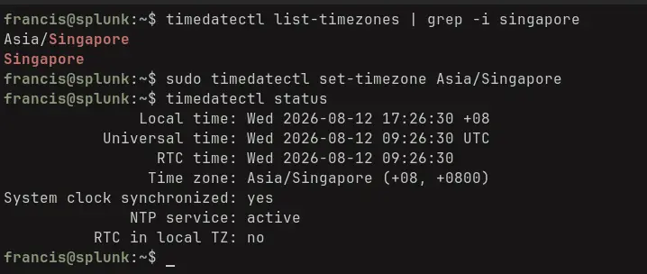

__Setting timezone__
# Disk Management
The Ubuntu server installer option for “use an entire disk” only allocates around half the volume group by design. I want to utilise the entire allocated storage.

First, check the mismatch in the LV (Logical Volume) and VG (Volume Group) 
```
sudo vgs
sudo lvs
```

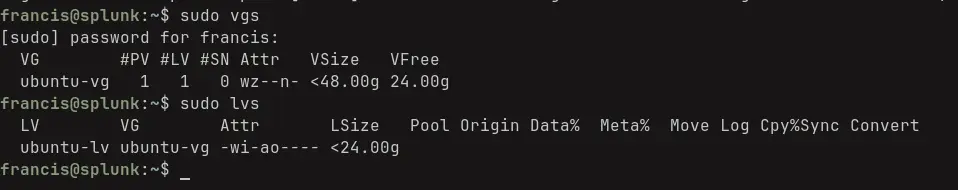

__LV vs VG__

Half of the volume group is free, I will expand the LV to take up the entire allocated storage

```bash
sudo lvextend -l +100%FREE /dev/ubuntu-vg/ubuntu-lv
sudo resize2fs /dev/ubuntu-vg/ubuntu-lv # assumes ext4
# check storage is now the full disk 
df -h
```

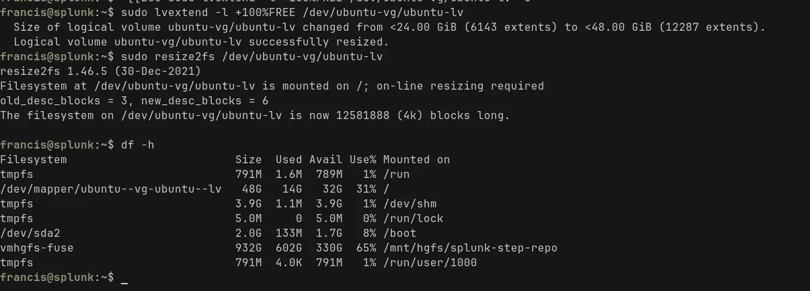

__Expanding LV__
# Network Management
## Checking NAT Network Configuration on Host
First I must check on the **host** system the configuration of the VMware NAT network.

```
grep -i nat /etc/vmware/networking
```

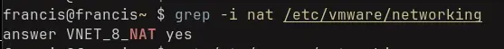

__NAT Network Name__

```
grep -iE "(^ip|netmask)" /etc/vmware/vmnet8/nat/nat.conf
```

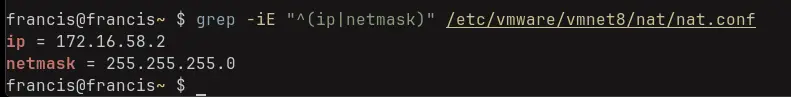

__NAT Network Address Space__

```
cat /etc/vmware/vmnet8/dhcpd/dhcpd.conf
```

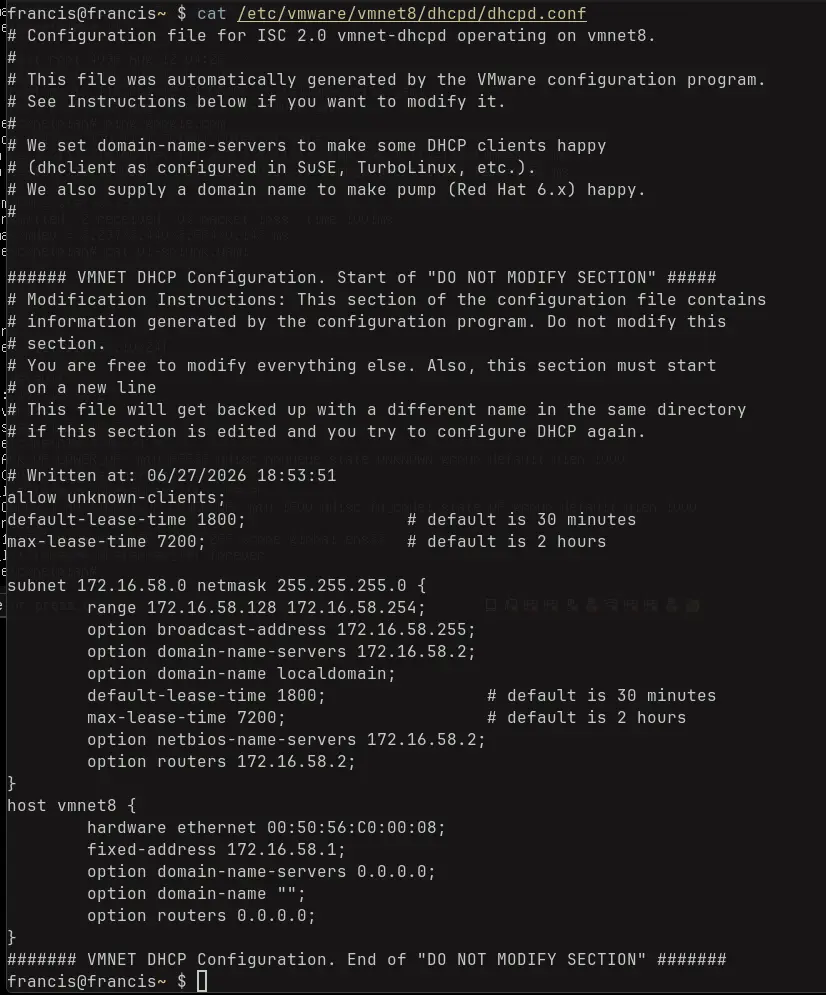

__DHCP Configuration of vmnet8__

Therefore,

| Network         | Value          |
| --------------- | -------------- |
| Network Address | 172.16.58.0/24 |
| Netmask         | /24            |
| Gateway         | 172.16.58.2    |
| DNS             | 172.16.58.2    |

## Checking NAT Network Status on Host
```
systemctl status vmware-networks.service
```

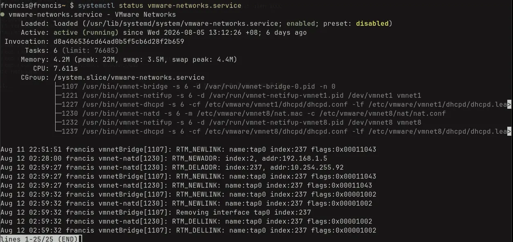

__VMWare networks service__

```
ps aux | grep -E 'vmnet-natd|vmnet-dhcps|vmnet-bridge'
```

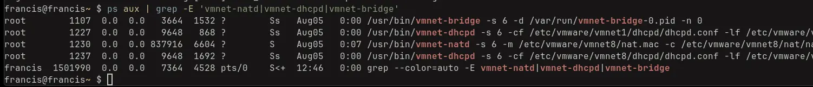

__Daemons are live__

```
ip -4 a show vmnet8
```

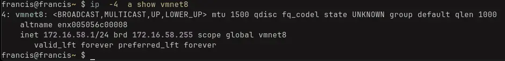

__vmnet8 Interface is up__

## Creating Netplan config on VM
Check name of the network interface in the Ubuntu VM using `ip -4 a`.

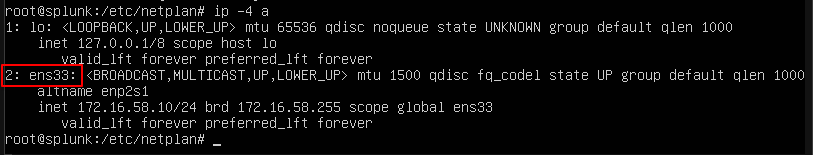

__Interface Name__

I will create the following netplan config file, `01-splunk.yaml`, so that the IP is static and is reachable from the host system.

```yaml
network:
  version: 2
  ethernets:
    ens33:
      dhcp4: no
      addresses: [172.16.58.10/24]
      routes:
        - to: default
          via: 172.16.58.2
      nameservers:
        addresses: [172.16.58.2]
```

After creating the netplan, ensure the permissions are configured properly, apply it then verify the applied netplan matches what we expect.

```bash
sudo chmod 600 /etc/netplan/01-splunk.yaml
sudo netplan apply
sudo netplan get
```

> [!note]
> World readable netplan configs will not be used and trying to do so will prompt Ubuntu to set the appropriate permissions

This produces,

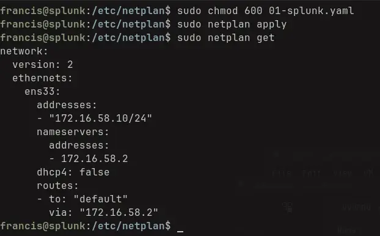

__Netplan applied__

> [!note]
> The number prefixed to each netplan yaml file determines the order in which they are parsed. Later netplan configs take precedence.
> If networking breaks, check if another netplan with a larger prefix is taking precedence.

## Enable UFW
To enable ufw and configure the rules such that the host machine can both access Splunk and SSH into the guest machine I need to run the following commands

```
sudo ufw allow from 172.16.58.0/24 to any port 22 proto tcp
sudo ufw allow from 172.16.58.0/24 to any port 8000 proto tcp
sudo ufw allow from 172.16.58.0/24 to any port 8089 proto tcp
sudo ufw enable
sudo ufw status verbose
```

> [!note]
> If you are configuring the server from SSH by the time you reach this section, ensure to allow SSH before enabling ufw. Otherwise, you will be locked out and you have to interact with the VM directly.

This should produce the following output on the guest machine,

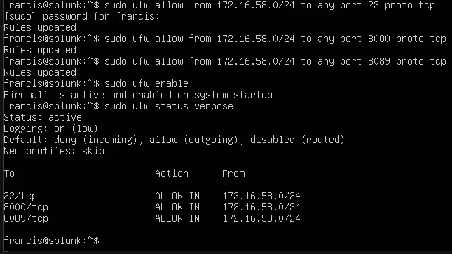

__Configuring and Enabling UFW__

We only allow traffic from `172.16.58.0/24` as this is our vmnet8 subnet.
Port 8000 corresponds to Splunk Web, port 8089 corresponds to the splunkd management port and port 22 corresponds to ssh.
## Enabling SSH to VM
I will enable SSH on the Ubuntu VM for convenience.
On the VM I will install openssh-server using the following commands,

```
sudo apt update && sudo apt install -y openssh-server
sudo systemctl enable --now ssh
```

Ensure SSH is enabled through `sudo ufw status verbose`.  If the rule is set, I can connect by using `ssh francis@172.16.58.10`.

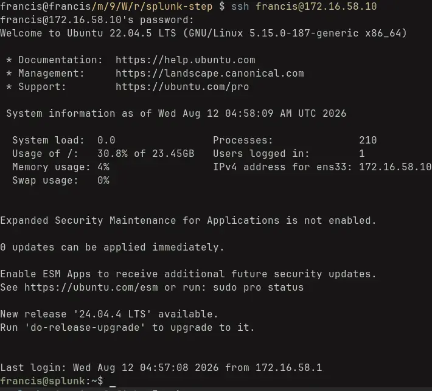

__Successful SSH connection__
# Creating the Splunk User
I now create the dedicated service user on the guest machine since running splunk enterprise as root is deprecated and not best practice. I will use the following commands to achieve this.

```
sudo groupadd -r splunk
sudo useradd -r -g splunk -d /opt/splunk -s /bin/bash -c "Splunk Service Account" splunk
id splunk
```

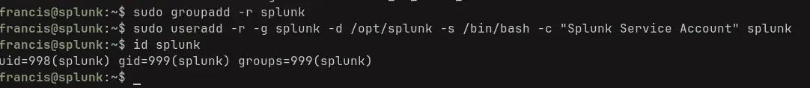

__Splunk Service User Created__
# Installing Splunk Enterprise
## Downloading the Installer
Now I can install Splunk Enterprise. I download the package and since I am on Ubuntu I download the debian one. The wget command can be retrieved straight from the Splunk Enterprise [download page](https://www.splunk.com/en_us/download/splunk-enterprise.html) after signup. 

I just edit the command slightly so it will wget the file into `/tmp`

```
wget -O /tmp/splunk-10.4.2-33c3bf42cd73-linux-amd64.deb "https://download.splunk.com/products/splunk/releases/10.4.2/linux/splunk-10.4.2-33c3bf42cd73-linux-amd64.deb"
```

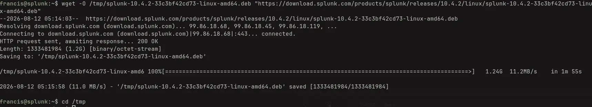

__Successful Download__
## Verify Installer
Download the SHA512 file to verify the installation bits.


__Download SHA512 for file verification__

Move this file into the guest machine using `scp`.  I then verify the downloaded installation against the checksum file using the following commands,

```
# On host
scp /path/to/splunk-step-repo/splunk-10.4.2-33c3bf42cd73-linux-amd64.deb.sha512 francis@172.16.58.10:/tmp/

# On Guest
cd /tmp
sha512sum -c splunk-10.4.2-33c3bf42cd73-linux-amd64.deb.sha512
```

Which gives us,

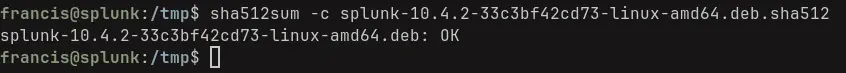

__Checksum verified__
## Installation
Install the package and hand ownership to the service account.

```bash
sudo apt install /tmp/splunk*.deb
sudo chown -R splunk:splunk /opt/splunk
```

## Seed file
Create a seed for the admin account by creating  `user-seed.conf`. The file should contain the following content,

```
[user_info]
USERNAME = <USERNAME>
PASSWORD = <PASSWORD>
```

Create this file in `/opt/splunk/etc/system/local` on the guest Ubuntu machine. Then ensure the following permissions are set

```
sudo chown splunk:splunk /opt/splunk/etc/system/local/user-seed.conf
sudo chmod 600 /opt/splunk/etc/system/local/user-seed.conf
```

Verify that the file exists and has the correct contents by using,

```
sudo -u splunk ls -al /opt/splunk/etc/system/local
sudo -u splunk cat /opt/splunk/etc/system/local/user-seed.conf
```

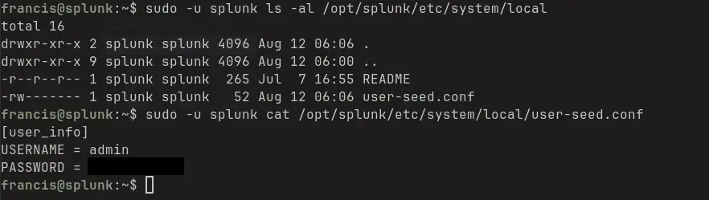

__Verifying seed file__

## First Login

```
sudo -u splunk /opt/splunk/bin/splunk start --accept-license --answer-yes --no-prompt
```

Which will install and manually start the splunk web instance. After running this command, I verify that the web instance is reachable on `http://172.16.58.10:8000` 

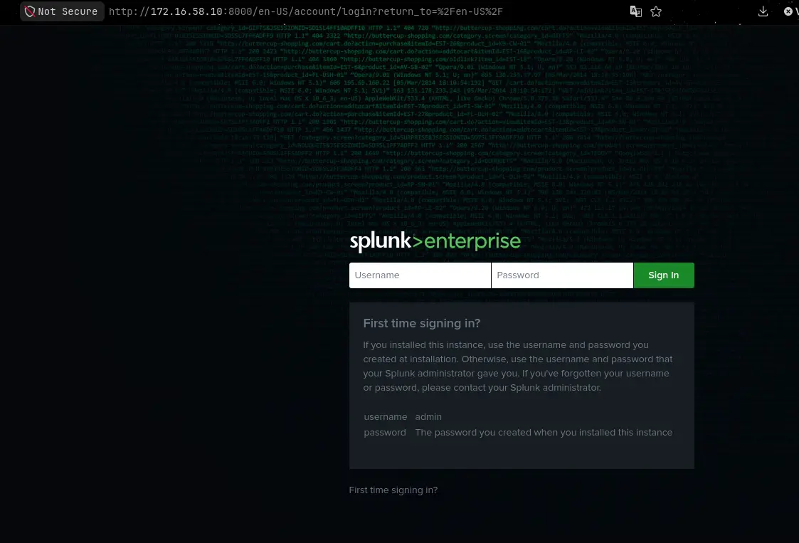

__Splunk Web on `172.16.58.10:8000`___

and if the seeded credentials  work

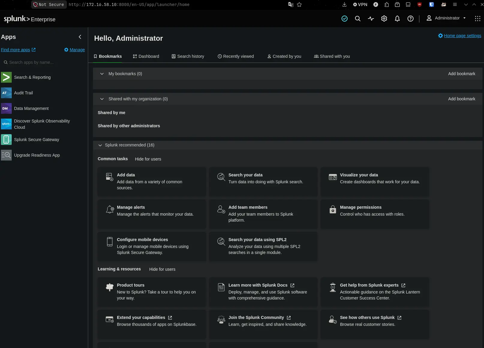

__Successful login using seeded credentials__

> [!note]
> Splunk usually consumes the seed file ensuring it does not remain on disk with the plaintext password. It is good practice to check rather than assume. Check if the seed file still exists in `$SPLUNK_HOME/etc/system/local` after the first login and delete with `sudo rm -f /opt/splunk/etc/system/local/user-seed.conf` if exists.

## Changing Splunk to be managed by systemctl
The Splunk web instance is working now but I want it to be managed by `systemctl` so that it auto starts on boot, has unified logging through `journalctl` and resource limits get set.

First, stop the running splunk instance
```
sudo -u splunk /opt/splunk/bin/splunk stop
```

Then run `boot-start` with the following arguments

```
sudo /opt/splunk/bin/splunk enable boot-start -systemd-managed 1 -user splunk -group splunk
```

Then perform the following commands to re-read the unit files and start Splunkd

```
sudo systemctl daemon-reload
sudo systemctl start Splunkd
sudo systemctl status Splunkd
```

Together these commands should produce the following output,

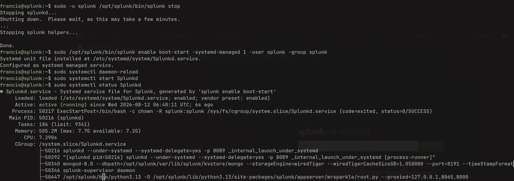

__Output of all commands__

# Splunk Licensing
Every install of Splunk Enterprise comes with a free trial but I have a developer license so I will be installing that instead. Navigate to `Settings > License` and install the downloaded license file from Splunk.

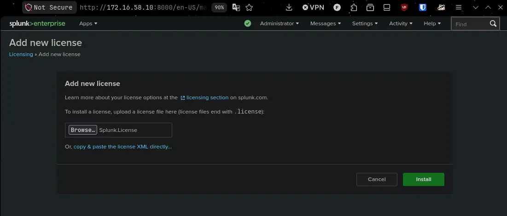

__Installing Developer License__

A successful installation will prompt a restart

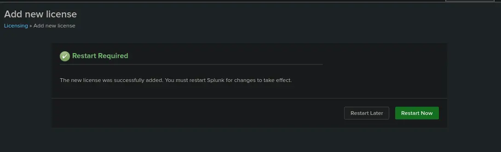

__Restart Required Prompt__

After a successful restart, `Setting > License` should show the updated volume limits as well as license group. An example is shown below,

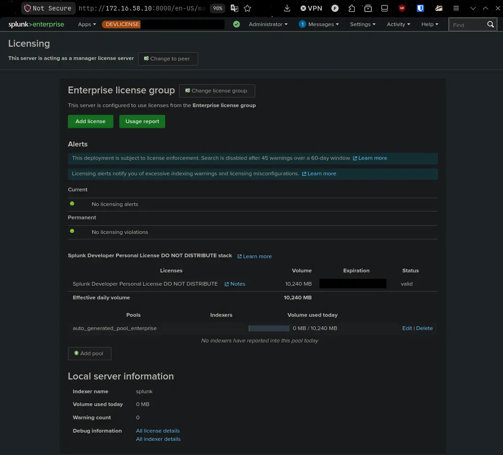

__Developer License Installed Example__
# Optional: Mounting shared folder
I want to mount a read-only folder that exists on my host system to the VM. This read-only folder serves as a convenient means to push files into the guest system but is not strictly required for its operation.

First we configure the VMware machine to have shared folders enabled and configured as shown below,

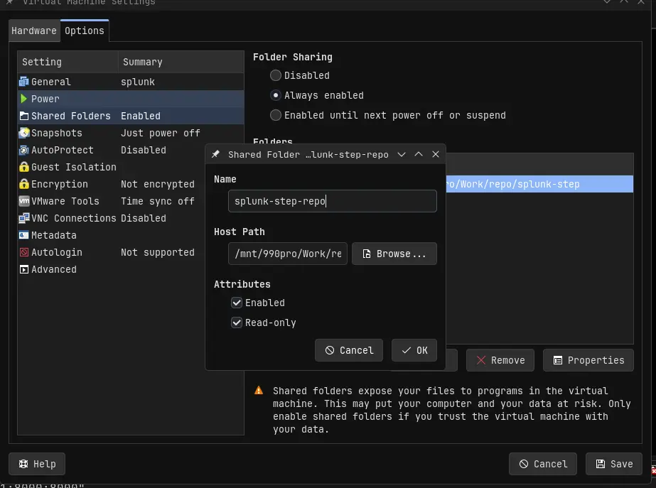

__Shared Folder configuration__

 Then I install `open-vm-tools` through `sudo apt install -y open-vm-tools`.

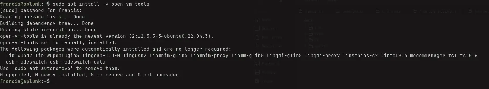

__Successful install__

Then I confirm that the guest can see the share through `vmware-hgfsclient`

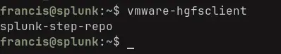

__Shared folder is visible__

Now we add this mount to `/etc/fstab` so it persists through reboots and verify the mount succeeded

```bash
# Create mount point 
sudo mkdir -p /mnt/hgfs/splunk-step-repo

# Edit fstab file, I use vim here but any text editor will do
sudo vim /etc/fstab 

# Append this to the fstab file
# Ensure the share name matches what was seen in vmware-hgfsclient
.host:/splunk-step-repo  /mnt/hgfs/splunk-step-repo  fuse.vmhgfs-fuse  allow_other,ro,nofail,_netdev  0  0

# reload systemctl daemons then mount
# Systemd regenerates mount units from fstab
sudo systemctl daemon-reload
sudo mount -a

# Verify
mount | grep hgfs 
ls -l /mnt/hgfs/splunk-step-repo 
```

# Verifying System 
The baseline system is now fully setup. The following verification steps ensure the baseline is good.
## Verifying Splunk starts on boot
Reboot the Ubuntu virtual machine and manually check if `http://172.16.58.10:8000` is reachable post boot.

Invoke the reboot 
```bash
sudo reboot
```

After the guest returns, confirm Splunk started as part of boot

```bash
uptime -p
systemctl is-enabled Splunkd
systemctl show Splunkd -p ActiveEnterTimestamp
# -b restricts the journal to current boot
journalctl -u Splunkd -b --no-pager | head -20
```

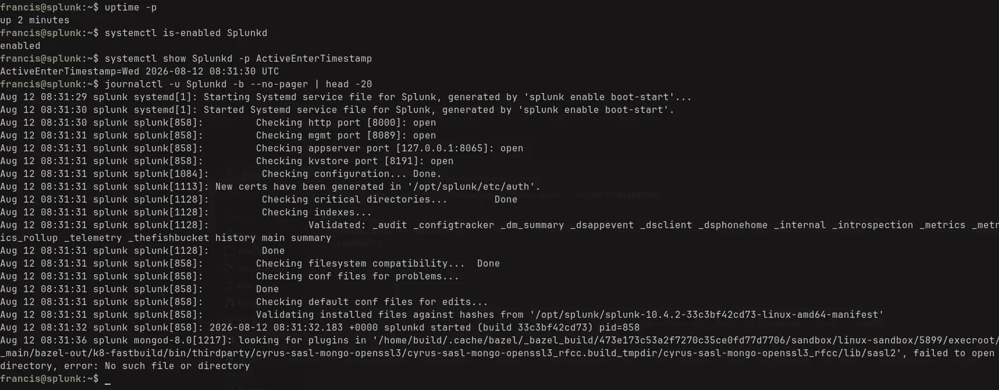

__systemd logs for starting splunk on boot__
## Verify Timezone
Ensure the server timezone matches the local timezone.

```
timedatectl status
```

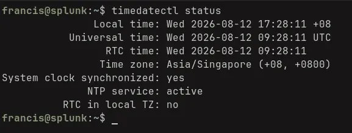

__Timezone properly set__

## Verifying Entire Disk is being used
Check if the LV uses the entire disk storage of VG and not just half of it.

```
sudo lvs
sudo vgs
df -h
```

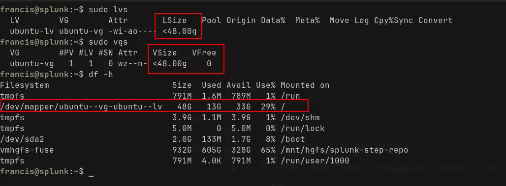

__Check entire allocated storage is being used__

## Verifying Splunk Service Account exists
Check that the Splunk service account, `splunk`, exists.

```
id splunk
```

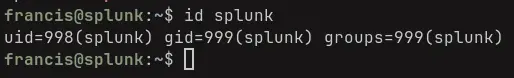

__Splunk Service Account Exists__

## Verifying Splunk is ran under the Splunk Service Account
Check that Splunk is being ran in the context of the splunk service account and not root.

```
ps -eo user,comm | grep splunkd
```

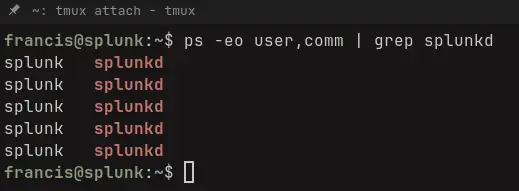

__splunkd is running as splunk service account__

## Verify ownership in Splunk `etc` and `var` directories
Config and data directories in the splunk home must be writeable by the service account otherwise it cannot function properly.
Check if `/opt/splunk/etc` and `/opt/splunk/var` contain any files not owned by user or group `splunk`.

```
sudo find /opt/splunk/etc /opt/splunk/var ! -user splunk | wc -l
sudo find /opt/splunk/etc /opt/splunk/var ! -group splunk | wc -l
```

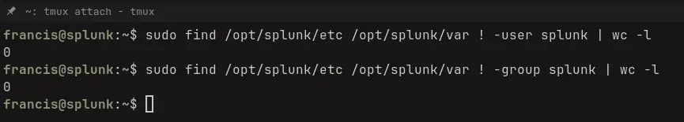

__Ownership properly configured__

> [!note]
> root-owned files under `bin/` and `lib/` are expected

## Verify Splunk Web and Splunk Management API is reachable on host
Check that both are reachable by running the following commands on the host machine

```
curl -I http://172.16.58.10:8000
curl -k -I --connect-timeout 5 https://172.16.58.10:8089/services/server/info
```

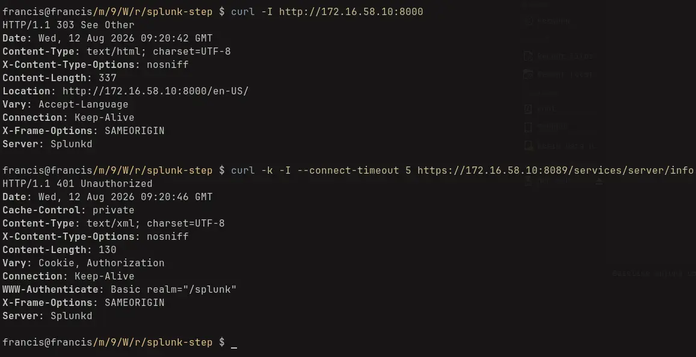

__Responses from both endpoints__

> [!note]
> A 401 response from `curl -k -I --connect-timeout 5 https://172.16.58.10:8089/services/server/info` means the service is up and running


## Verifying mount succeeds
If you created the optional mounted share folder, check if the folder mounted properly.

```bash
mount | grep hgfs
df -h | grep hgfs
ls -l /mnt/hgfs/splunk-step-repo/
```

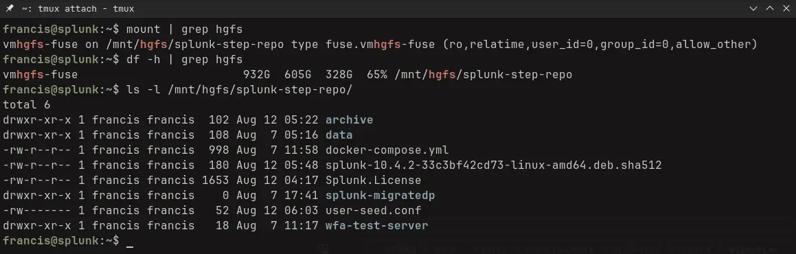

__Successfully mounted__