#splunk #core-certified-user #finished #reviewed 
# Scenario

You've just started as a junior data analyst at GlobalCart, an online retailer selling across 12 countries. It's Q3 2026, and your manager has dropped a stack of ad-hoc questions on your desk ahead of Friday's leadership review. The `sales_data.csv` is already loaded, so go find the answers in Splunk rather than Excel.

Dataset: [`data/sales_data.csv`](data/sales_data.csv) (6,000 events, 2026-05-01 to 2026-07-26)

> [!WARNING]
> **Environment drift since this writeup.** These searches were written against the environment as it stood on 2026-07-31 and no
> longer all run as-is. Current state is in [globalcart-manifest](../../environment/globalcart-manifest.md).
>
> **Lookup names have changed.** Every `| lookup` below names a superseded definition:
>
> | Used below | Current |
> | ---------- | ------- |
> | `KVPriority` (Q7), `priority_lookup` (Q12) | `category_to_priority` |
> | `region_lookup` (Q8) | `country_to_region` |
> | `cost_supplier_lookup` (Q9) | `product_to_cost` |
>
> **Relative time ranges no longer reach the data.** The dataset ends 2026-07-26, so any
> window anchored to *now* opens after the last event and returns nothing. This affects
> Q7 (`-14@d`) and the bonus alert (`-2d@d`). The absolute ranges in Q8–Q12 still work.
>
> **Dataset path moved** to `data/GlobalCart/sales_data.csv` within the same repo.

# Questions

## Q1 — Basic Searching (2.0)
>Leadership is worried about refunds eating into margins. Find every `Electronics` order that was Refunded and had revenue over $100. How many are there, and what's the total revenue lost?

```
index="globalcart" category="Electronics" order_status="Refunded" revenue>100
| stats count(product) as product_count, sum(revenue) as revenue_lost
```

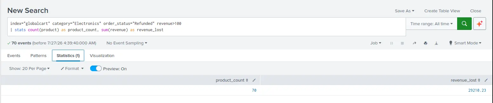

__Electronic orders refunded with revenue over 100__

---

## Q2 — Fields & Search Language Fundamentals (3.0, 4.0)
>Your manager doesn't want to see raw event data — they want a clean table. Build a search that returns only `customer_id`, `product`, `revenue`, and `order_status`, renames `customer_id` to `Customer`, sorted by revenue descending, showing just the top 10.

```
index="globalcart"
| rename customer_id as Customer
| table Customer,product,revenue,order_status
| sort -revenue
| head 10
```

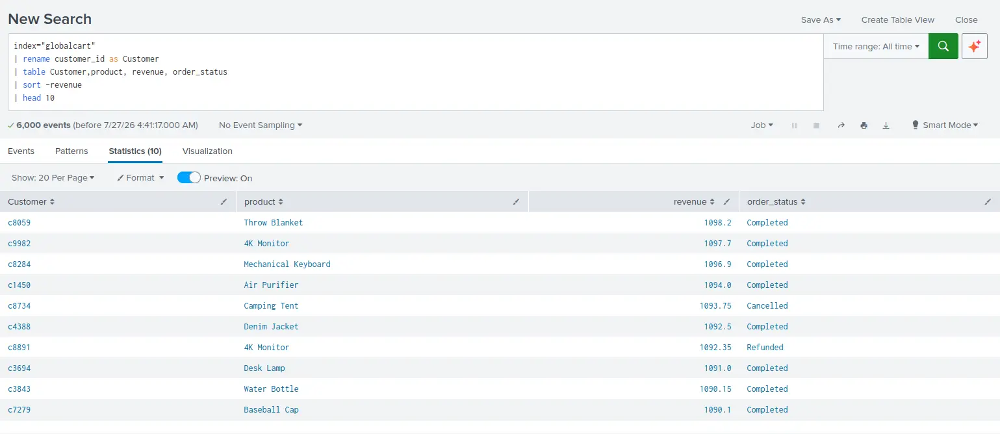

__Top 10 products with highest revenue in descending order__

---
## Q3 — Transforming Commands: top/rare (5.0)
>Which single product generated the most orders overall? Now flip it — which country has the fewest orders in the entire dataset? (Two different commands for these two answers — they're near-opposites of each other.)

```
index="globalcart"
| top limit=1 product showperc=f
```

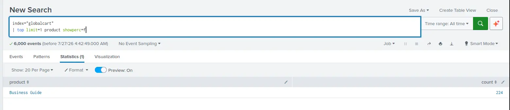

__Most ordered product__

```
index="globalcart"
| rare limit=1 country showperc=f
```

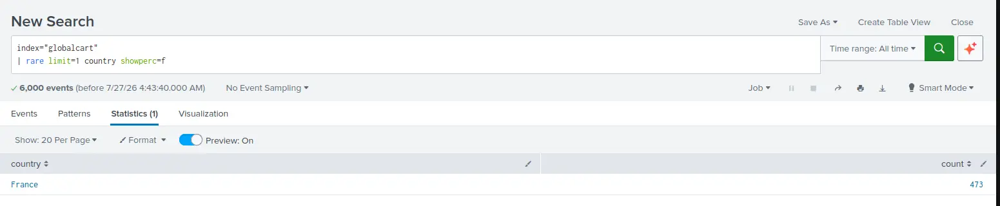

__Least ordered product__

---
## Q4 — Transforming Commands: stats (5.0)
>Management wants a revenue breakdown by category, sorted highest to lowest, with average customer rating alongside it. One `stats` command, two aggregations, one `sort`.

```
index="globalcart"
| stats sum(revenue) as total_revenue, avg(rating) as avg_rating by category
| eval total_revenue="$".round(total_revenue,2), avg_rating=round(avg_rating,2)
| sort -total_revenue
```


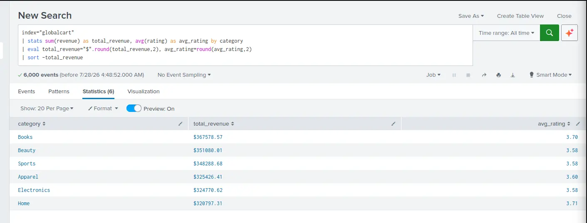

__Revenue by category in descending order with average rating__

---
## Q5 — dedup + counting distinct values (4.0, 5.0)
>How many unique customers placed at least one order in the Beauty category? There are two valid ways to answer this — one using `dedup` + a count, one using a single `stats` function. Try both and confirm they agree.

```
 index="globalcart" category="Beauty"
| dedup customer_id
| stats count(customer_id)
```


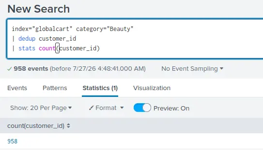

__Number of unique customers who ordered from Beauty category__

```
index="globalcart" category="Beauty"
| stats dc(customer_id) as unique_customers
```

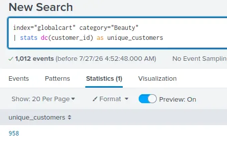

__Number of unique customers who ordered from Beauty category__

---
## Q6 — Reports & Dashboards (6.0)
>Build a `timechart` showing daily revenue, split by `device` (Desktop/Mobile/Tablet). Save it as a report, then add that report to a new dashboard titled "Revenue by Device."

```
index="globalcart"
| timechart span=1d sum(revenue) by device
| rename _time as Date
| fieldformat Date=strftime(Date, "%b %d, %Y")
| fieldformat Desktop="$"+tostring(Desktop,"commas")
| fieldformat Mobile="$"+tostring(Mobile,"commas")
| fieldformat Tablet="$"+tostring(Tablet,"commas")
```

`Save as Report > Add to Dashboard > New Dashboard > Revenue By Device`

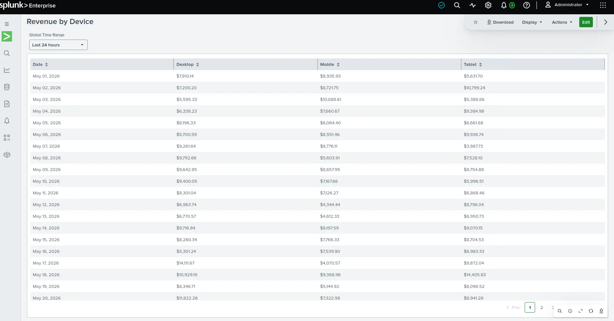

__Revenue By Device Dashboard__

---

## Q7 — Lookups (7.0) (Using CSV file-based Lookups)
>Create a small lookup CSV with two columns: `category` and `priority` (e.g. Electronics=Tier1, Books=Tier3 — you decide the tiers). Upload it as a lookup file, define a lookup, and write a search that enriches `sales_data` with a new `priority` field pulled from that lookup.

To complete this question we need to create and upload a csv file that maps categories to priority.
We do that through the following,
### (1) Create csv file that maps category to priority
We first check the values of the category

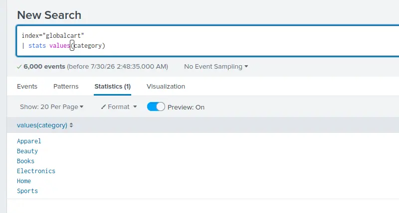

__Unique list of values for category__

Then, we create the csv file as shown below,

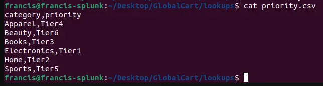

__csv lookup mapping category to priority__

### (2) Add csv file as new lookup table file + configuring permissions

To do this through the GUI we first add this file as a new table look up file.

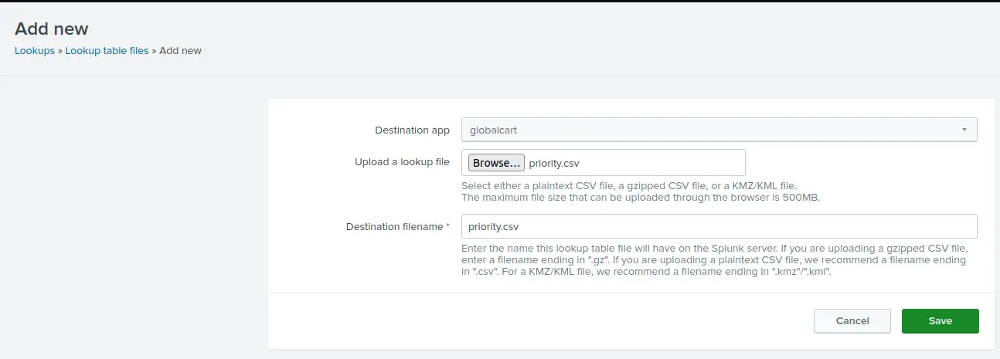

__Adding priority.csv as new lookup table file__

We want to make this lookup file accessible only in the `globalcart` app and can only be modified and read by certain roles.
Therefore, we set the following permissions,

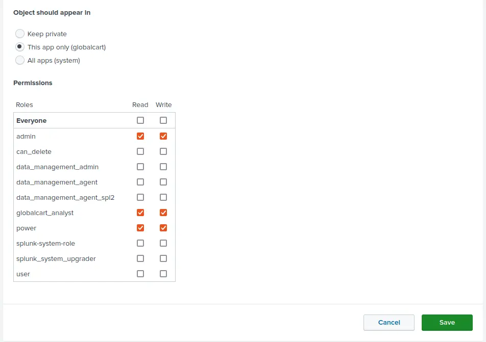

__Lookup table file permissions__

### (3) Add lookup definition + configuring permissions
Then we add a lookup definition for this file,

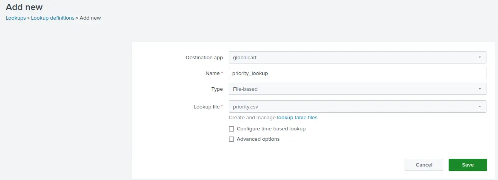

__Adding new lookup definition__

Then assign the same permissions as the lookup table file.

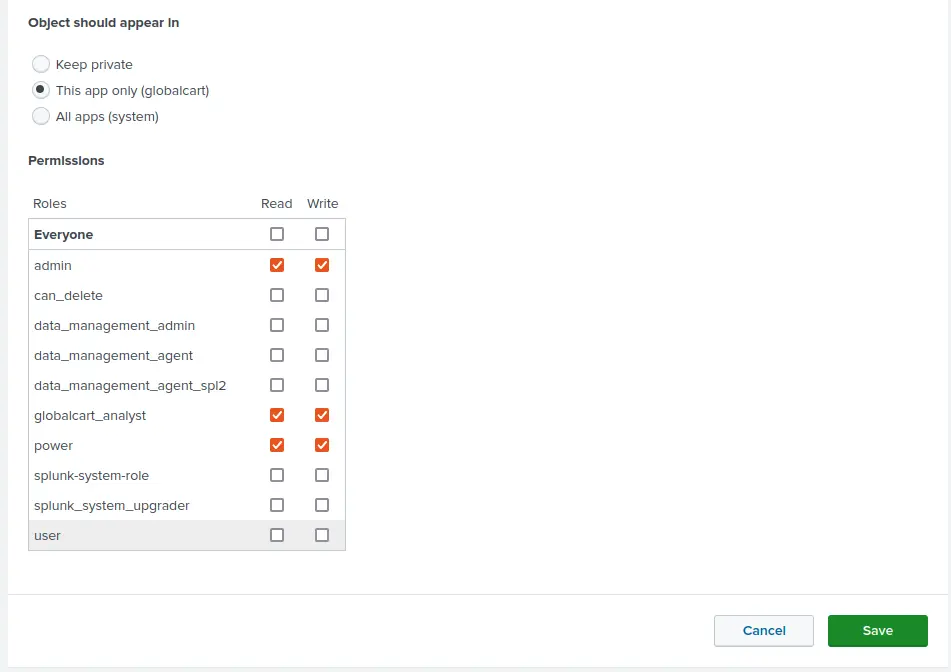

__Assigning permissions for the lookup definition__

>[!NOTE]
>Permissions for the lookup table file should be higher or equal to the permissions of the lookup definition it is associated with.

### Answer
With this, we can now use the priority lookup in our search to answer the question.
To do so we performed the following search,

```
index="globalcart" earliest=-14@d latest=@d
| lookup KVPriority category OUTPUT priority
| bin _time span=1d 
| stats avg(revenue) as avg_revenue by _time,priority
| xyseries _time priority avg_revenue
```

> [!warning]
> This search returns nothing today. `-14@d latest=@d` was a live window when written but
> now opens after the dataset's last event (2026-07-26), and `KVPriority` is no longer the
> definition name. To reproduce the screenshot, use an absolute range inside the data and
> `category_to_priority`.


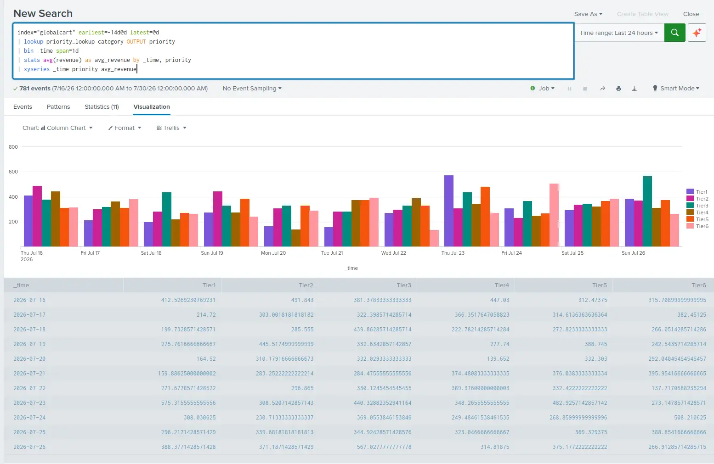

__Average revenue by priority per day in last 2 weeks__

---

## Q8 — Lookups: Reference table enrichment (7.0) (Using KVStore Lookups)
>Leadership wants revenue grouped by region, not just by country — but `sales_data` has no `region` field. Build a lookup CSV mapping each of the 12 countries in the dataset to a region of your choosing (e.g. North America, Europe, APAC, LATAM, Africa). Upload it, define the lookup, and write a search that enriches events with `region` and shows total revenue by region, sorted highest to lowest.

*Hint: `stats values(country)` first to confirm you've got all 12 countries covered before you build the CSV.*

We first find the list of all countries using 
```
index="globalcart" earliest="05/01/2026:00:00:00" latest="07/28/2026:00:00:00"
| stats values(country)
```

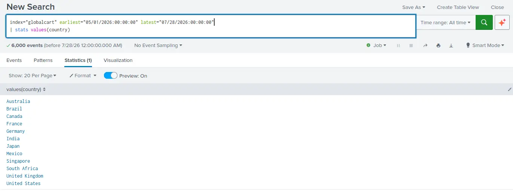

__List of all countries__

To create a kv lookup we first need to do the following,

### (1) Creating `kv_region` stanza in `collections.conf`

To get started on creating a `kvlookup` for this question we need to define the actual database where our KV store data lives in. All KV store collections live in an embedded MongoDB instance that ships with Splunk.

>[!NOTE]
> To refresh, MongoDB's hierarchy is as follows, 
> Database → Collection (Table) → Document (Row) → Fields (Columns, but flexible/schema-less)

To do so, we need to first find the `collections.conf` we want to edit because this is unique to the app. The target app we will use is the `globalcart` app which was created just for this scenario.

We can find it at `$SPLUNK_HOME/etc/apps/globalcart/local/collections.conf`.
Then we just add the following stanza,

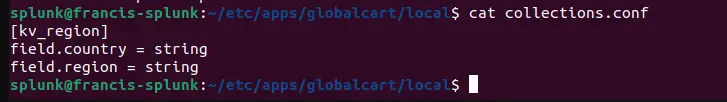

__New Collection Defined__
### (2) Creating `kv_region` stanza in `transforms.conf`
`
After adding the new stanza in `collections.conf`, we also need to add another stanza in `transforms.conf` in the same directory.
This is because SPL does not know how to communicate with  a raw MongoDB collection directly.
There is a need to create an abstraction layer on top of that so the two components can interact.

This abstraction layer is the transform which we define below,

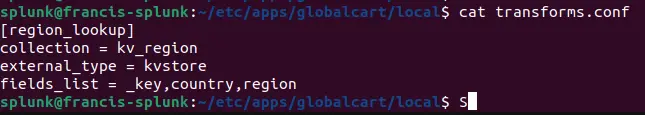

__New Transform Defined__

In terms of naming, we want to separate the name of transform/lookup definition from the storage method.
The reason being that there are legitimate reasons or use cases where the underlying storage is changed.
Therefore, we should keep the name storage agnostic to avoid confusion later.

### (3) Adding data to the `kv_region`
There are a few ways to do this and we will do it through the native SPL way which is clunkier but is the true native way to do it.

We first create a csv file containing the data we want to insert and make sure the fields match.

>[!NOTE]
If the fields in the csv do not match in the collections, this will cause silent failure where the undeclared fields are just dropped.
If the fields in the csv match the collections but not the transforms, then the undeclared fields are invisible to Splunk but written in the collection.

As a rule of thumb, always ensure that the fields, included the casing of letters, match completely with the `transforms.conf` and `collections.conf`. 

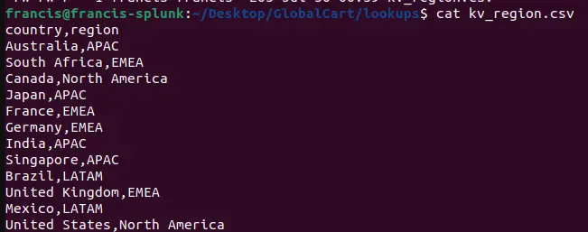

__CSV containing lookup data__

Then we add this file as a new lookup table file through `Lookups > Lookup table files >> Add new`

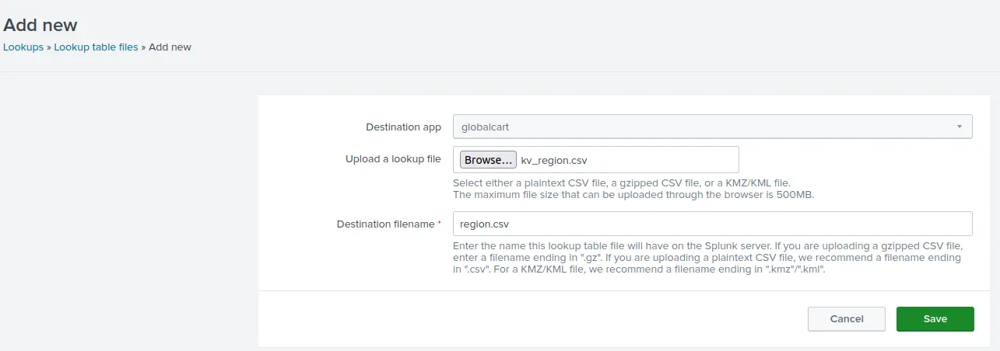

__Adding new lookup table file__

Then we add the data through the search in the app,

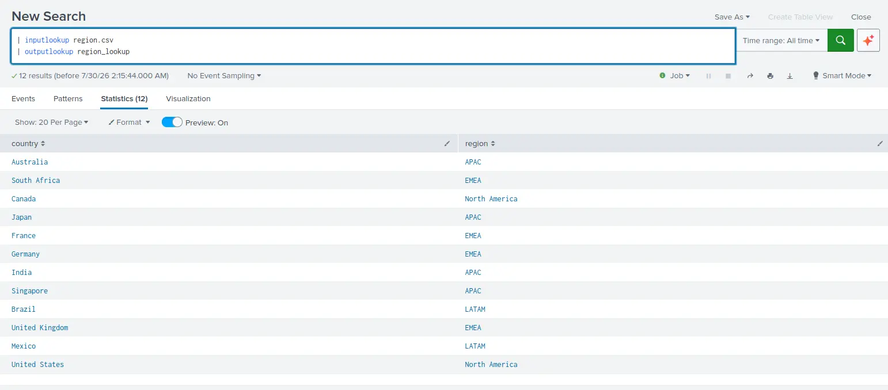

__Populating data in `region_lookup`__

### Answer
Now we can use the `region_lookup` to complete the task in the question.
We can do that through the query,
```
index="globalcart" earliest="05/01/2026:00:00:00" latest="07/28/2026:00:00:00"
| lookup region_lookup country OUTPUT region
| stats sum(revenue) as "Total_Revenue" by region
| sort -'Total Revenue'
```

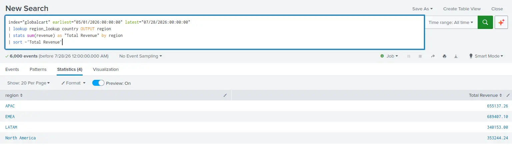

__Total Revenue by region in descending order__

---

## Q9 — Lookups: Multi-field output (7.0) (Using Splunk Lookups App )
>Finance wants to know profit margin per product, but `sales_data` only has `revenue`, not cost. Build a lookup CSV keyed on `product` with two output columns: `cost_price` and `supplier`. Use it to enrich the data, then calculate `margin = revenue - (units * cost_price)` per order, and show total margin by `supplier`.

*Hint: a single `lookup` command can pull back more than one field at once — you don't need two lookups for two output columns.*

In questions `Q7` and `Q8` we explored using file-based and KVstore lookups.
In `Q9`, we will instead use the more convenient `Splunk App for Lookup File Editing` to upload and use a KV store lookup.
We do that through the following,
### (1) Create cost_price and supplier csv
We first query for the values of products so we know what to create.

```
index="globalcart"
| stats values(product)
```

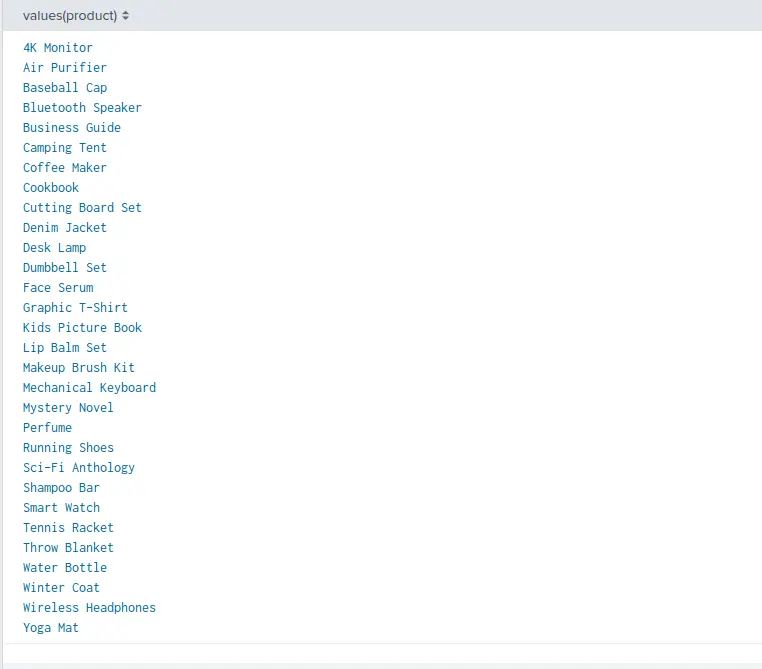

__Unique list of all products__

Then we create the csv file as follows,

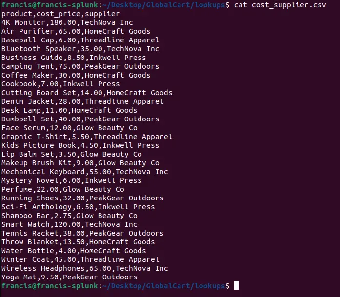

__cost_supplier csv file__

### (2) Create new KV store lookup through app
We navigate to the following menu through `New Lookup > Create KV store lookup`, then populate with the following values

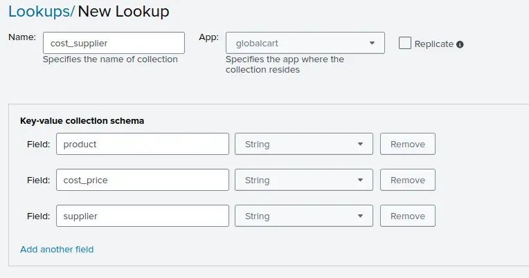

__New look up__

### (3) Populate the values of the new KV Store
Click on the three dot menu to import then select our created csv file.

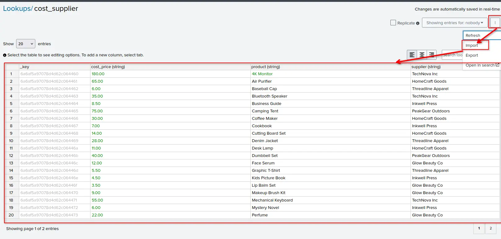

__Populated KV Store__

### (4) Create the lookup definition/ transform
To create the transform to make this usable in search, we click on the three dot menu and then click `Open in Search`.
This will prompt us to create a new transform and we will name it `cost_supplier_lookup` as seen below,

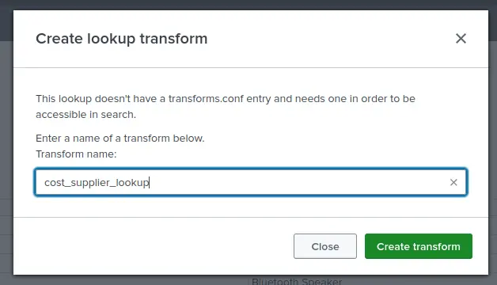

__Create lookup transform__

### (5) Properly set permissions
Under the lookup app search for the cost_supplier lookup file and edit the permissions to be the following,

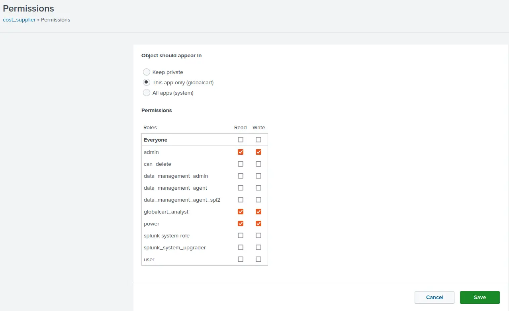

__Lookup file permissions__

Then navigate to `Lookups > Lookup definitions` and change the permissions of the associated look up definition to match the permissions of the lookup file. As seen below,

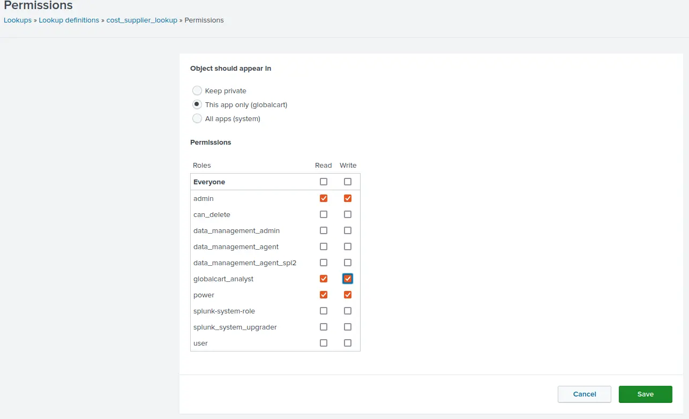

__Lookup definition permissions__
### Answer
Now with the lookup created and with the proper permissions we can answer the questions.
We answer the question using the following query,

```
index="globalcart" earliest="05/01/2026:00:00:00" latest="07/28/2026:00:00:00"
| lookup cost_supplier_lookup product OUTPUT cost_price, supplier
| eval margin=(revenue - (units * cost_price))
| stats sum(margin) as "Total Margin" by supplier
```

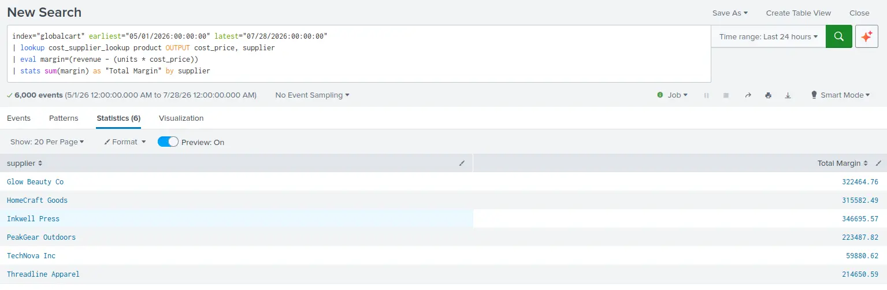

---

## Q10 — Subsearches: Filtering with a result set (9.0)
>Your manager wants a deep-dive on GlobalCart's single biggest customer by total revenue — but only knows to ask "show me everything they bought," not who that customer is. Write one search that finds the top customer by revenue *and* returns every order they placed, using a subsearch to feed that customer_id into the outer search. Don't hardcode the customer_id.

*Hint: `[ search ... | stats sum(revenue) as total by customer_id | sort -total | head 1 | fields customer_id ]` — subsearches run first and get passed in as a filter.*

```
index="globalcart" earliest="05/01/2026:00:00:00" latest="07/28/2026:00:00:00"
[search index="globalcart" earliest="05/01/2026:00:00:00" latest="07/28/2026:00:00:00" | stats sum(revenue) as total_revenue by customer_id | sort -total_revenue | head 1 | fields customer_id]
| table customer_id,product, order_status, revenue
```

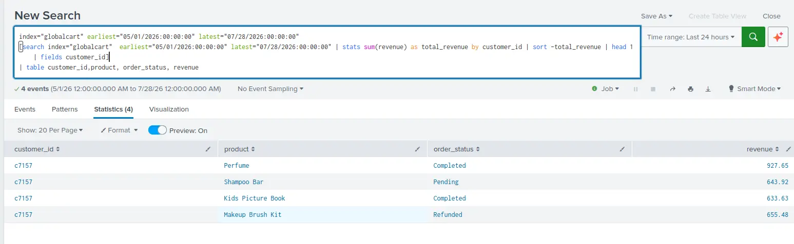

__List of Orders by Single Biggest Customer by Total Revenue__

---

## Q11 — Subsearches: Exclusion with NOT (9.0)
>Leadership wants to know which countries have a clean refund record — zero `Refunded` orders across the entire dataset. Use a subsearch to find the set of countries that *do* have refunds, then exclude them from the full list of countries to find the ones that don't.

*Hint: `NOT [subsearch]` combined with `format` is the pattern here — think about what field the subsearch needs to return for the `NOT` to match against.*

```
index="globalcart" earliest="05/01/2026:00:00:00" latest="07/28/2026:00:00:00"
NOT [ search index="globalcart" earliest="05/01/2026:00:00:00" latest="07/28/2026:00:00:00" order_status="Refunded" | stats count by country | search count>0 | fields country ]
| table country
```

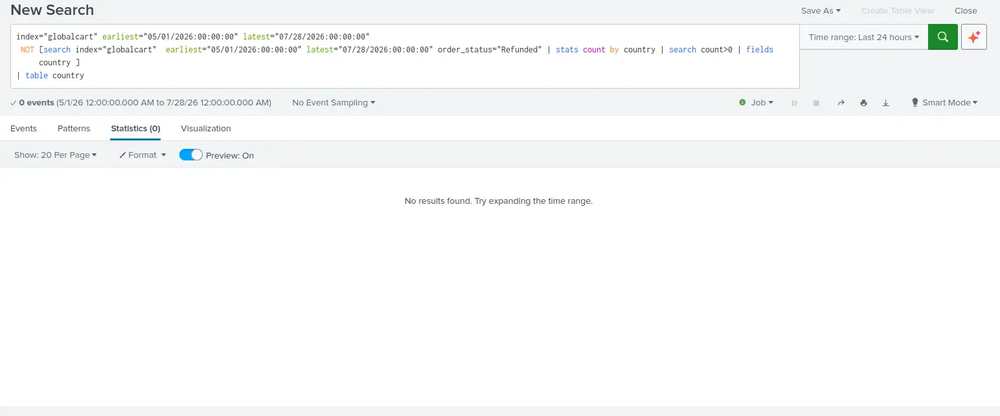

__List of countries where there were no refunds__

---

## Q12 — Subsearches + Lookups combined (9.0)
>Combine both skills: use a subsearch to identify GlobalCart's single best-selling category by total revenue, then — in the same outer search — use the `priority_lookup` lookup from Q7 to show that category's priority tier alongside its revenue and order count. The category name itself should never be typed into the search by hand.

*Hint: the subsearch should return just the winning `category`, which becomes an implicit filter on the outer search — then pipe through `lookup` as usual.*

```
search index="globalcart" earliest="05/01/2026:00:00:00" latest="07/28/2026:00:00:00"
[ search index="globalcart" earliest="05/01/2026:00:00:00" latest="07/28/2026:00:00:00" | stats sum(revenue) as total_revenue by category | sort -total_revenue | head 1 | fields category]
| lookup priority_lookup category OUTPUT priority
| stats count as "Total Orders", sum(revenue) as "Total Revenue" by category,priority
```

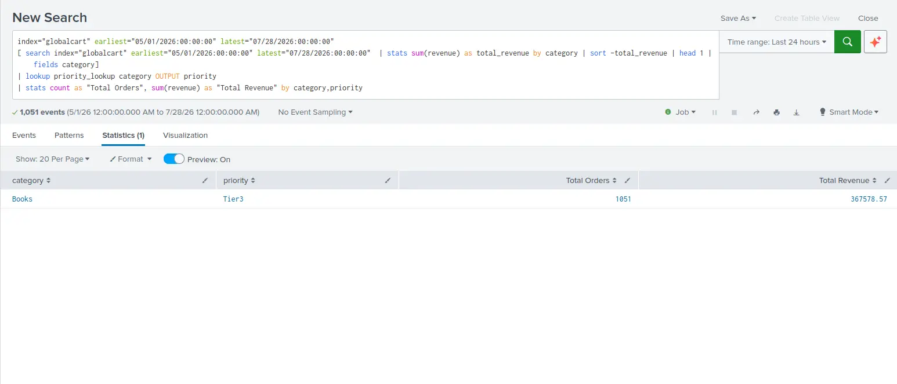

__Best selling category and priority__

---

## Bonus Challenge — Alerts (8.0)

Build a scheduled alert that would trigger if daily refund revenue exceeds a threshold you pick (e.g. $500/day). Since your data is historical, remember the "search all time, schedule the check" trick — get it to actually fire once and confirm it shows up under Activity > Triggered Alerts.

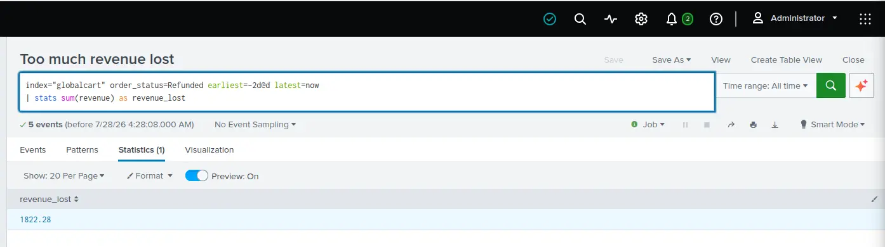

__Base search for alert__

I defined the following search and just made it so it looks back 2 days until now.
This will ensure the alert fires.
We then save this as alert and do the following,

> [!warning]
> The `-2d@d` window no longer fires. It guaranteed a hit while the data was recent, but
> the dataset ends 2026-07-26 and the window now sits entirely past it, so the search
> returns no refunds and the trigger condition is never met. The alert in the current
> environment ("Too much revenue lost") uses an all-time range instead, and logs to
> `index=globalcart` with sourcetype `globalcart:alerts` rather than `index=main`.

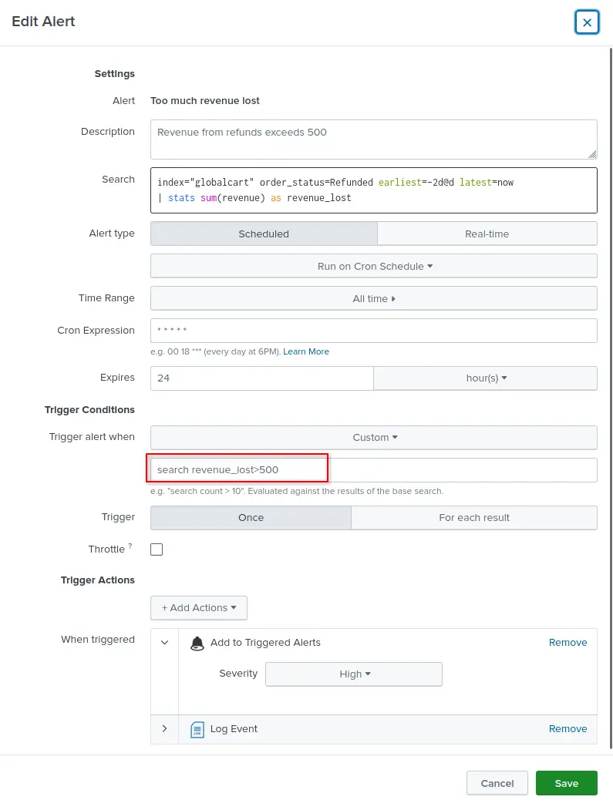

__Defining the alert__

We add the following actions as well
- Add to triggered alerts with high severity
- Add log event

This alert runs every minute and we can see it happening on both the triggered alerts as well as just the search app on `index=main`

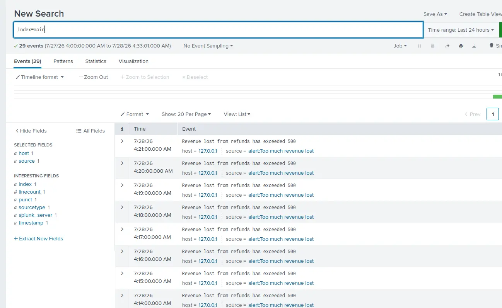

__Log events generated by alert__

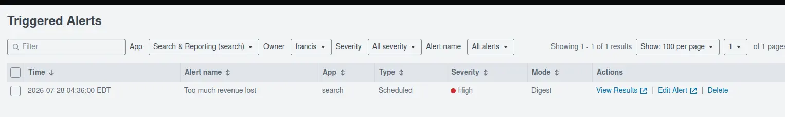

__Triggered Alert entries__

---