#splunk #core-certified-user #finished #reviewed 
# Scenario

You're the newest junior SOC analyst at **Ironvale Financial**, a mid-size regional bank that runs its own in-house Security Operations Center. It's Q3 2026, and your SOC lead wants a walkthrough of the last seven weeks of security telemetry before the end-of-week leadership review. What nobody has flagged yet is that at least two live incidents are sitting in that data.

Four raw log exports have landed on your desk straight off the collection tier, and getting them into Splunk is where you start. Each arrives in a different format under a different sourcetype, with only some fields pre-extracted, which is a good deal closer to real collection-tier output than a tidy single-CSV exercise.

## Dataset

All four files live in [`data/`](data/). Total: **5,221 events**, spanning **2026-06-08 to 2026-07-26**.

| File            | Suggested sourcetype | Format                                         | Notes                                                                                                                                                                               |
| --------------- | -------------------- | ---------------------------------------------- | ----------------------------------------------------------------------------------------------------------------------------------------------------------------------------------- |
| `auth.log`      | `ironvale:auth`      | Syslog-style, freeform text (**no key=value**) | VPN/SSH login success, failure, and session-close events. `user`, source IP, and port are only recoverable via regex — nothing is auto-extracted except the odd `sessionid=` token. |
| `firewall.log`  | `ironvale:firewall`  | `key=value` pairs                              | Perimeter firewall allow/block decisions. Splunk auto-extracts these fields at search time.                                                                                         |
| `proxy.log`     | `ironvale:proxy`     | Pipe-delimited, no header                      | Outbound web proxy requests: `time\|host\|src_ip\|user\|method\|url\|status\|bytes\|user_agent`. Needs delimiter-based field extraction.                                            |
| `endpoint.json` | `ironvale:endpoint`  | JSON, one object per line                      | EDR/endpoint telemetry (file downloads, process starts, malware verdicts). Splunk auto-extracts JSON fields.                                                                        |

Suggested index name: `ironvale_soc` (call it whatever you like, just be consistent across questions).

---

# Questions

## Q1 — Splunk Basics: onboarding the data (5%)
>None of this is in Splunk yet. Create a new index (not `main`), then upload all four files into it, **manually assigning the correct sourcetype to each one** (`ironvale:auth`, `ironvale:firewall`, `ironvale:proxy`, `ironvale:endpoint`) at upload time — don't let Splunk auto-detect. Confirm all four sourcetypes landed correctly with one search.

*Hint: `| metadata type=sourcetypes index=ironvale_soc` or `index=ironvale_soc | stats count by sourcetype` both work as a confirmation search — but the upload/sourcetype-assignment itself is a UI task, not SPL.*

### (1) Create the index `ironvale_soc` 
The creation of this index is straight forward, we just have to navigate to create a new index, name it appropriately and leave the default parameters.

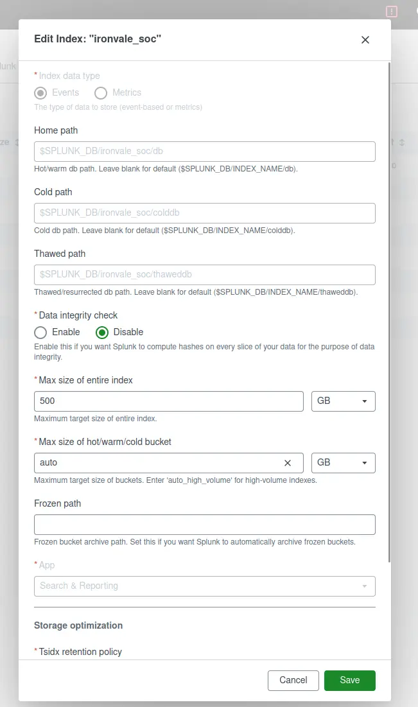

__New index named `ironvale_soc`__

### (2) Add the data and assign it to the appropriate index
We have 4 data sources which are
- `auth.log` 
- `endpoint.json`
- `firewall.log`
- `proxy.log`
We want to ingest these data and assign it to the `ironvale_soc` index with custom source types as follows,
- `auth.log` → `ironvale:auth`
- `endpoint.json` → `ironvale:endpoint`
- `firewall.log` → `ironvale:firewall`
- `proxy.log` → `ironvale:proxy`

We can do this through `Settings > Add Data > Upload` and as we run through the wizard we will see a `Set Source Type` step which we will save as a new name according to the file name. Below, is an example for `auth.log`.

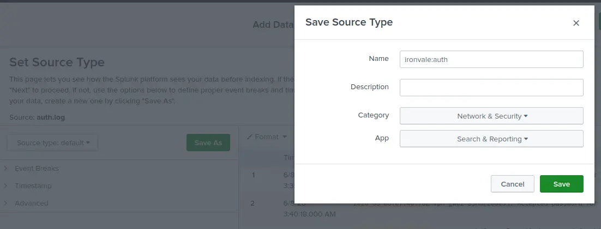

__Setting custom source type__

Then we just leave the host value as default for now and change the index to the one we just created.

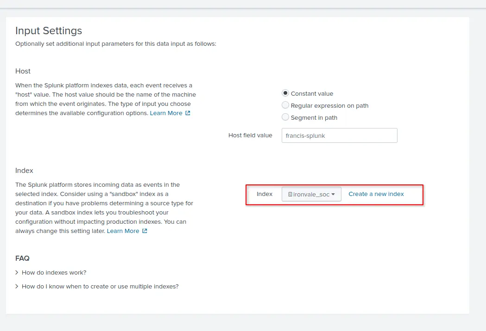

__Setting index__

Which  gives us this review and we can do the same for the rest.

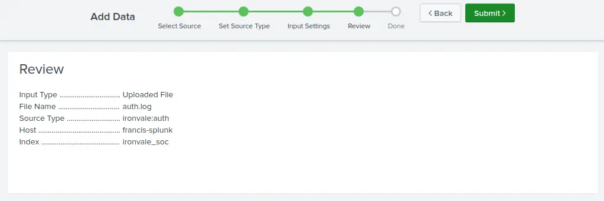

__Data Review__

### (3) Verify result from conf files

We can verify what indexes and logs are configured through the `indexes.conf` and `props.conf`  found in the `local` folder of the targeted app which in this case was just the default Splunk search app.

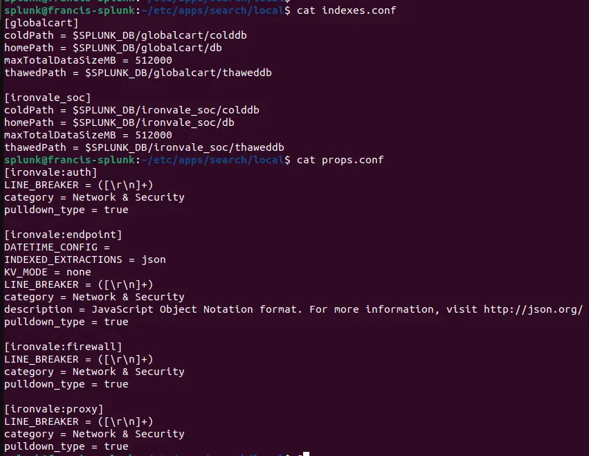

__`props.conf` and `indexes.conf` values__

We can also verify through `| metadata type=sourcetypes index=ironvale_soc` which gives us the following,

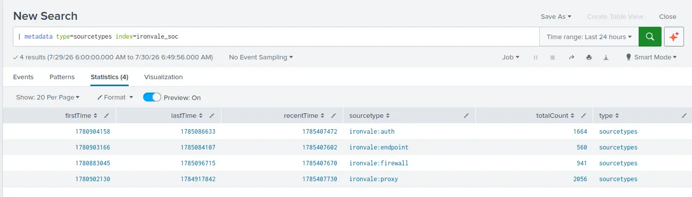

__Metadata of source types__

---

## Q2 — Splunk Basics: apps, indexes, and permissions (5%)
>Your SOC lead wants this dataset kept out of the default Search & Reporting workspace other teams poke around in. Create a new app (or workspace) scoped to SOC work, and explain in a sentence or two: what's the actual difference between an *index* and a *sourcetype* here, and why does putting this in a dedicated app/permission scope matter for a bank's data?

Let’s first answer the question on the distinction between index and a sourcetype, and why does putting this in a dedicated app/permission scope matter for a bank’s data. An index is where the actual data is stored whereas a sourcetype is a metadata tag that tells Splunk how to process data. The key difference in this context is that when we want to restrict who can view what data, we will apply role based access control on the indexes someone is allowed to search in, not on what source types.

It is important to put these information in a dedicated app and set proper role permissions because we need to tightly control who is able to view what data. Creating a dedicated app only solves one problem which is to control who can see the app and the related user interface, it does not prevent anyone from actually querying and interacting with the underlying index data. 

To limit who can search the index data we need apply role-based access control that limits what indexes can be searched by a given role. These two controls must be applied together and are fundamental in ensuring that  any single role is only allowed to view data that is required to fulfil their job function and nothing more. This is paramount in a banking context where access must not only follow least-privilege but be demonstrably enforced, since examiners and auditors will test whether restricted data is actually unreachable by unauthorised roles, not just hidden from view. For example, an analyst from the investment banking team should not be able to see network and security related data, only the SOC analyst should be able to see this.

Let’s now create the dedicated app as well as the appropriate permissions.

### (1) Edit base roles permissions
The base role permissions `power` and `user` need to be properly configured as subsequent roles we create will inherit from these roles.
By default, the capabilities of these roles are restrictive enough to be left as is but we should ensure that the searchable indexes for both roles are set appropriately.

For the `user` role we will just allow it to be included and default to the `main` index. As seen below,

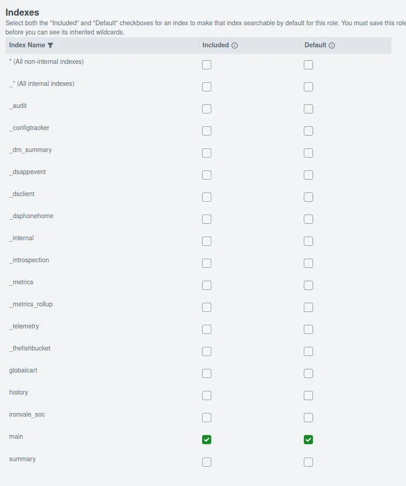

__Allowed Indexes for `user`__

For the `power` role we will allow the following indexes,

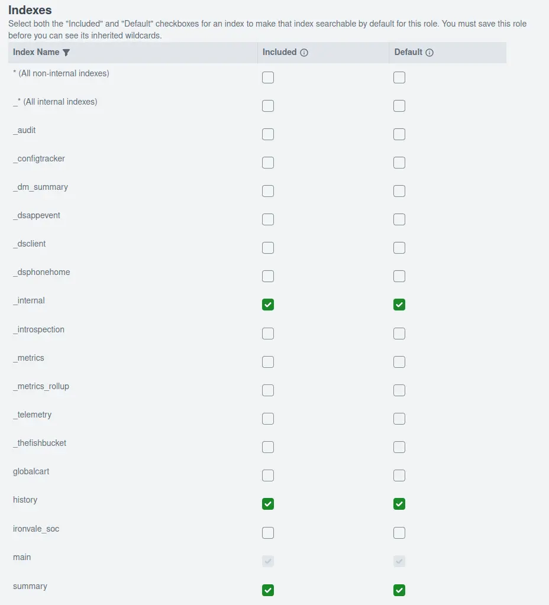

__Allowed indexes for `power`__

### (2) Create `ironvale_soc_analyst` role
We will now create an `ironvale_soc_analyst` role and make it inherit from `power`.
`power` is appropriate here because the job function of a SOC analyst relies on the usage of scheduling reports and alerts.
Then we just add the `ironvale_soc` index to this role’s allowed indexes.

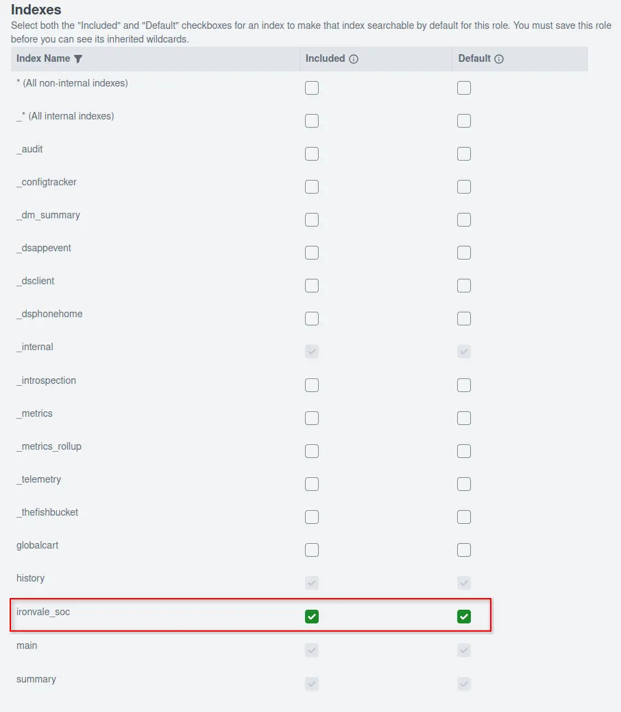

__Allowed indexes for `ironvale_soc_analyst`__

We have not created the app yet but once we have, we should go under the `Resources` in this role and set the default app as `ironvale_soc` or whatever app name we have set. 

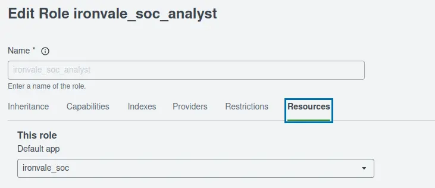

__Setting default app for `ironvale_soc_analyst`__

### (3) Creating the app and setting permissions
The creation of the app is straightforward through the `Manage Apps > Create App`.
We will name the app and home folder `ironvale_soc` and leave the rest of the fields default.

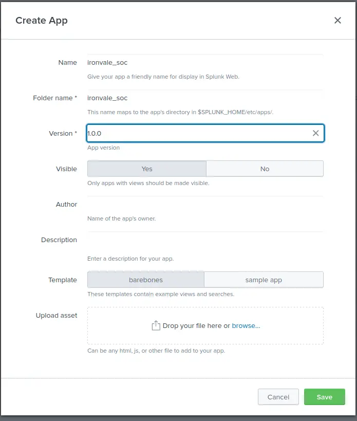

__Creating the app__

Then we just set the permissions appropriately,

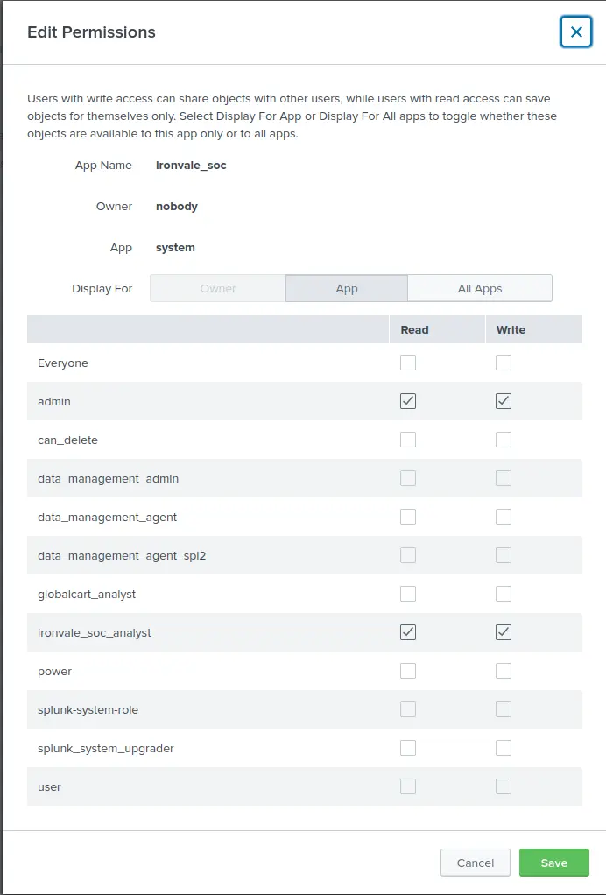

__Configuring app permissions__

### (4) Creating a user account with the appropriate role 
Let’s also create a new user account `jane` which will have the `ironvale_soc_analyst` role.

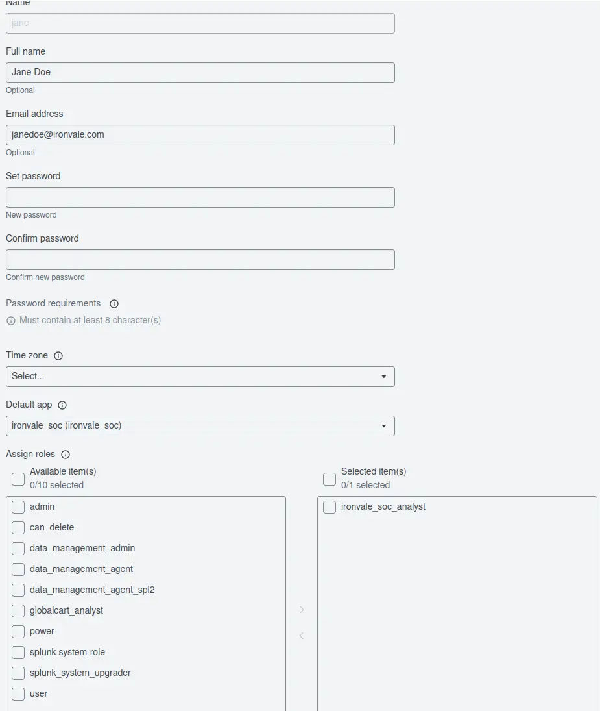

__Account information about `jane`__

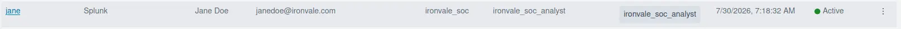

__Active `jane` user account__

---

 ## Q3 — Basic Searching: booleans & wildcards (22%)
>Before diving into incidents, get a feel for the noise floor. Find every failed login (`action` isn't a real field yet in `auth.log` — you're searching raw text) where the message indicates a failed password, **excluding** anything sourced from the internal `10.50.0.0/16` range, using a wildcard on the octets rather than typing out every possibility. Combine this with an explicit `OR` to also catch `PAM: Maximum authentication attempts` lockout messages.

There are two ways to exclude anything source from the internal `10.50.0.0/16` range.
One of them is using `cidrmatch()` and the other is using `match` with wildcards on the octets.
We will go through both in this question as well as bin `_time` to 1 minute to see if anything interesting emerges.

### (1) Using `cidrmatch()`

```
index="ironvale_soc" sourcetype="ironvale:auth" ("failed pass*" OR "PAM: Maximum*")
| bin span=1m _time
| rex field=_raw "^\S+ (?<vpn_name>[a-zA-Z0-9-]+) \S+\: (?<action>.+?) for (?<user>\S+) from (?<src_ip>[0-9.]+)( port (?<port>\d+) ssh\d$)?"
| where NOT cidrmatch("10.50.0.0/16",src_ip)
| stats count by src_ip, _time, vpn_name, user, action
```

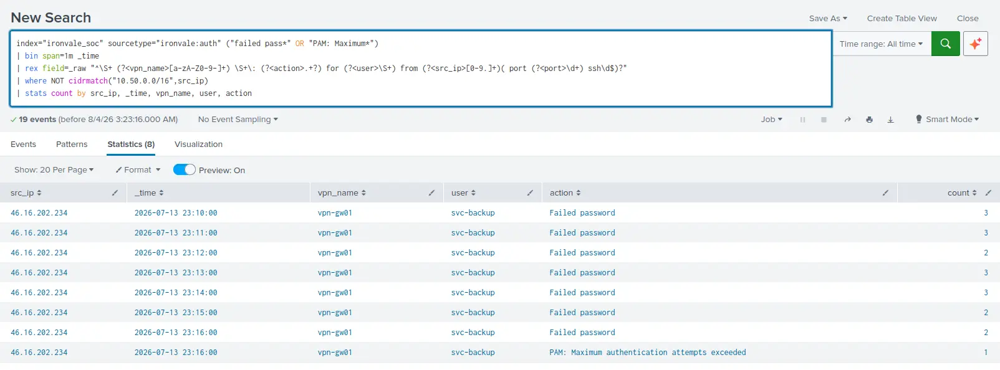

__Query result `cidrmatch()`__

### (2) using `match()`

```
index="ironvale_soc" sourcetype="ironvale:auth" ("failed pass*" OR "PAM: Maximum*")
| bin span=1m _time
| rex field=_raw "^\S+ (?<vpn_name>[a-zA-Z0-9-]+) \S+\: (?<action>.+?) for (?<user>\S+) from (?<src_ip>[0-9.]+)( port (?<port>\d+) ssh\d$)?"
| where NOT match(src_ip,"10.50.*.*")
| stats count by src_ip, _time, vpn_name, user, action
```

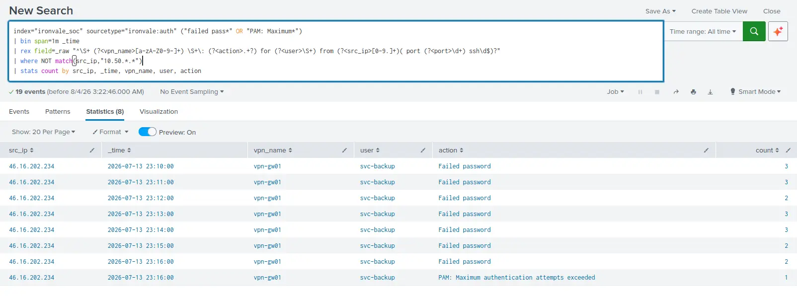

__Query result using `match()`__

---

## Q4 — Basic Searching: time range & job settings (22%)
>Your SOC lead asks: "how does last week's failed-login volume compare to the week before?" Answer using the time range picker (not `earliest=`/`latest=` typed by hand) to run the same search across two different weeks. Then open the Job Inspector on one of those searches and report back the scan count vs. the event count returned — and explain in one sentence why those two numbers can differ.

### (1) Determining last week’s failed-login volume compared to the week before
First we do a `rex` to extract the needed fields 

```
index="ironvale_soc" sourcetype="ironvale:auth"
| rex field=_raw "^\S+ (?<vpn_name>[a-zA-Z0-9-]+) \S+\: (?<action>.+?) for (?<user>\S+) from (?<src_ip>[0-9.]+) port (?<port>\d+) ssh\d$"
```

Then we refine the time range to between the start of the week before the last one and the end of the last week.
Assuming the SOC lead asked this question on `07/31/2026`, the end of last week would be `07/26/2026`.
Therefore, we will limit the time range using the date range picker to be between `07/13/2026` and `07/26/2026`.

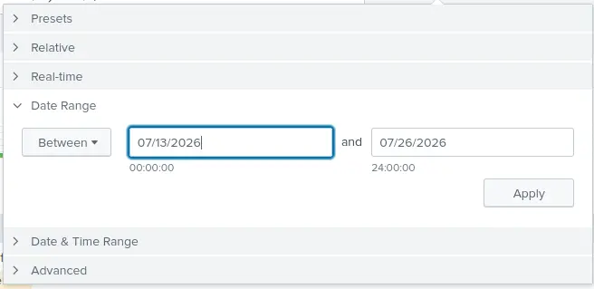

__Setting time range__

With the time range set we can compare the failed-login volume using the following query,

```
index="ironvale_soc" sourcetype="ironvale:auth"
| rex field=_raw "^\S+ (?<vpn_name>[a-zA-Z0-9-]+) \S+\: (?<action>.+?) for (?<user>\S+) from (?<src_ip>[0-9.]+) port (?<port>\d+) ssh\d$"
| where action like "%Failed pass%"
| timechart span=1d count as "Failed Logins"
| timewrap 1w
```

This charts the failed logins by time binned by days and compares the last week with the week before it.

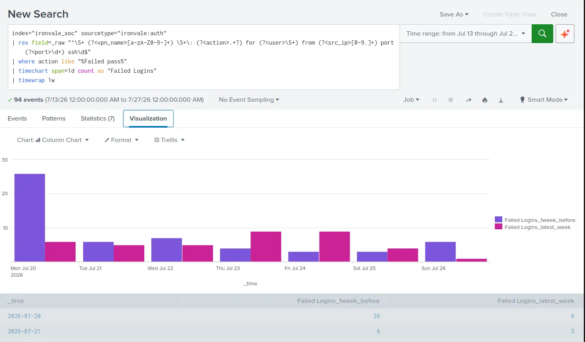

__Failed logins comparison__

This shows a abnormal spike in failed logins on `Tue Jul 14`, the Tuesday 1 week before.
The current query shows all failed logins including `src_ip`s that are from the internal network `10.50.0.0/16`.
If we add `| where NOT cidrmatch("10.50.0.0/16",src_ip)` we will see the following,

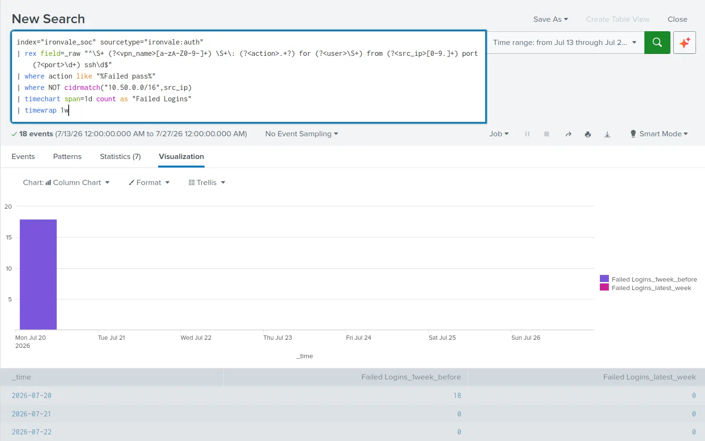

__Spike in failed logins originating from outside internal network__

This means that the spike in failed logins in that week was from an IP address that originated from outside the network.

### (2) Event Count vs Scan Count
Assuming our search is 

```
index="ironvale_soc" sourcetype="ironvale:auth"
| rex field=_raw "^\S+ (?<vpn_name>[a-zA-Z0-9-]+) \S+\: (?<action>.+?) for (?<user>\S+) from (?<src_ip>[0-9.]+) port (?<port>\d+) ssh\d$"
| where action like "%Failed pass%"
| where NOT cidrmatch("10.50.0.0/16",src_ip)
| timechart span=1d count as "Failed Logins"
| timewrap 1w
```

We can inspect job through the job drop down to compare the event count vs scan count.
Navigating to search job properties, we will be able to see the following,

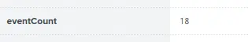

__Query’s Event Count__

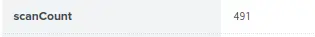

__Query’s Scan Count__

Notice how the scan count is `491` whereas the event count is `18`. This is because the scan count is the number of raw events that Splunk had to physically read off disk for the given time range/index before any other search filtering terms are applied. Whereas, the event count is how many of those raw events actually match the search criteria after filtering. This is what causes the disparity in value between these two fields as the initial event-generating command retrieved a lot more events than what we filter down to.

Therefore, we can optimise this query by moving the filter for `Failed pass` to the event-generating command such that query becomes 

```
index="ironvale_soc" sourcetype="ironvale:auth" "failed pass*"
| rex field=_raw "^\S+ (?<vpn_name>[a-zA-Z0-9-]+) \S+\: (?<action>.+?) for (?<user>\S+) from (?<src_ip>[0-9.]+) port (?<port>\d+) ssh\d$"
| where NOT cidrmatch("10.50.0.0/16",src_ip)
| timechart span=1d count as "Failed Logins"
| timewrap 1w
```

Which cuts down the scan count to `94` but the event count remains at `18`.

---

## Q5 — Using Fields: interesting fields sidebar (20%)
>Run a plain search over `sourcetype=ironvale:firewall` and, separately, over `sourcetype=ironvale:auth`. Open the **Interesting Fields** sidebar for each. List which fields Splunk found automatically for each sourcetype, and explain why the two lists look so different given what you know about the raw formats.

Let’s first compare the two searches side by side,

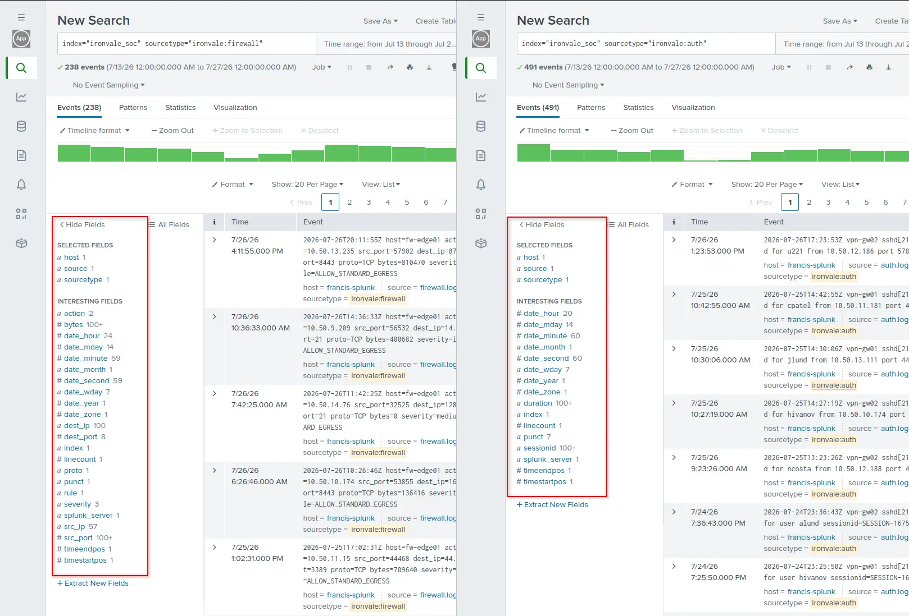

__Side by side comparison of the two source types__

If we look at the interesting fields for `ironvale:firewall`, we can see that it has more interesting fields than that of `ironvale:auth`. 

This is because Splunk’s default field extraction managed to automatically find numerous key value pairs at search time in the `ironvale:firewall` logs such as `src_ip` and `src_port`. The raw format of `ironvale:firewall` enables this by having clean `key=value` pairs in each event.
On the other hand, the raw format of `ironvale:auth` does not consist of any clean `key=value` pairs, resulting in Splunk being unable to extract key data like `src_ip` , port etc.

---

## Q6 — Using Fields: regex extraction with `rex` (20%)
>`auth.log` never gives you a clean `user` or `src_ip` field automatically — the text is freeform. Use `rex` to pull `user`, `src_ip`, and `port` out of the raw `_raw` text for failed-login events, then use your extracted fields to count failed logins by `user`, sorted descending.

We have actually already done this in `Q3` and we can view the values in table using the query below,

```
index="ironvale_soc" sourcetype="ironvale:auth" ("failed pass*")
| bin span=1m _time
| rex field=_raw "^\S+ (?<vpn_name>[a-zA-Z0-9-]+) \S+\: (?<action>.+?) for (?<user>\S+) from (?<src_ip>[0-9.]+) port (?<port>\d+) ssh\d$"
| table user,src_ip,port
```

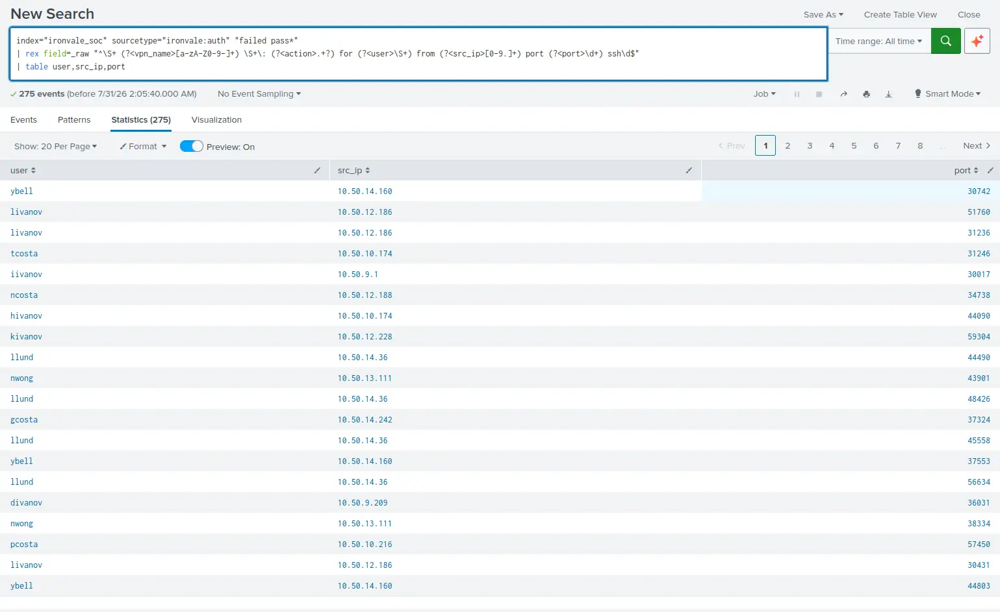

__Extracted fields and values in a table__

We then replace table with stats in our query so we can count failed logins by user in descending order.

```table user,src_ip,port
index="ironvale_soc" sourcetype="ironvale:auth" ("failed pass*")
| bin span=1m _time
| rex field=_raw "^\S+ (?<vpn_name>[a-zA-Z0-9-]+) \S+\: (?<action>.+?) for (?<user>\S+) from (?<src_ip>[0-9.]+) port (?<port>\d+) ssh\d$"
| stats count as "Failed Logins" by user
| sort -"Failed Logins"
```

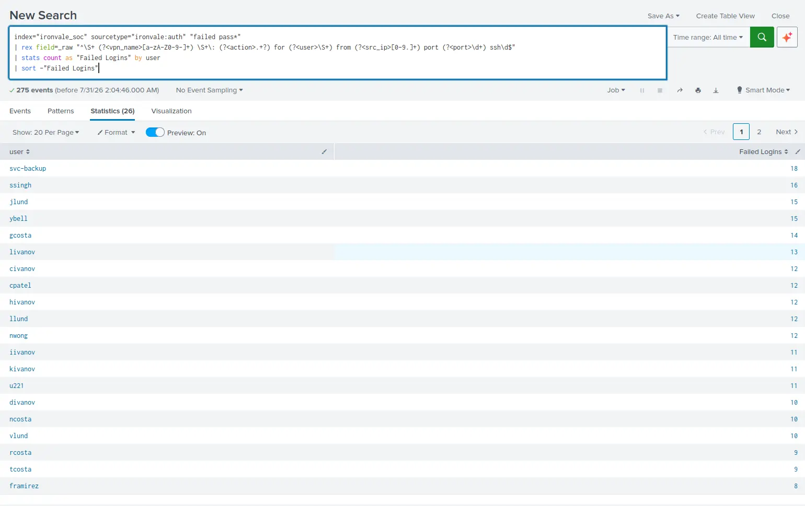

__Failed login count by user sorted descending__

Which tells us that the user `svc-backup` has the most failed logins.

---

## Q7 — Using Fields: permanent field extraction via delimiters (20%)
>`proxy.log` has no header row and no key=value pairs — just pipe-delimited positional fields. Use the Field Extractor (delimiter method) to build a **permanent** extraction for `sourcetype=ironvale:proxy` that names all nine columns (`req_time`, `proxy_host`, `src_ip`, `user`, `method`, `url`, `status`, `bytes`, `user_agent`). Save it, then confirm it works by finding the top 10 most-requested domains — you'll need `rex` (or `eval`+`split`) on top of your new `url` field to isolate just the hostname.


### (1) Create the extraction using the Field Extractor Wizard
For this we just search for the source type first using the following query,

```
index="ironvale_soc" sourcetype="ironvale:proxy"
```

Then go through the field extraction wizard making sure to select `delimiters > pipe`. Then we rename each field to what is required in the question,

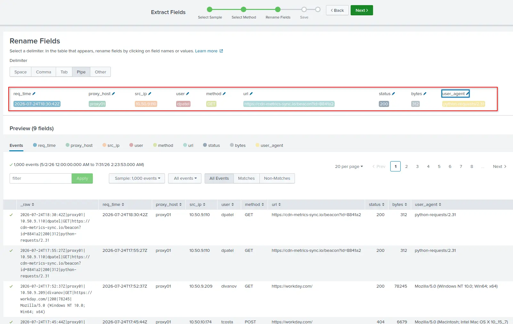

__Renaming fields__

Then we save the extraction.

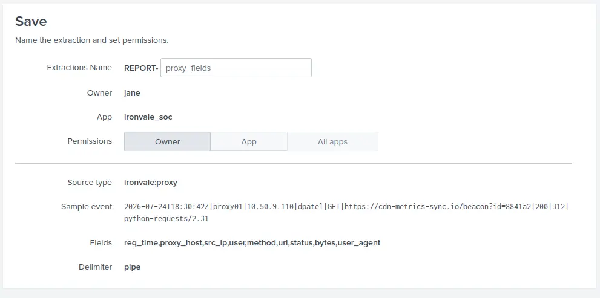

__Saving the extraction__

### (2) Find Top 10 most-requested domains
With the new fields we can do this with the following query
```
index="ironvale_soc" sourcetype=ironvale:proxy
| rex field=url "(?:https?:\/\/)?(?<domain>.*?)\/"
| stats count by domain
| sort -count limit=10
```

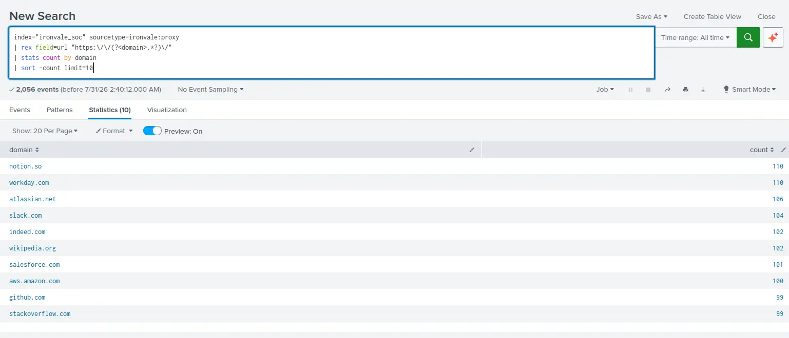

__Top 10 most-requested domains__

---

## Q8 — Using Fields: tags & event types (20%)
>Tag every `auth.log` failed-login event (however you identify them) with the tag `failed_auth`. Then create an **event type** called `bruteforce_window` that captures a burst of failed logins from a single source in a short window (you decide the exact search that defines "burst" — document your reasoning). Confirm both work by searching `tag=failed_auth` and `eventtype=bruteforce_window` separately.

### (1) Create field extraction for `ironvale:auth`
Let’s create a persistent field extraction that is able to capture all the relevant fields in logs that 
- Handle accepted or failed passwords
- Session closed
- PAM
We will base the regex we are about to create on the following example logs 

```
2026-07-14T03:16:59Z vpn-gw01 sshd[21656]: PAM: Maximum authentication attempts exceeded for svc-backup from 46.16.202.234
2026-07-26T17:23:53Z vpn-gw02 sshd[21522]: Failed password for u221 from 10.50.12.186 port 57834 ssh2
2026-07-24T17:58:14Z vpn-gw02 sshd[21381]: Accepted password for jlund from 10.50.13.111 port 46344 ssh2 sessionid=SESSION-1674
2026-07-24T23:36:43Z vpn-gw02 sshd[21384]: session closed for user alund sessionid=SESSION-1675 duration=18947s
```

Generalising the structure, we will get something like this 

```
time <vpn> <pid>: <action> for <user> from <src_ip>
time <vpn> <pid>: <action> for <user> from <src_ip> port <port> ssh2
time <vpn> <pid>: <action> for <user> from <src_ip> port <port> ssh2 sessionid=<session_id>
time <vpn> <pid>: <action> for user <user> sessionid=<session_id> duration=<duration>

```

We will use the following regex.

```
^\S+\s+
(?<vpn>[^ ]+)\s+
(?<pid>[^:]+):\s+
(?<action>.*?)\s+
for\s+
(?:user\s+)?
(?<user>[a-zA-Z0-9_-]+)
(
	\s+
	(?:from\s+)(?<src_ip>\d{1,3}\.\d{1,3}\.\d{1,3}\.\d{1,3})
	((?:\s+port\s+)(?<port>\d+)\s+(?<protocol>[a-zA-Z\d]+))?
)?
(\s+(?:sessionid=)(?<session_id>SESSION-\d+))?
(\s+(?:duration=)(?<session_duration>\d+)s)?
```

Then just collapse it into a single line

```
^\S+\s+(?<vpn>[^ ]+)\s+(?<pid>[^:]+):\s+(?<action>.*?)\s+for\s+(?:user\s+)?(?<user>[a-zA-Z0-9_-]+)(\s+(?:from\s+)(?<src_ip>\d{1,3}\.\d{1,3}\.\d{1,3}\.\d{1,3})((?:\s+port\s+)(?<port>\d+)\s+(?<protocol>[a-zA-Z\d]+))?)?(\s+(?:sessionid=)(?<session_id>SESSION-\d+))?(\s+(?:duration=)(?<session_duration>\d+)s)?
```

We then use this regex to create the field extraction by opting to edit the regex in the wizard as shown below,

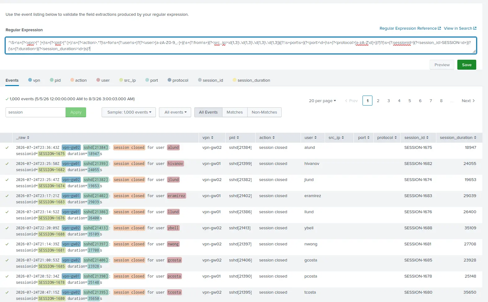

__Creating the generic field extraction__

Then we just save the field extraction with the suggested name

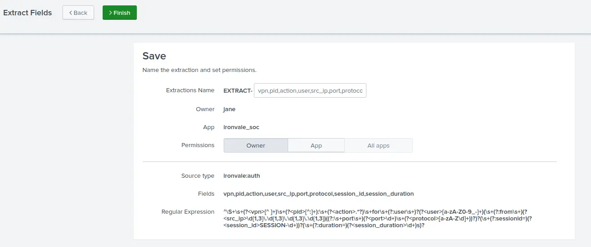

__Saving the field extraction__

### (2) Creating the tag 

To do this we just set a tag `failed_auth` for the action field where `action=Failed password`

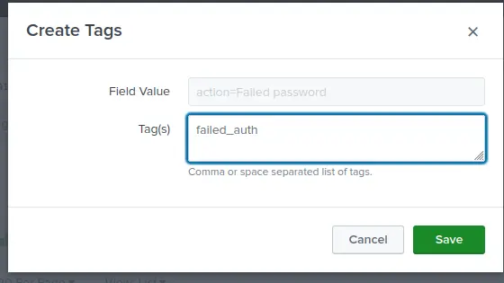

__Creating `failed_auth` tag__

### (3) Creating the event type
We first define a base search for the event type `bruteforce_window` which in this case we would choose it to be,

```
index="ironvale_soc" sourcetype="ironvale:auth" (tag=failed_auth OR "PAM: Maximum*")
```

The query consists of the newly created tag as well as a match on `"PAM: Maximum*"`, the match on `PAM` allows us to find logs where the authentication is being denied outright due to having failed too many attempts. 

The newly created tag `failed_auth`  is used in the query as this makes it so we can expand the criterion for what constitutes a `failed_auth`later on without changing the event type. This makes it more convenient for us SOC analyst as all we have to do is filter for `eventtype="bruteforce_window"` to get all matching failed authentication attempts. 

Then save this base search as event type `bruteforce_window`

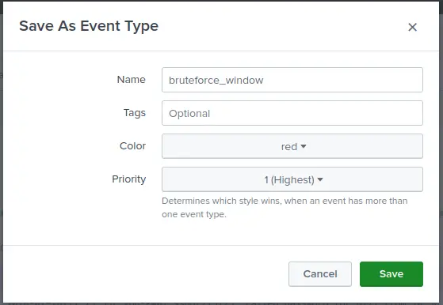

__Saving event type__

### (4) Verifying tag and event type was created 

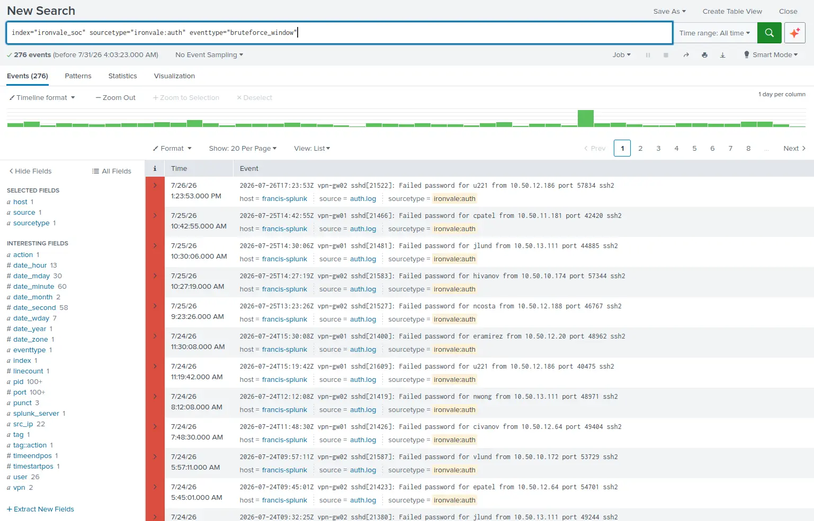

__Event type query results__

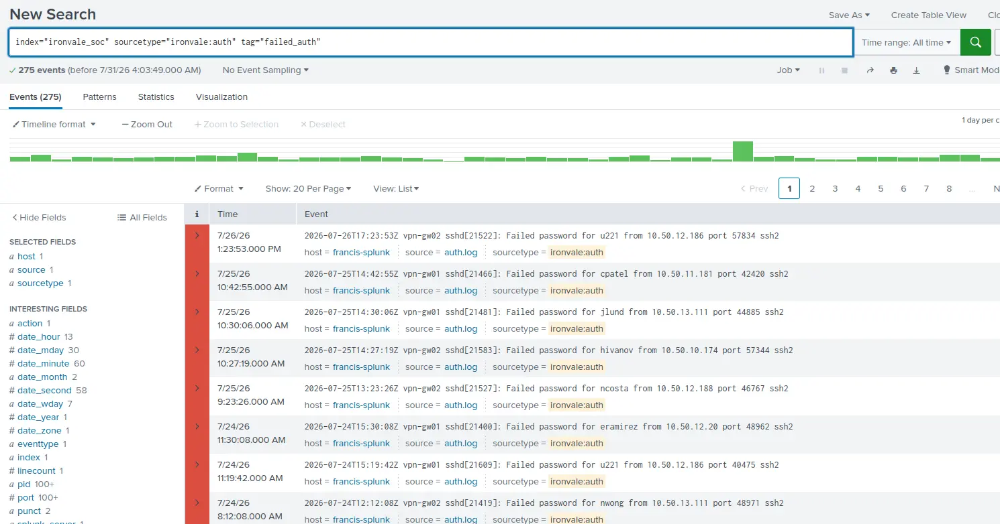

__Tag query results__

### (5) Why is the event type definition created the way it is

The base query for the event type `bruteforce_window` is 

```
index="ironvale_soc" sourcetype="ironvale:auth" (tag=failed_auth OR "PAM: Maximum*")
```

The reason why we want to create an event type is because we want to have a reusable label that groups all events that would fall under the category of `bruteforce_window`. This allows us to combine matching tags, wild card matching on specific terms and other filtering criteria to retrieve a complete set of events that are relevant to determining a brute force window.

However, this event type just retrieves all events of that type, it does not determine where an actual brute force is taking place and of what IP. We need to use the event type together with other transformations like the following query,

```
index="ironvale_soc" sourcetype="ironvale:auth" eventtype="bruteforce_window"
| sort _time
| streamstats time_window=5m count as failures by src_ip
| where failures>5
| table _time, src_ip, failures
```


---

## Q9 — Search Language Fundamentals: `transaction` (15%)
>Every successful VPN login in `auth.log` has a matching "session closed" event sharing the same `sessionid=` value. Extract `session_id` (permanent field extraction or `rex`), then use `transaction session_id` to reconstruct each session and calculate the average session duration in hours. Does the `duration=` value embedded in the logout line agree with what `transaction` calculates? Why might they differ slightly?

Having already created the field extraction in `Q8`, we can just use the extracted fields and their values here.
### (1) Transaction

```
index="ironvale_soc" sourcetype="ironvale:auth" session_id=*
| transaction session_id
| eval duration_h=(duration/60/60), session_duration_h=(session_duration/60/60)
| stats avg(duration_h) as "Txn Duration in Hours" , avg(session_duration_h) as "Session Duration in Hours"
```

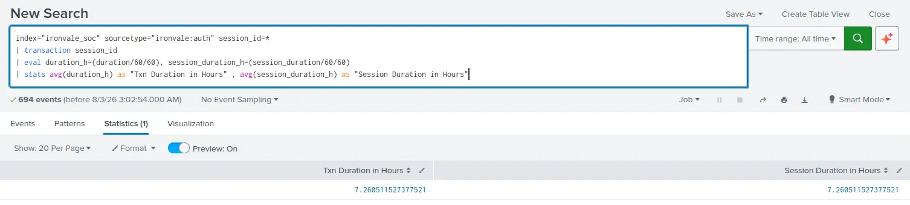

__Average duration of session in hours__

```
index="ironvale_soc" sourcetype="ironvale:auth"
| transaction session_id
| where session_duration != duration
```

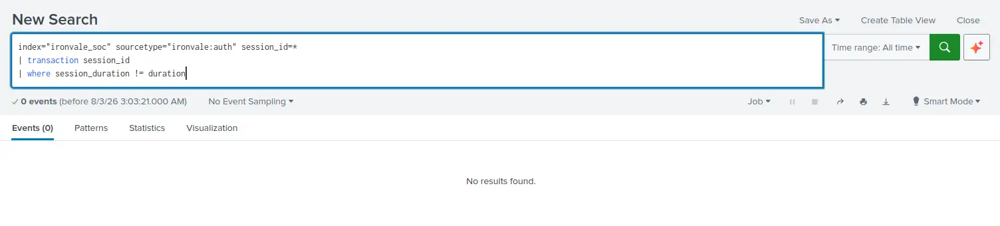

__Transactions where duration calculated by `transaction` does not match the `session_duration`__

> [!note]
>  When using transaction we should note that the calculated duration from invoking transaction will clobber any existing duration field. Therefore, the original duration values for any given event will actually be overwritten.


### (2) Does `duration` agree with `session_duration` and why?
In this dataset, the `session_duration` in the logs agrees with the `duration` calculated by `transaction`. 
We need to note though that this dataset is fabricated and that there are real cases where the duration calculated by `transaction` does not match the duration shown in `session_duration`. This is because the `session_duration` is calculated by PAM from its own reference of time, where as `duration` is calculated by `transaction` based on the `_time` field. It is possible for these two fields to drift from each other, hence the inconsistencies.

---

## Q10 — Search Language Fundamentals: `iplocation` (15%)
>Something set off a lockout alert a couple weeks back. Pull all failed logins in `auth.log`, extract `src_ip` , pipe into `iplocation src_ip`, and summarize count by `Country`. Is there one external IP responsible for a disproportionate share of failures? What does that pattern (many failures, tight time window, single source) usually indicate?

We can answer the question by doing the following query,

```
index="ironvale_soc" sourcetype="ironvale:auth" tag="failed_auth"
| iplocation src_ip
| stats count by Country,src_ip
```

Which gives us,

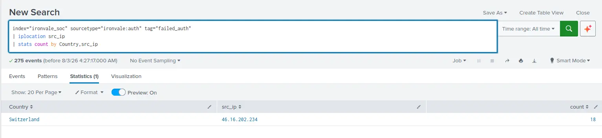

__Results of query__

This shows a single external IP address (an IP address that does not belong in the network `10.50.0.0/16`) originating from Switzerland accounting for 18 events tagged with `failed_auth`.

Given that we have an event type `bruteforce_window`, we can also use it in the following query to better illustrate excessive amount of failures.

```
index="ironvale_soc" sourcetype="ironvale:auth" eventtype="bruteforce_window"
| sort _time
| streamstats time_window=5m count as failures by src_ip
| where failures>5
| iplocation src_ip
| table _time, src_ip, City, Country , failures, action, user
```

Which gives us this,

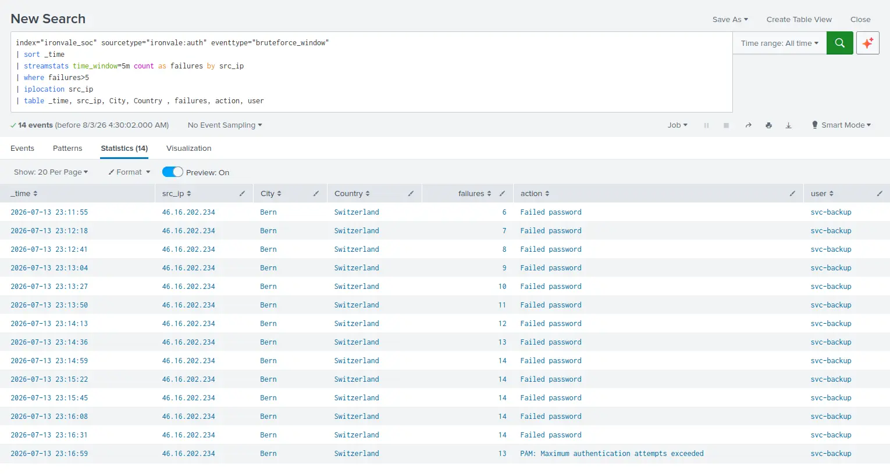

__Brute force window results with geographic location__

This behaviour is characteristic of a brute force attack and the results show that an external IP address `46.16.202.234` conducted a brute force attack on user `svc-backup` on `2026-07-13`.

---

## Q11 — Search Language Fundamentals: `chart` vs `timechart` (15%)
>Build a matrix — not a timeline — showing failed vs. successful logins in `auth.log` broken down by day of week. Since `sourcetype` alone won't separate success from failure within `auth.log`, first tag events as `login_success` or `login_failure` (`eval` + `case`/`match` against the raw text works), then use the **`chart`** command (not `timechart`) to produce a table of counts with `login_success`/`login_failure` as one axis and day-of-week as the other. Explain when you'd reach for `chart` instead of `timechart`.

### (1) Why chart over timechart

The question states that we are required to create a matrix of form,

| Day of Week | login_success | login_failure |
| ----------- | ------------- | ------------- |
| Monday      | x             | x             |
| Tuesday     | x             | x             |
| …           | …             | …             |

This task is not possible for `timechart` as its x-axis is hard coded to be the actual chronological `_time` buckets.
The question here is not asking us to bucket by `_time`, it is asking us to bucket by derived categorical labels which is just a set containing the names of the days in a week.

For instance, if our time range encompasses 2 weeks, then we would want a row in the matrix where it corresponds to `Monday` and the number of `login_failure` and `login_success` is actually the sum of each of these events that happened on both Mondays of each week. This is just not possible for `timechart` as it would treat the two Mondays in that 2 week time range as distinct points in time and not a single categorical label.

Therefore, we should use `chart` here.

### (2) Creating the desired matrix

Since, we already have a tag `failed_auth`, we can create another tag `successful_auth` as shown below to complement our existing one.

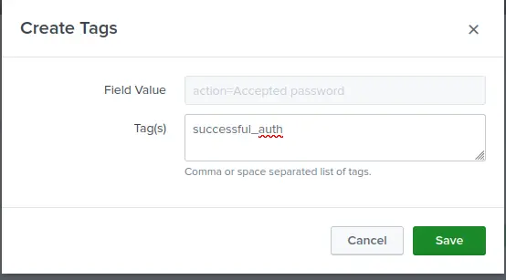

__Defining a tag for successful logins__

Then we do the following query to create the desired matrix,

```
index="ironvale_soc" sourcetype="ironvale:auth" (tag="failed_auth" OR tag="successful_auth")
| eval Date=strftime(_time,"%Y-%m-%d"), Day_of_Week=strftime(_time,"%A")
| chart count over Day_of_Week by tag
| rename failed_auth AS login_failure, successful_auth AS login_success
| eval sort_key=case(
Day_of_Week="Monday",1,
Day_of_Week="Tuesday",2,
Day_of_Week="Wednesday",3,
Day_of_Week="Thursday",4,
Day_of_Week="Friday",5,
Day_of_Week="Saturday",6,
Day_of_Week="Sunday",7)
| sort sort_key
| fields - sort_key
```

This query counts all events matching a tag grouped by the `Day_of_Week` categorical label then displays it in a matrix.
Additionally, the days of the week are sorted in order using `eval`, `case` and `sort` commands.

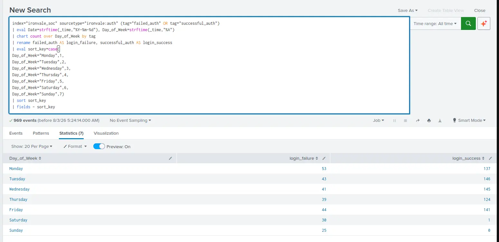

__Desired Matrix__

---

## Q12 — Basic Transforming Commands: `stats` (15%)
>Finance is worried about a potential large data transfer. Using `ironvale:firewall`, find the top 5 internal source IPs by total `bytes` sent over the whole window, with both `sum` and `avg` per IP, sorted by total descending. Anything jump out as way outside the normal range?

We can use the query to find the top 5 internal source IPs by total bytes sent over the whole window,

```
index="ironvale_soc" sourcetype="ironvale:firewall" 
| where cidrmatch("10.50.0.0/16",src_ip)
| stats sum(bytes) as total_bytes, avg(bytes) as avg_bytes by src_ip
| sort -total_bytes limit=5
| eval total_megabytes=round(total_bytes/1024/1024,2),avg_megabytes=round(avg_bytes/1024/1024,2)
| fields src_ip, *_megabytes
```

which gives us,

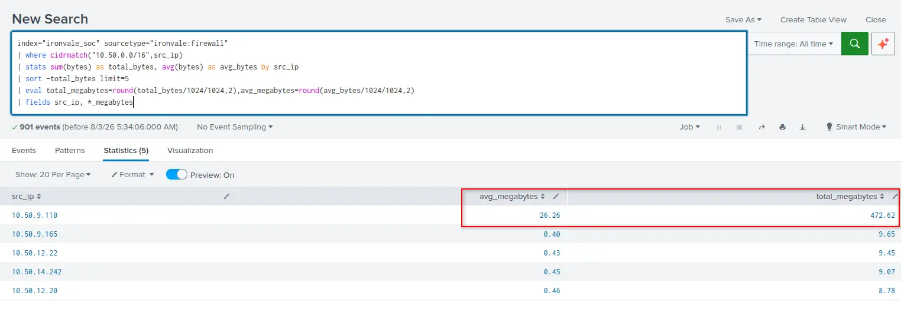

__Query results__

This shows us that `10.50.9.110` is transferring significantly more data than every other end point in the internal network.

---

## Q13 — Basic Transforming Commands: `top` / `rare` (15%)
>Two quick ones: which destination port gets blocked most often on the firewall? And separately, which `user_agent` string shows up *least* often in the proxy logs — rare enough that it might be worth a second look (automation tools rarely look like a real browser)?

### (1) Most blocked destination port on the firewall
We can find the most blocked destination port on the firewall by using the query,

```
index="ironvale_soc" sourcetype="ironvale:firewall" action=blocked
| top dest_port limit=1
```

which tells us that the most blocked destination port is port `21` which is the FTP port.

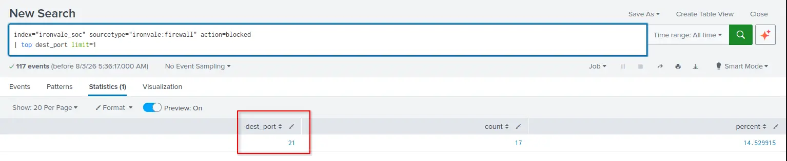

__Most blocked `dest_port`__

### (2) Rarest `user_agent` string on proxy
We can find which `user_agent` string shows up the least often by using the query,

```
index="ironvale_soc" sourcetype="ironvale:proxy" 
| rare user_agent limit=1
```

Which tells us the rarest `user_agent` string is `python-requests/2.31` which corresponds to a python library used to send HTTP requests. This implies the use of automation to make these requests to the proxy.

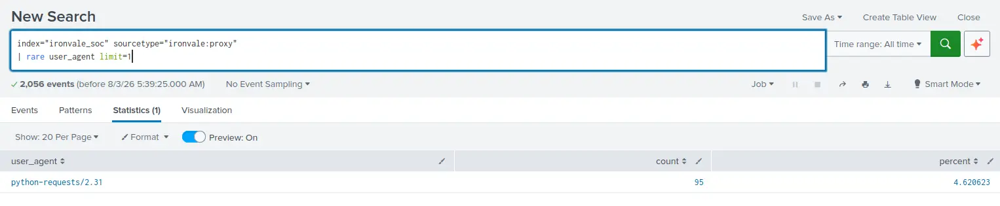

__Rarest `user_agent` string on proxy__

---

## Q14 — Reports & Dashboards: multi-panel build using Dashboard Studio (12%)
>Build a "SOC Daily Overview" dashboard that satisfy the following: 
>(1) a single-value panel pinned to a fixed **last 24 hours** window, showing count of `severity=critical` endpoint events, with a color threshold (green under 1, red at 1+)
>(2) a pie chart of `ironvale:firewall` events by `action`
>(3) a timechart of failed logins per day.
>(4) A table showing the top 10 failed logins by user and src_ip 
>(5) Add an interaction : Zooming into a time range in the failed logins time chart should filter the table panel showing the top 10 failed logins by user and src_ip. 

For this question we will use the dashboard studio in Splunk enterprise.


__New dashboard created, shared in app using dashboard studio__

### (1) Creating the Single value panel

We add a new single value visualisation to the dashboard, position it and size appropriately.
We then define the Title, Description and primary data source, as shown below,

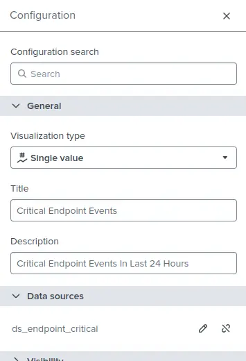

__Configuration of Single Value Visualisation__

The primary data source `ds_endpoint_critical` is built on query 

```
index="ironvale_soc" sourcetype="ironvale:endpoint" severity="critical" 
|  stats count
```

and has a static time range to `Last 24 hours` as shown below,

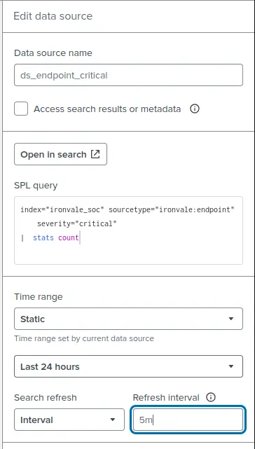

__`ds_endpoint_critical` primary data source configuration__

We also set the search refresh to be `Interval` at refresh interval `5m`.
We chose interval here instead of delay as we want this count to be a reliable search that happens every 5 minutes and since the underlying query is cheap, a basic stats count query scoped to the last 24 houts, it should run fast without little to no variance between run times.

We then navigate to the configuration of the visualisation under `Color and style` and set the major value colour to change to red if it is more than or equal to 1 or green if otherwise.

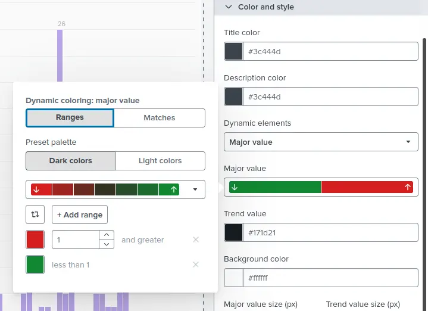

__Setting the colour for the major value__

### (2) Creating the pie chart of `ironvale:firewall` actions
We add a new pie chart visualisation, position and size it accordingly.
We then define a title, description and data source.

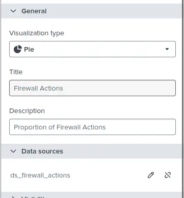

__Visualisation configuration__

The primary data source `ds_firewall_actions` is constructed as follows

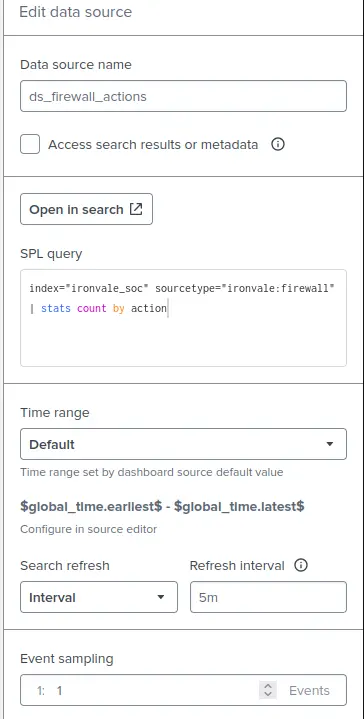

__`ds_firewall_actions` data source configuration__

Similarly, we set the search refresh to be interval and it refreshes every 5 minutes.
However, this time we set the time range to default to the global time range set by the global time picker of the dashboard. 
This would allow us to see the proportion of blocked to allowed firewall actions scoped to a defined time range.

### (3) Creating time chart of failed logins per day
We add the following visualisation, size and position appropriately.

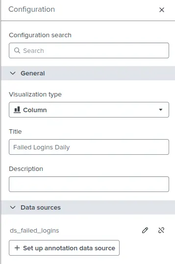

__Visualisation configuration__

The data source `ds_failed_logins` is configured as follows,

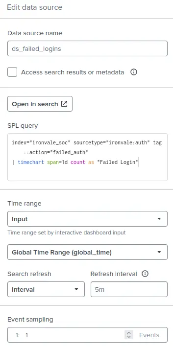

__`ds_failed_logins` data source configuration__

Then we create an interaction where on click it will set the time range token of the global time range.

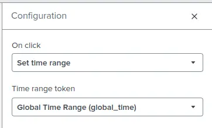

__Interaction to set time range__

This makes it so when we zoom into a particular time range, the global time range is updated which in turn updates the other visualisations that use that time range. In the case of this dashboard, the visualisations for firewall and top 10 failed logins will be updated by this interaction.

### (4) Creating table showing top 10 failed logins by user and IP
Create a new table visualisation and set the following configuration,

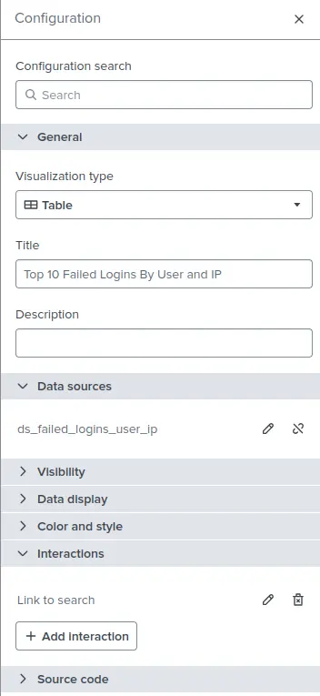

__Visualisation Configuration__

The data source `ds_failed_logins_user_ip` is defined as such

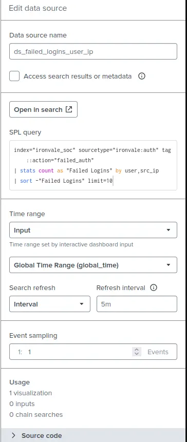

__`ds_failed_logins_user_ip` data source definition__

We also added an interaction where the user can click on a value and it will open the related search for the select value. The interaction is defined as follows,

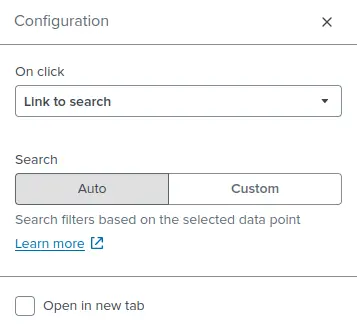

__Interaction definition__

### (5) Final dashboard result

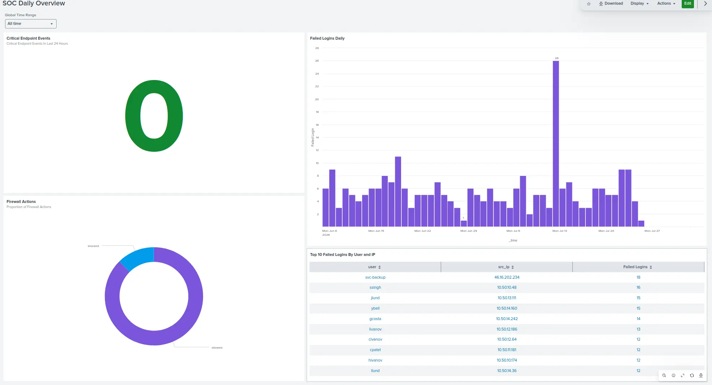

__Final dashboard result__

We can zoom in to the time range on the spike of failed logins as shown below,

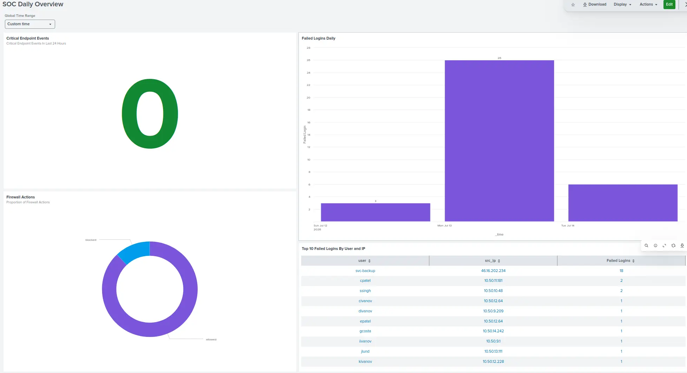

__Dashboard updated with targeted time range__

Which will show us that the `src_ip` `46.16.202.234` had 18 failed logins to the user `svc-backup` between `Sun, Jul 12 2026` to `Tue, Jul 14 2026`.

We can click the `src_ip` which will lead us to the related search,

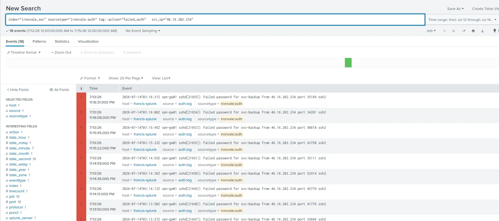

__Related search of `src_ip` with excessive failed logins__

---

## Q15 — Lookups: threat-intel enrichment (6%)
>Build a lookup CSV called `known_bad_ips.csv` with columns `ip` and `threat_type` (your call on what to put in it — but it should include the IP(s) responsible for the lockout pattern from Q10). Upload it, define the lookup, and write a search that enriches both `ironvale:auth` (on your extracted `src_ip`) and `ironvale:firewall` (on `src_ip`) with `threat_type`, then shows only events that matched an entry in the lookup.
### (1) Creating new lookup
We will create the csv first as shown below,

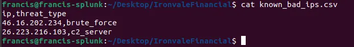

__Created `known_bad_ips.csv`__

> [!note]
> The IPs here are IPs that we have found to be suspicious. `26.223.216.103` caused the highest amount of blocked firewall actions, significantly more than every other IP. `46.16.202.234` caused the highest amount of login failures, significantly more than every other IP. However, the threat types here are not derived from a thorough investigation of the dataset, they are created by us to simulate threat intel that can be used to enrich our queries. They are not necessarily the ground truth of the threat type of an IP.


Then we just upload this lookup through the `Lookup table files > Add New ` wizard,

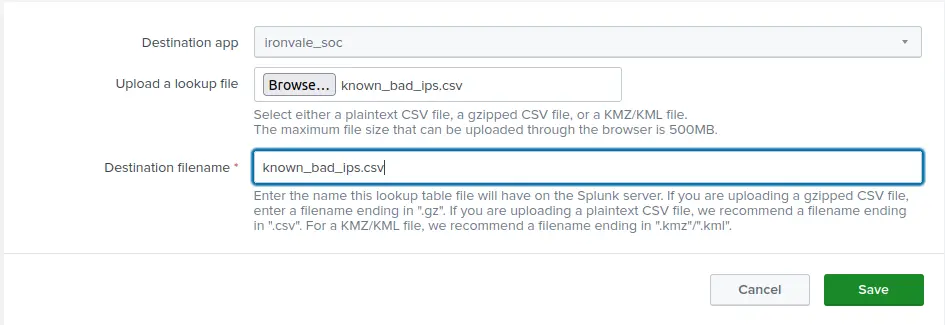

__Adding newly created csv as new lookup table file__

We can verify it is in by running the query

```
| inputlookup known_bad_ips.csv
```

Which shows,

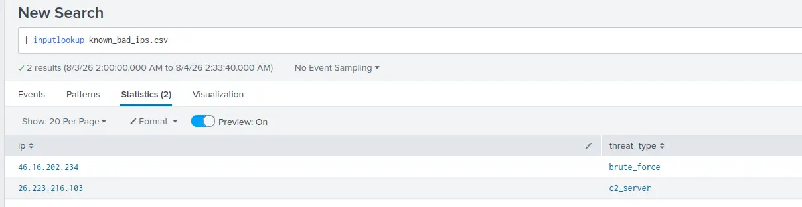

__Verifying lookup was loaded__

> [!note]
> We use a uploaded csv as the lookup table file in this question. However, a KV lookup will be preferred here as that form of lookup allows for CRUD operations. This is highly valuable for an ever evolving list such as this.


### (2) Enriching `ironvale:auth` and `ironvale:firewall` results

Using the following queries we can enrich our `ironvale:auth` and `ironvale:firewall` results

For `ironvale:auth`,

```
index="ironvale_soc" sourcetype="ironvale:auth" 
| lookup known_bad_ips.csv ip as src_ip OUTPUT threat_type
| search threat_type=*
| table _time,action,user,src_ip,threat_type
```

Which shows,

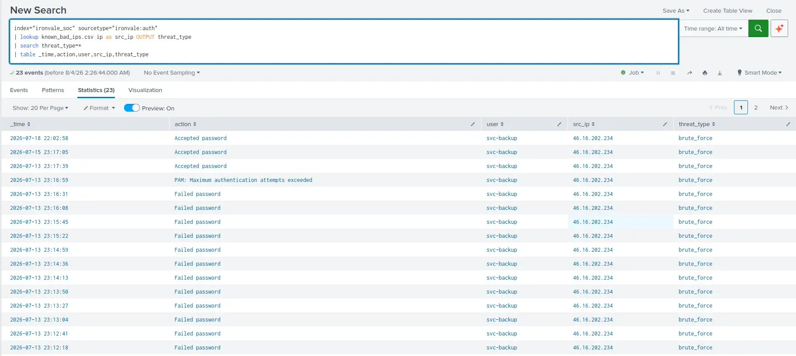

__Enriched `ironvale:auth` results__

Then similarly for `ironvale:firewall`,

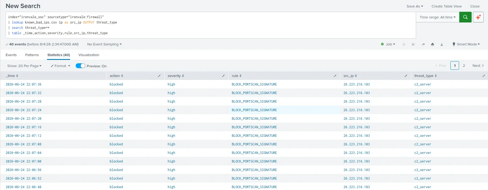

__Enriched `ironvale:firewall` results__

---

## Q16 — Scheduled Reports & Alerts (5%)
>Build a scheduled alert that fires when the same source IP produces 5+ failed logins within a 5-minute window (base it on your Q8 `bruteforce_window` event type, or write it fresh). Since the data is historical, use the "search all time, schedule the check" trick from before so it actually fires. Confirm it under Activity > Triggered Alerts, and add a "log event" and "add to triggered alerts" action with high severity.

### (1) Creating the alert

We first define the base query

```
index="ironvale_soc" sourcetype="ironvale:auth" eventtype="bruteforce_window" 
| sort _time
| streamstats time_window=5m count as failed_logins by src_ip
| where failed_logins>5
| stats max(failed_logins) as "Failed Logins in 5m" by src_ip
```

Then we save it as an alert, with the following configuration

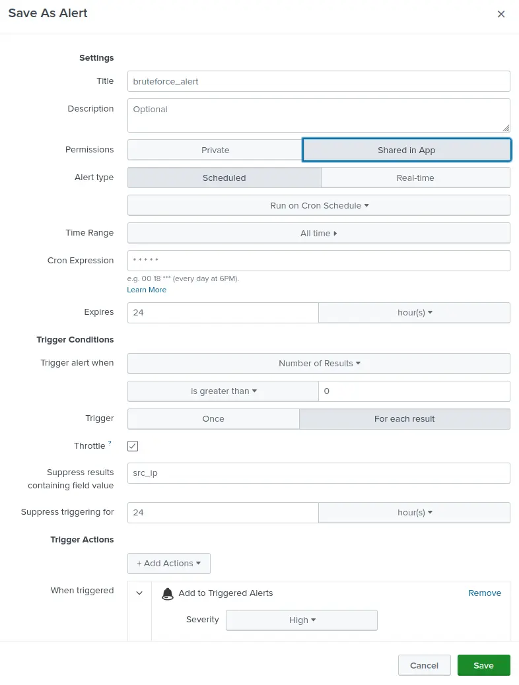

__Alert definition__


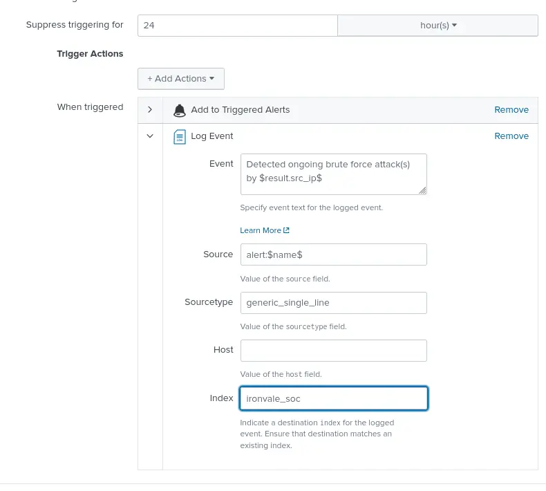

__Log event action definition__

### (2) Verifying alert fired
Since, we made it fire every minute through the cron schedule. We can check if the alert fired by searching `index="ironvale_soc" "brute"` which will show us the log event.

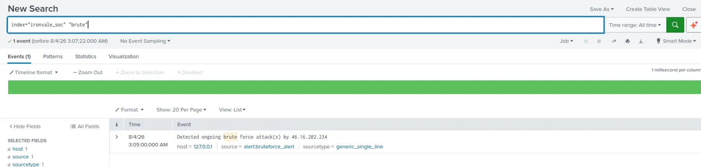

__Log event of alert__

We can also view it under triggered alerts as shown below,

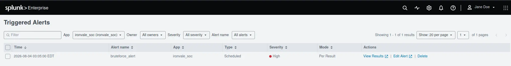

__Triggered alert__

---