#splunk #core-certified-user
# Scenario

**Lumeo Streaming**, a video-on-demand platform, has just hired you as a Business Intelligence Analyst. It's Q3 2026 and your director wants a data-driven story for the quarterly business review on Friday: (1) does the billing system actually agree with what the app tells customers about their own plan, (2) was there a service-quality incident anyone should know about, and (3) are any high-value customers at risk of churning?

The telemetry is still sitting in flat files, and it is deliberately messy: inconsistent casing, stray units, missing values. Normalising it is part of the analysis rather than a detour from it. The lab runs across six Splunk Power User areas: **Comparing Values**, **Result Modification**, **Correlation Analysis**, **Multivalue Fields**, **Knowledge Objects**, and **Data Models**.


Data can be found in [`data/`](data/).

## Dataset

All four files live in `LumeoStreaming/` next to this file. Suggested index: `lumeo_streaming` (call it whatever you like, just be consistent). These are all header-having CSVs — Splunk will auto-extract fields from the header row on upload, no field-extraction wizard needed this time.

| File                           | Suggested sourcetype   | Rows   | Notes                                                                                                                                                                                                              |
| ------------------------------ | ---------------------- | ------ | ------------------------------------------------------------------------------------------------------------------------------------------------------------------------------------------------------------------ |
| `stream_events.csv`            | `lumeo:events`         | ~8,700 | Per-session playback telemetry: `session_start` → `play`/`pause`/`buffer`/`error` events → `session_end`. `session_id` links related events into a session. Several fields are **deliberately messy** (see below). |
| `billing.csv`                  | `lumeo:billing`        | 450    | One row per customer per billing cycle (3 cycles: Jun/Jul/Aug 1). Clean `plan` field — ground truth against the app's messier `plan_tier_raw`.                                                                     |
| `support_tickets.csv`          | `lumeo:tickets`        | 235    | Customer support tickets. Not every customer has one.                                                                                                                                                              |
| `quarterly_revenue_matrix.csv` | `lumeo:revenue_matrix` | 6      | A finance-team export — **already a 2-D matrix** (Month × Region). Independent of the other three; exists specifically for `untable`/`xyseries` practice.                                                          |


**Messy fields in `lumeo:events`:**
- `plan_tier_raw` — inconsistent casing/spacing/format (`"basic"`, `"BASIC"`, `"STD"`, `"premium_plus"`, `"Premium+"`, etc.), mapping to four canonical tiers: `Basic`, `Standard`, `Premium`, `Premium Plus`.
- `bitrate_label` — only on `play` events: `"4500 kbps"`, `"2000kbps"`, `"720p-3000kbps"`.
- `watch_pct_raw` — only on `session_end`: `"87%"`, `"100%"`, `"N/A"`, or blank.
- `rating_raw` — sometimes on `session_end`: `"4 stars"`, `"5"`, `"3.0"`, `"n/a"`, or blank.
- `device` and `region` — occasionally blank.
- `error_code` — blank except on `error` events: `E1001` (Network Timeout), `E2002` (DRM License Error), `E3003` (Decode Failure), `E4004` (Auth Token Expired).

Not every session has a `session_end` event — some end abruptly on an unrecoverable error.

Each section below has **3 questions**, each a single, focused ask. Underneath each section is a short list of **extra practice** one-liners covering a couple more commands from that course — optional, no write-up expected, just run them and sanity-check the result.

---

# Part 1 — Comparing Values

## Q1 — Normalize plan tiers
`plan_tier_raw` has a dozen-plus raw spellings but only four real tiers. Use `eval` + `case()` (or `match()` inside `case()`) to produce a clean `plan_tier` field with exactly `Basic` / `Standard` / `Premium` / `Premium Plus`. Confirm you caught every variant: `stats count by plan_tier` should return exactly 4 rows.

> Hint: `case()` stops at the first match, so order conditions most-specific first, and add a trailing `1=1, "Unknown"` to catch anything missed.

The four basic plans offered by lumeostreaming are `Basic`, `Standard`, `Premium` and `Premium Plus`.
However, `plan_tier_raw` has multiple variants of the values related to a given plan and we can view these values through

```
index="lumeo" sourcetype="lumeo:events" | fieldsummary plan_tier_raw
```

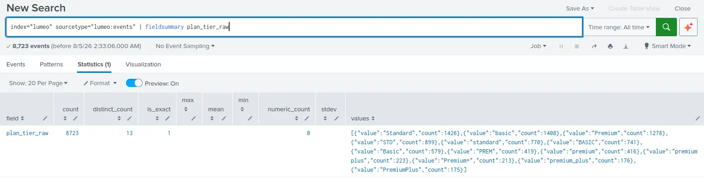

__List of values for `plan_tier_raw`__

Therefore, the mapping is as follows,

```
Basic : "basic", "BASIC"
Standard : "STD" 
Premium : "Premium", "PREM", "premium" 
Premium Plus : "premium plus", "premium_plus", "Premium+", "PremiumPlus"
```

We can then use `eval` and `case` to normalize the values as shown below,

```
index="lumeo" sourcetype="lumeo:events"
| eval plan_tier_raw= lower(plan_tier_raw)
| eval plan_tier= case(
plan_tier_raw=="premium+","Premium Plus",
in(plan_tier_raw, "basic"), "Basic",
in(plan_tier_raw, "standard","std"), "Standard",
in(plan_tier_raw, "prem","premium"), "Premium",
like(plan_tier_raw,"premium%plus"), "Premium Plus",
1=1,"Other"
)
| stats count by plan_tier
```

This results in the following normalized plan tiers

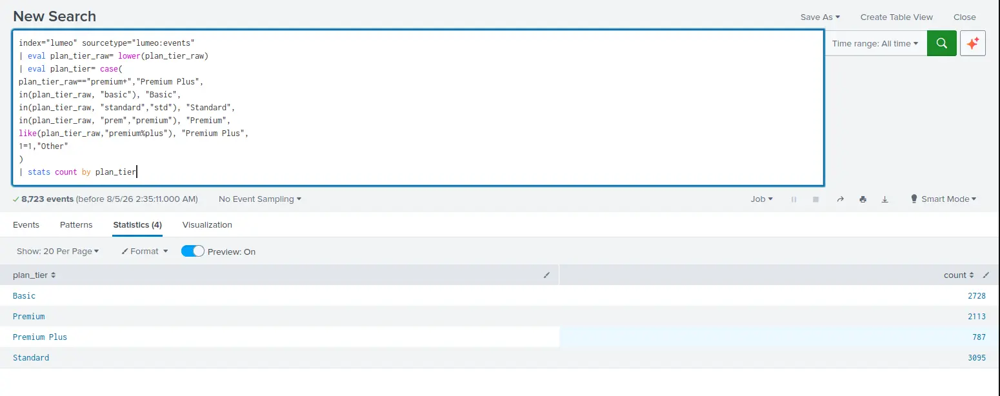

__Normalized `plan_tier`__

## Q2 — where, wildcards, and like()
Find all `play` events using a 1080p bitrate two ways: once with `where` + `like()`, and once by just trying `where bitrate_label="1080p*"`. The second one doesn't work the way you'd expect — in one sentence, why not?

> Hint: base-search wildcards (`bitrate_label=1080p*`) get expanded against raw text at index time; `where` is a post-filter that needs `match()` (regex) or `like()` (`%`/`_` wildcards) — a bare `=` in `where` doesn't support `*` at all.

We can find all `play` events using 1080p bitrate by using the following query,

```
index="lumeo" sourcetype="lumeo:events" event_type="play"
| where like(bitrate_label,"1080p%")
| fieldsummary bitrate_label, event_type
```


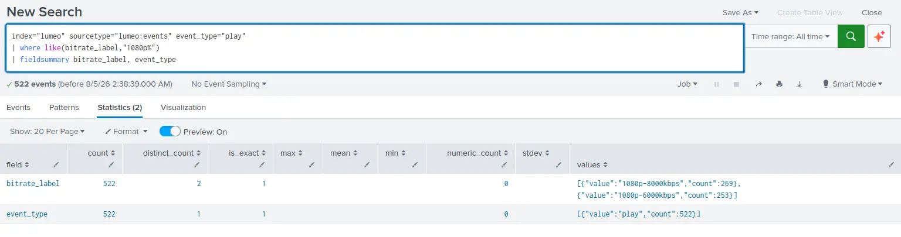

__All play events using 1080p bitrate__

`where bitrate_label="1080p*"` does not work because the wild card is wrong. The wildcard in a `where` command is `%` not `*`.  `*` is used in the `where` command as a multiplication operator.

## Q3 — fillnull and a simple quality flag
Replace blank `device` values with `"Unknown Device"` using `fillnull`. Then create a new field `qoe_flag` that's `"Poor QoE"` when `buffer_ms` > 5000 (else something else), and get a distinct count of `session_id` for the `"Poor QoE"` rows.

> Hint: `fillnull value=X field1 field2` fills multiple fields with the same replacement in one command.

We can fill in the null values using the command `| fillnul device value="Unknown Device"` then use `eval` with `if` to create a new field calledd `qoe_flag` that helps us to categorize events with a poor quality of experience. We can then verify our results using `fieldsummary`.

```
index="lumeo" sourcetype="lumeo:events" 
| fillnull device value="Unknown Device" 
| eval qoe_flag=if(buffer_ms>5000,"Poor QoE", "Normal QoE")
| fieldsummary device, qoe_flag
```

Which results in,

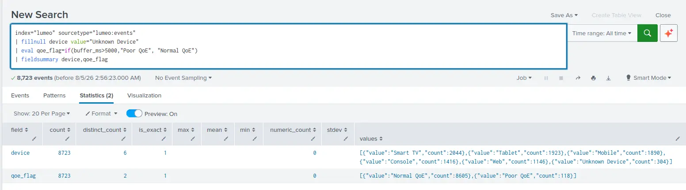

__Filled nulls in `device` and created `qoe_flag`__

We can view which sessions are affected with `Poor QoE` by using `|stats dc(session_id) by qoe_flag` which gives us,

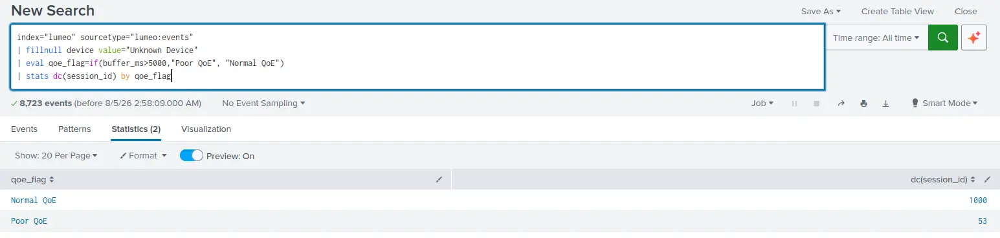

__Number of unique sessions affected by poor quality of experience__

53 unique sessions are experiencing poor QoE.


## Extra practice

>use `fieldformat` to display `duration_sec` as `H:MM:SS` without changing the underlying sortable value

```
index="lumeo" sourcetype="lumeo:events" duration_sec=*
| fieldformat duration_sec=tostring(duration_sec,"duration")
| table duration_sec
```

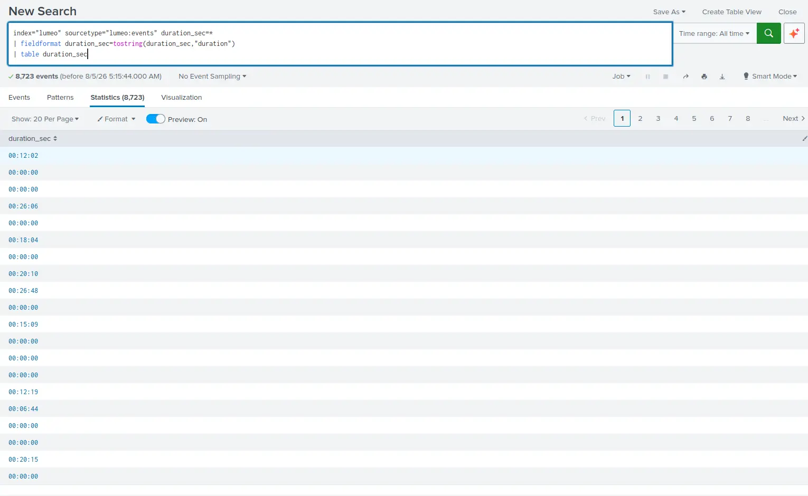

__Formatted `duration_sec`__

>use `isnull()`/`isnotnull()` to count how many rows have a blank `region`

```
index="lumeo" sourcetype="lumeo:events"
| where isnull(region)
| stats count
```

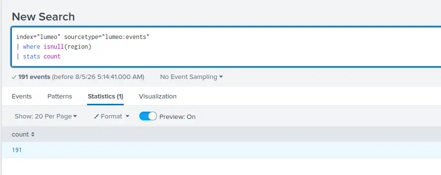

__Count of rows with blank region__

>Categorise `play` events into `SD`/`HD`/`4K` with `case()` after you extract a numeric bitrate 

We will define `SD`, `HD` and `4K` as the following,

```
SD: <=2000
HD: >2000 <=4500
4K: >4500
```

Which gives us the query,

```
index="lumeo" sourcetype="lumeo:events" bitrate_label=*
| rex field=bitrate_label "(\d+p[-\s])?(?<bitrate_kbps>\d+)\s?kbps"
| eval bitrate_kbps=toint(bitrate_kbps)
| eval bitrate_quality=case(
bitrate_kbps<=2000,"SD",
bitrate_kbps>2000 AND bitrate_kbps<=4500,"HD",
bitrate_kbps>4500,"4K"
)
| stats count by bitrate_quality
```

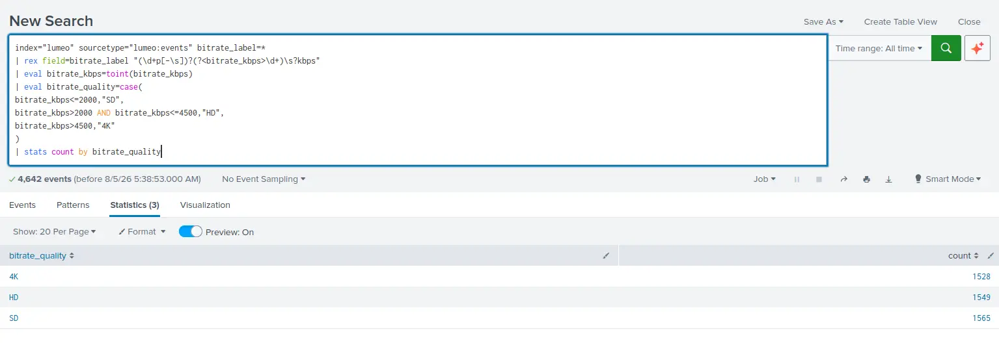

__Categorised bitrate__

---

# Part 2 — Result Modification

## Q4 — untable, delta, and xyseries: build a growth-rate matrix
Finance doesn't want the raw dollar matrix from `lumeo:revenue_matrix` — they want month-over-month **% revenue growth**, per region, back in that same Month × Region shape. You can't diff "this row vs. last row" while every region is its own column, so: `untable` it into `Month`/`Region`/`Revenue` rows, sort so each region's months run in chronological order, use `delta` to get the month-over-month dollar change, `eval` that into a growth %, then `xyseries` it back into a matrix — this time of growth rates, not dollars. Which region had the sharpest single-month decline, and in which month?

> Hint: `delta` has no `by` clause. Sorted `Region, Month`, every region's *first* month (`2026-02`) ends up diffed against the *previous region's last* month — a bogus cross-region artifact. Filtering out `Month="2026-02"` conveniently kills exactly those bad rows, since it's also each region's genuine first data point with nothing real to compare against anyway.
>
> Also: this sourcetype came in as a raw CSV upload, so every event is also carrying `host`/`source`/`sourcetype`/`_raw`/etc. `fields -` them (or explicitly `table` just the fields you care about) before eyeballing any intermediate step, or you'll be squinting at metadata noise the whole way through.

By loading this in as a csv we will see that many additional metadata fields will be added to each event as seen below,

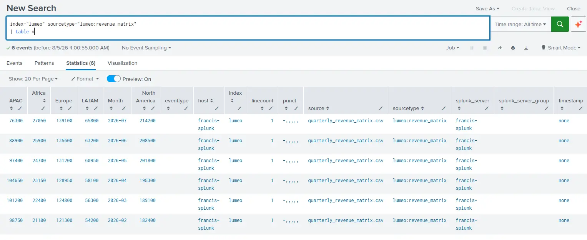

__Additional metadata__

We should remove these metadata first before we move forward as they will not be used. We can list all the columns using `| fieldsummary | stats values(field)` then use a `fields -` to remove the columns we do not want which is every column that is not `Month` and the regions. Therefore creating the query,

```
index="lumeo" sourcetype="lumeo:revenue_matrix"
| fields - host index linecount punct source sourcetype splunk_server splunk_server_group timestamp _raw eventtype _time
```

Which when put into table output produces,

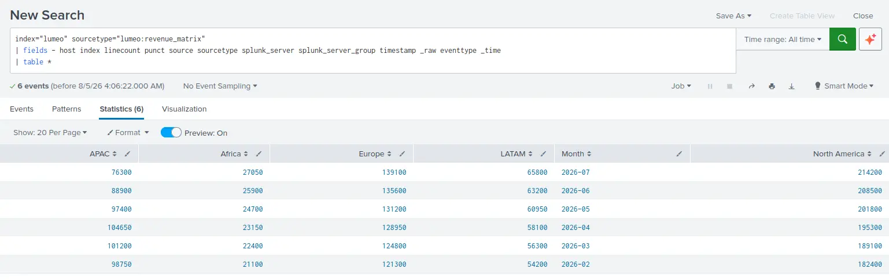

__Output table__

The main problem we are trying to solve in this question is that we cannot perform aggregations or otherwise transforming functions on entire columns.
Splunk does not have that capabilty. The solution to this is the use of untable which changes the wide format of the existing table into a tall one. We can use the following query which gets the data into the shape that is required for us to move forward.

```
index="lumeo" sourcetype="lumeo:revenue_matrix"
| fields - host index linecount punct source sourcetype splunk_server splunk_server_group timestamp _raw eventtype _time
| untable Month Region Revenue
| sort Region, Month
```

Viewing this as a table we get,

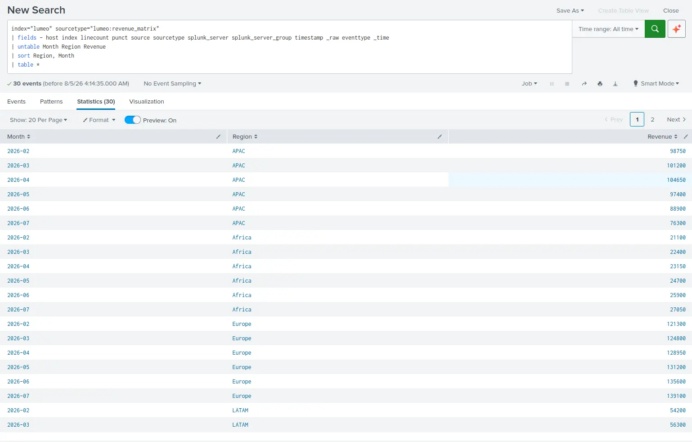

__Reshaped data__

We sorted the output by `Region` and `Month` as `delta` is reliant on the order of events and we are trying to determine the percentage growth of revenue by region AND month.
This will then allow us to calculate the percentage growth of revenue by region through the use of `delta` and `eval` as shown below,

```
index="lumeo" sourcetype="lumeo:revenue_matrix"
| fields - host index linecount punct source sourcetype splunk_server splunk_server_group timestamp _raw eventtype _time
| untable Month Region Revenue
| sort Region, Month
| delta Revenue as Revenue_Change
| eval Revenue_before=Revenue-Revenue_Change
| eval Revenue_pct=round((Revenue/Revenue_before*100) - 100,1)
```


We view it as a table first to see our current progress.

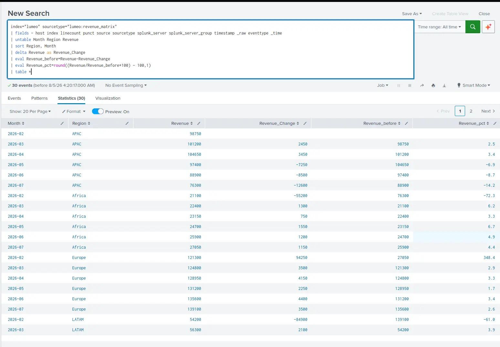

__Table with caclulated deltas__

If we look at our table there is a significant problem that we have to solve. The revenue values of the first month of every region which is `2026-02` causes a bug in the calculation of the percentage growth where the percentage  calculated either results in null or a comparision of revenues between two different regions. We should remove all rows with month `2026-02` as these values should be considered the baseline for any given region. 

This resolves the bug and gives us the following table with the correct revenue percentage growth per month by region.

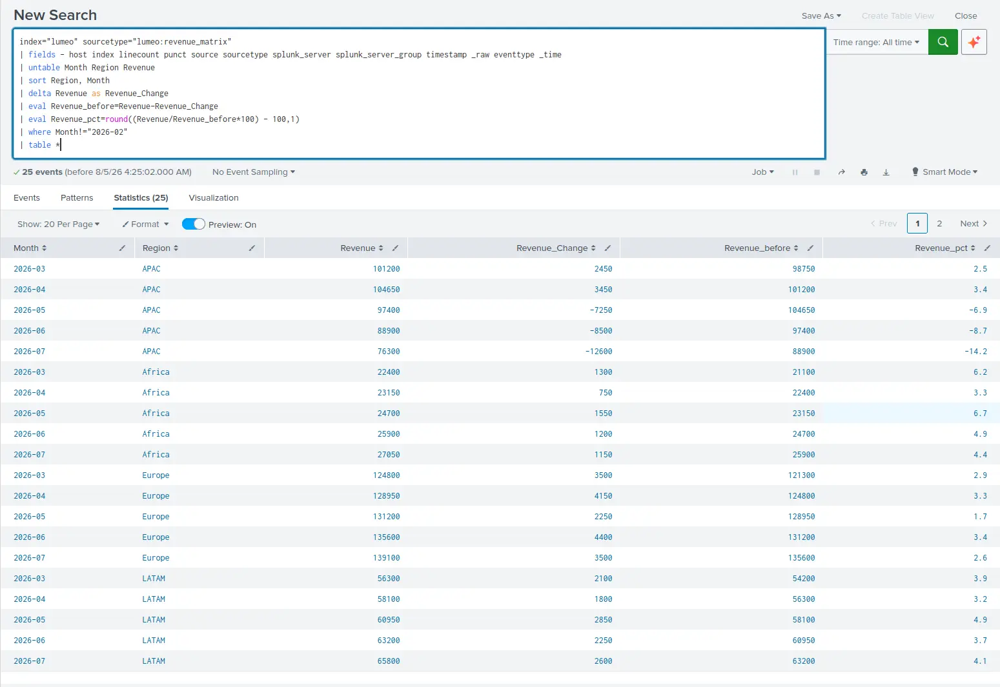

__Corrected output__

The final step is to convert this table back into the matrix shape as stated by the question. The desired matrix shape is `Month x Region` so all we have to do is reserve `untable` through the use of `xyseries`. Which gives us the final full query as below,

```
index="lumeo" sourcetype="lumeo:revenue_matrix"
| fields - host index linecount punct source sourcetype splunk_server splunk_server_group timestamp _raw eventtype _time
| untable Month Region Revenue
| sort Region, Month
| delta Revenue as Revenue_Change
| eval Revenue_before=Revenue-Revenue_Change
| eval Revenue_pct=round((Revenue/Revenue_before*100) - 100,1)
| where Month!="2026-02"
| xyseries Month, Region Revenue_pct
```

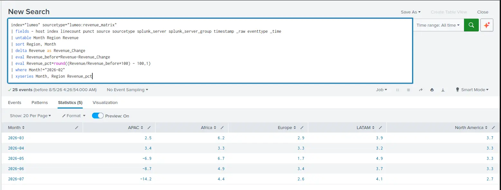

__Final Result__

## Q5 — eventstats: benchmark against the group
Add a field to every `buffer` event showing the average `buffer_ms` for that event's `region` (computed across the whole window), without collapsing the individual events. Filter to events where the individual reading is more than double its region's average. Which region has the most outliers?

> Hint: `eventstats` behaves like `stats` but adds the aggregate as a new field on every original row instead of summarizing rows away.

Ignoring all events without a region value, we can use the below query to add a new field `avg_buffer_ms_region` to answer the question.

```
index="lumeo" sourcetype="lumeo:events" event_type="buffer"
| eventstats avg(buffer_ms) as avg_buffer_ms_region by region
| where buffer_ms > 2*avg_buffer_ms_region
```

Which tells us the region with the most outliers is `Europe`.

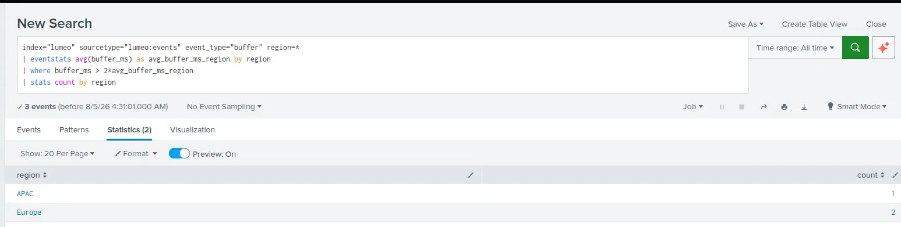

__Region with most outliers__

## Q6 — streamstats: running totals
For each `customer_id`, compute a running cumulative total of `duration_sec` across their `play` events, ordered by time — after each event, what's their total watch time so far?

> Hint: `streamstats` needs correctly time-sorted input and supports `by` to reset the running calculation per group — that incremental behavior is what separates it from `eventstats`.

```
index="lumeo" sourcetype="lumeo:events" event_type="play"
| sort _time
| streamstats sum(duration_sec) as cumsum_duration_sec by customer_id
| table cumsum_duration_sec, customer_id
```

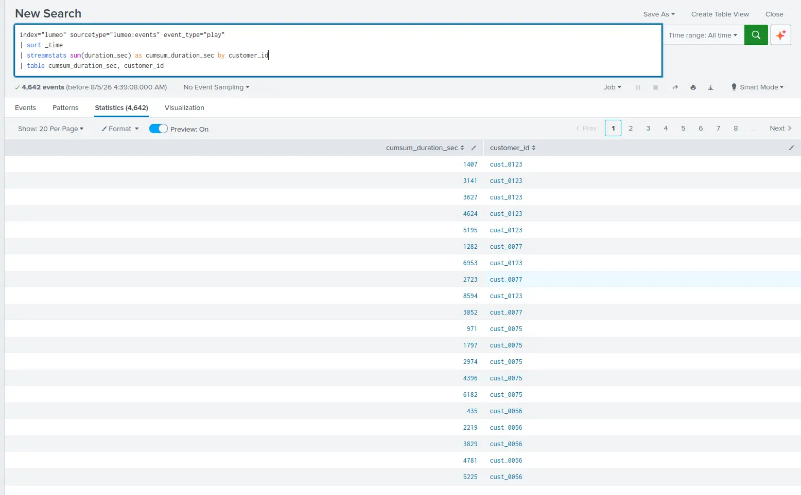

__Total watch time so far by customer id__

## Extra practice 

>use `appendpipe` to add a `TOTAL` row to the `lumeo:revenue_matrix` data such that is shows a region-by-revenue breakdown 

```
index="lumeo" sourcetype="lumeo:revenue_matrix"
| fields - host index linecount punct source sourcetype splunk_server splunk_server_group timestamp _raw eventtype _time
| untable Month, Region, Revenue
| sort Region, Month
| appendpipe [ | stats sum(Revenue) as Revenue by Region | eval Month="TOTAL" ]
| sort Region
```

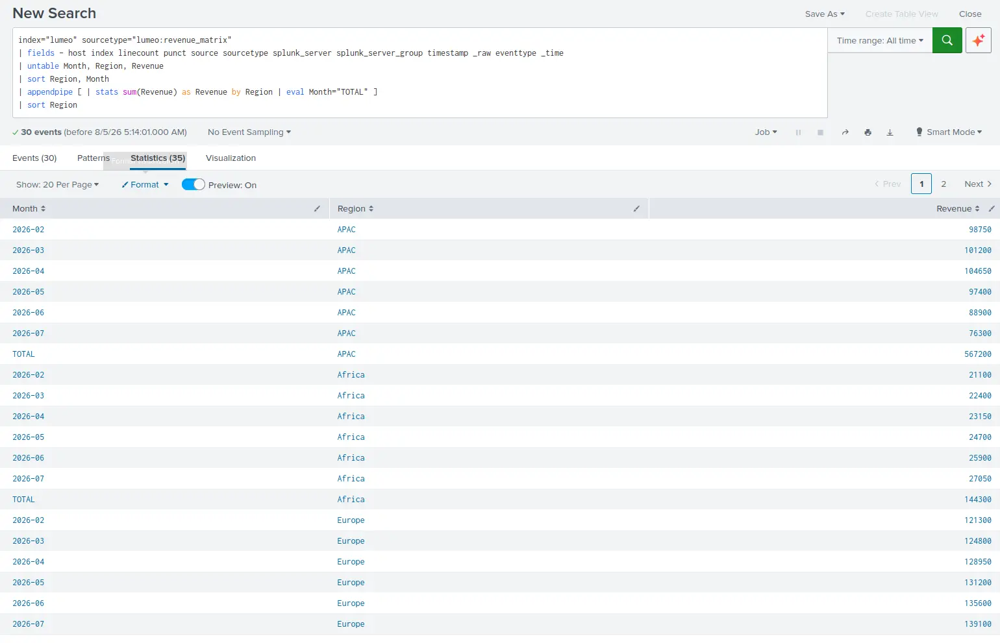

__Result__

>use `eval` + `tonumber`/`rex` to pull a clean numeric `bitrate_kbps` out of `bitrate_label` 

```
index="lumeo" sourcetype="lumeo:events" bitrate_label=*
| rex field=bitrate_label "(\d+p[-\s])?(?<bitrate_kbps>\d+)\s?kbps"
| eval bitrate_kbps=toint(bitrate_kbps)
```

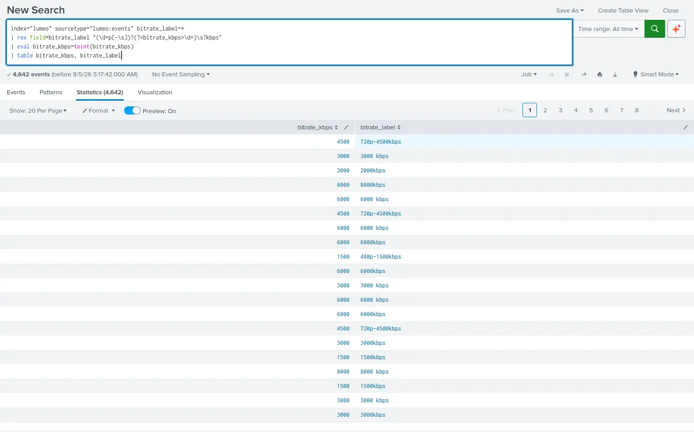

__Extracted bitrate__

>use `foreach` to build an `<<FIELD>>_isblank` flag for `plan_tier_raw`, `device`, and `region` in one command instead of three. 

```
index="lumeo" sourcetype="lumeo:events" bitrate_label=*
| rex field=bitrate_label "(\d+p[-\s])?(?<bitrate_kbps>\d+)\s?kbps"
| eval bitrate_kbps=toint(bitrate_kbps)
| foreach plan_tier_raw device region [eval <<FIELD>>_isblank=if(isnull(<<FIELD>>) OR <<FIELD>>="", 1, 0)]
| table *_isblank
```

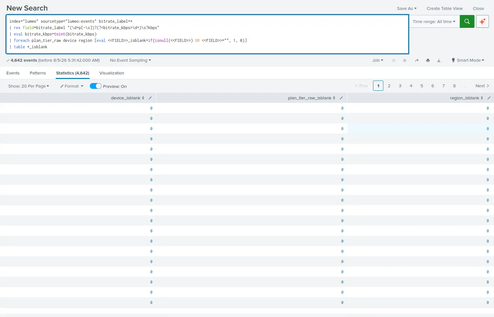

__Created new columns using `foreach`__

---

# Part 3 — Correlation Analysis

## Q7 — transaction: reconstructing sessions
Use `transaction session_id` to reconstruct complete viewing sessions. Report the average session duration in minutes, and how many sessions never got a closing `session_end` event.

> Hint: `transaction` marks a group `closed_txn=0` when its events run out without a session-ending event appearing.

```
index="lumeo" sourcetype="lumeo:events"
| transaction session_id startswith=(event_type="session_start") endswith=(event_type="session_end") keepevicted=true
| stats avg(duration) as avg_session_duration, count(eval(closed_txn=0)) as dangling_sessions
| fieldformat avg_session_duration=tostring(avg_session_duration,"duration")
```

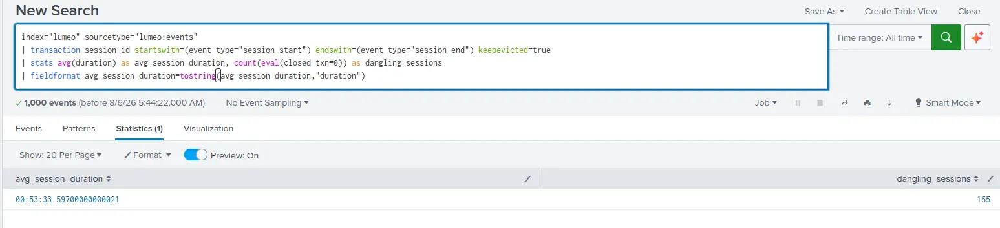

__Average session duration and count of dangling sessions__

Which tells us that the average session duration, calculated on the duration derived from `transaction` command, is 53 minutes 33 seconds (floor rounding). The number of sessions that never got a closing `session_end` event is 155. 

The main gotcha here is the `keepevicted` parameter of `transaction` which defaults to false. This parameter makes it so that transactions that do not have an event that corresponds to the defined `endswith` parameter is excluded from the result set. Therefore, we need to change `keepevicted` to true so we can count how many dangling or incomplete sessions exist in the result set.

## Q8 — join: catching plan mismatches
Some customers' app-reported plan (cleaned `plan_tier_raw` from Q1) doesn't match what billing actually charges (`plan` in `lumeo:billing`). Use `join customer_id` to combine a per-customer "most recent app-reported plan" search with a per-customer "most recent billing plan" search, and filter to disagreements. How many customers are affected?

> Hint: dedupe each side to one row per `customer_id` before joining, or you'll get a cartesian blowup — `join` merges rows from two separately-run result sets, it doesn't stream-merge on a shared index.

The question states "most recent billing plan", “per-customer” and mismatches in `plan`.
Let’s first check the possible values of `plan` in `lumeo:billing` to see if we need to clean anything up.

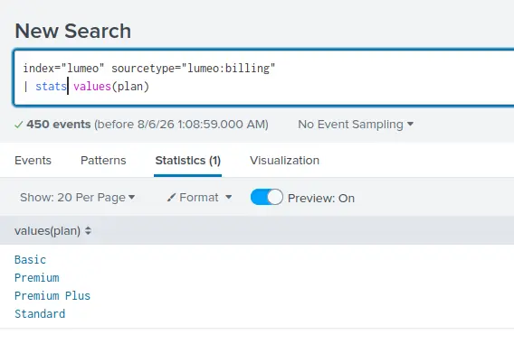

__`plan` values in `lumeo:billing`__

The possible values of `plan` match the values of the cleaned `plan_tier` in `lumeo:events`.  Therefore, we can check for mismatches easily by just comparing the values of `plan_tier` in `lumeo:events` and `plan` in `lumeo:billing`.

Since, `lumeo:billing` is a running log of the billing of a customer i.e. they will appear multiple times in the log, and the question states that we should get the most recent billing for a customer. We should run the `dedup` command. `dedup` defaults to keep first only so this will get us the desired result. Splunk by default already sorts by time reverse chronologically so most recents show first but to be explicit we can use `sort -_time`.

Therefore, the final query is 

```
index="lumeo" sourcetype="lumeo:events"
| dedup customer_id
| eval plan_tier_raw= lower(plan_tier_raw)
| eval plan_events= case(
plan_tier_raw=="premium+","Premium Plus",
in(plan_tier_raw, "basic"), "Basic",
in(plan_tier_raw, "standard","std"), "Standard",
in(plan_tier_raw, "prem","premium"), "Premium",
like(plan_tier_raw,"premium%plus"), "Premium Plus",
1=1,"Other"
)
| fields customer_id, plan_events
| join type=left customer_id [ 
   search index="lumeo" sourcetype="lumeo:billing" 
   | sort -_time
   | dedup customer_id
   | rename plan as plan_billing
   | fields customer_id plan_billing
   ]
| stats count(eval(plan_billing=plan_events)) as plans_matches, count(eval(plan_billing!=plan_events)) as plans_do_not_match
```

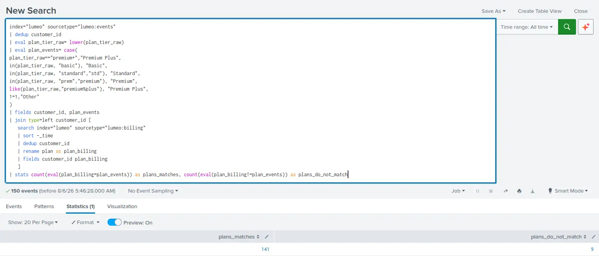

__Count of affected customers and non-affected customers__

Which tells us that for 9 customers, the plan defined in `lumeo:events` does not match the plan they are being billed for.

## Q9 — appendcols: side-by-side comparison
Build two independent stats tables — top 5 `genre` by total `duration_sec` watched, and top 5 `genre` by number of `error` events — then use `appendcols` to place them side-by-side as one comparison table.

> Hint: `appendcols` matches rows purely by *position*, not by any shared field — both sub-searches need to already be sorted meaningfully, and the two genre columns can legitimately show different genres on the same row.

```
index="lumeo" sourcetype="lumeo:events" 
| stats sum(duration_sec) as total_watchtime by genre
| sort -total_watchtime limit=5
| fields genre
| rename genre as "Top 5 Genre by Watchtime"
| appendcols [
   | search index="lumeo" sourcetype="lumeo:events"
   | stats sum(eval(event_type="error")) as genre_errors by genre
   |  sort -genre_errors limit=5
   | fields genre
   | rename genre as "Top 5 Genre by Error Events"
]
```


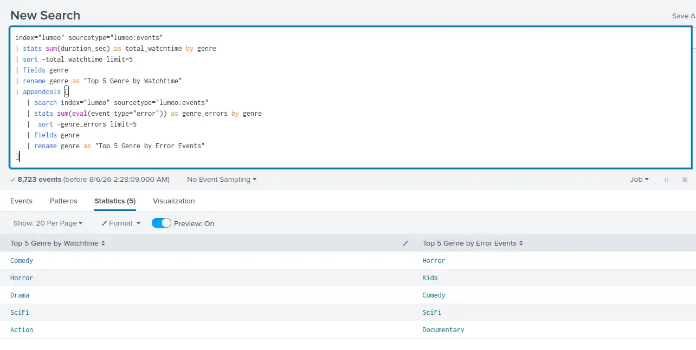

__Query results__

## Extra practice

>redo Q8's plan-mismatch check with a *subsearch* instead of `join` , can you still find the customers with affected? Why or why not?

Using a subsearch will allow us to still answer the question. This is shown below, with the following query and query results.

```
index="lumeo" sourcetype="lumeo:events" 
| dedup customer_id
| eval plan_tier_raw= lower(plan_tier_raw)
| eval plan_events= case(
plan_tier_raw=="premium+","Premium Plus",
in(plan_tier_raw, "basic"), "Basic",
in(plan_tier_raw, "standard","std"), "Standard",
in(plan_tier_raw, "prem","premium"), "Premium",
like(plan_tier_raw,"premium%plus"), "Premium Plus",
1=1,"Other"
)
| search NOT [ search index="lumeo" sourcetype="lumeo:billing" | dedup customer_id | rename plan as plan_events | fields customer_id plan_events ]
| table customer_id, plan_events
```

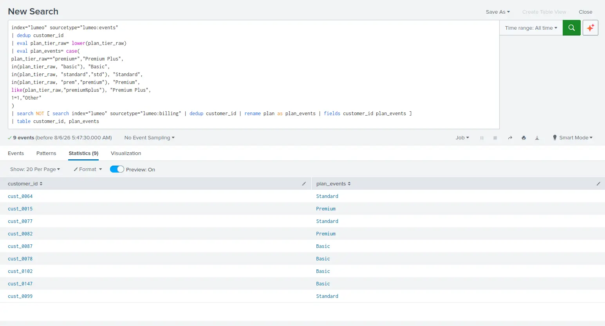

__List of affected customers__

Which shows 9 matching events, meaning 9 customers were affected.

However, we will not be able compare the mismatching plan value in `lumeo:billing` as the use of a subsearch constructs a filter, it does not allow for the results of the subsearch to be searchable. Furthermore, if the number of unique pairings of  customer ids and plan exceed 10,000 in the subsearch, the subsearch will silently start dropping values. This limit on the subsearch is higher for `join` commands at 50,000 and we retain access to the values in the subsearch.

Therefore, while a pure subsearch can get us the answer of how many customers were affected, we cannot check what values caused the mismatch.

>use `append` or `union` to combine a monthly billing-event count with a monthly ticket count into one per-customer table.

```
index="lumeo" sourcetype="lumeo:billing"
| eval month=strftime(_time,"%Y-%m"), event_type="billing"
| stats count as event_count by customer_id, month, event_type
| union [
   search index="lumeo" sourcetype="lumeo:tickets" 
   | eval month=strftime(_time, "%Y-%m"), event_type="ticket" 
   | stats count as event_count by customer_id, month,event_type 
   ]
| sort customer_id, month
```

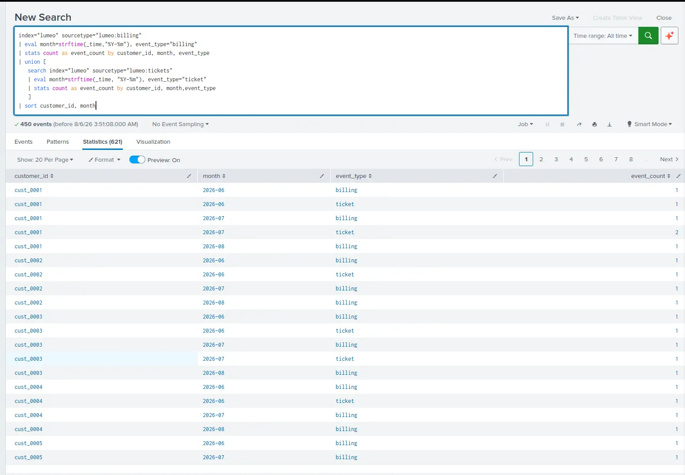

__Query result__

---

# Part 4 — Multivalue Fields

## Q10 — building and counting multivalue fields
Use `stats values(genre) as genres by customer_id` to build a multivalue `genres` field per customer. Add `mvcount(genres)` and find the customer(s) who streamed the *fewest* distinct genres.

```
index="lumeo" sourcetype="lumeo:events"
| stats values(genre) as genres by customer_id 
| eval genre_count=mvcount(genres) 
| table customer_id, genre_count
| sort +genre_count
```

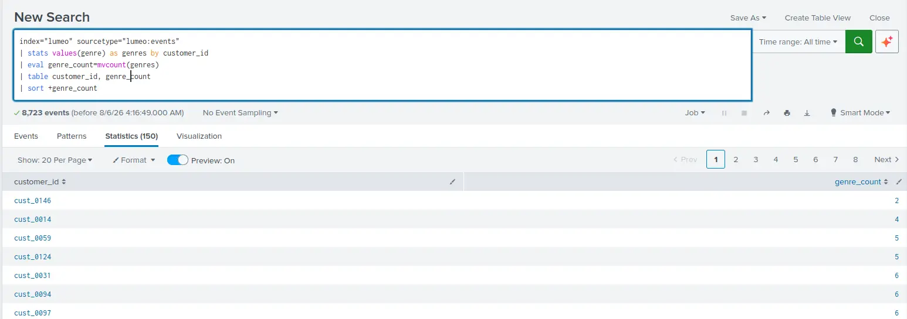

__Query result__

`cust_0146` streamed the fewest genres.

## Q11 — mvexpand: unpacking back to one row per value
You've already built a per-customer summary table for the customer-profile dashboard: `stats values(genre) as genres, dc(session_id) as sessions by customer_id, region`. Marketing now wants a unique-viewer breakdown by genre *within each region*, from that same table — without re-scanning raw events. Confirm the exploded row count for a genre/region pair matches a direct `stats dc(customer_id)` run against raw events, filtered to that genre and region.

> Hint: `mvexpand` duplicates every *other* field on the row (including `region`) for each value it unpacks — that's what makes the dc() cross-check valid, and it's also why `region` had to already be sitting on the row before you collapsed to one-row-per-customer, not added back in afterward. Don't be surprised if the split comes out close to flat across regions — genre preference isn't regionally driven in this data, and confirming that null result is a legitimate finding too.

```
index="lumeo" sourcetype="lumeo:events"
| stats values(genre) as genres, dc(session_id) as sessions by customer_id,region
| mvexpand genres
| rename genres as genre
| stats values(customer_id) as customers by region, genre
| eval customer_count=mvcount(customers)
| fields region, genre, customer_count
```

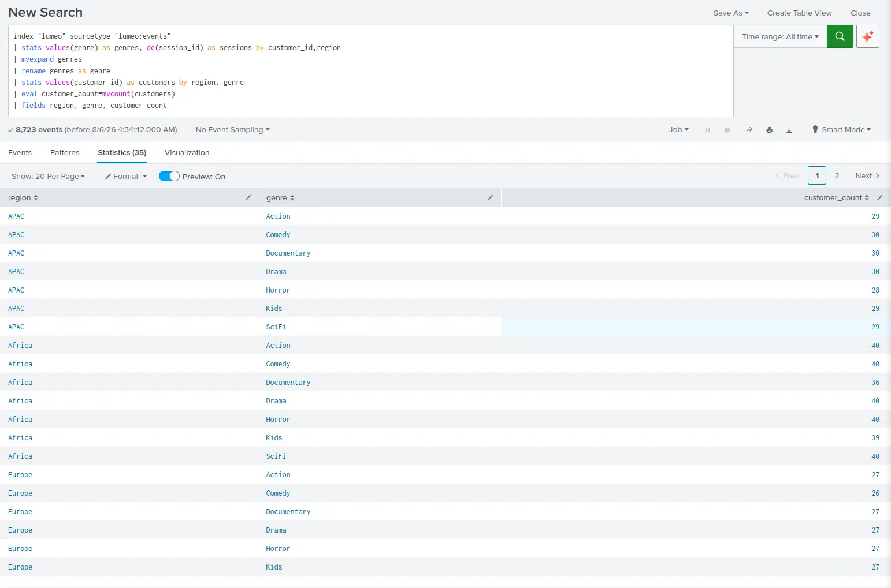

__Query Result__

Confirming the results using `stats dc(customer_id) by region, genre`

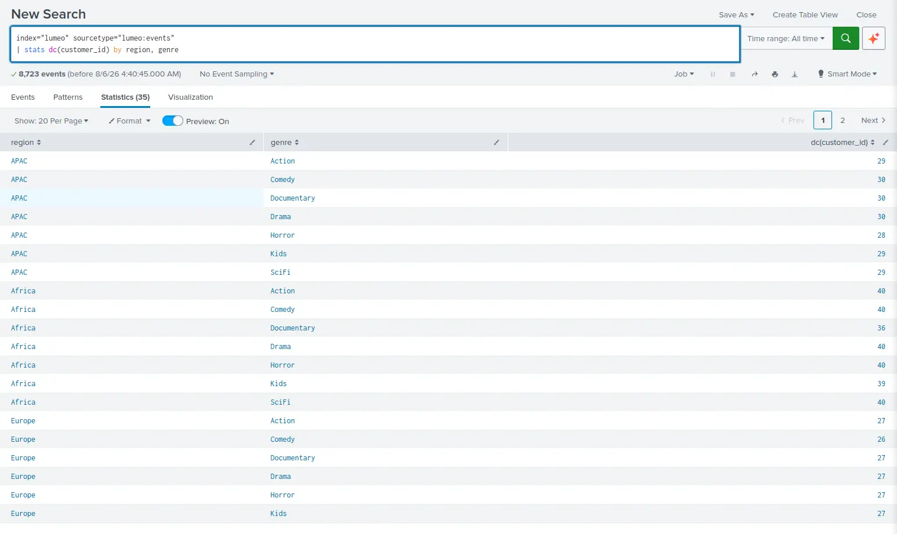

__Result Verification__

## Q12 — mvfilter and mvjoin
Support wants an escalation list for the DRM vendor: every customer who's hit a license/auth failure (`E2002` DRM License Error, or `E4004` Auth Token Expired — token expiry is what blocks license renewal, so ops treats both as the same escalation bucket), one line each, error codes readable as a single string rather than a raw multivalue field. Build a multivalue `error_codes` field per `customer_id` from `error` events, use `mvfilter` to keep only those two codes, drop any customer left with an empty list, then `mvjoin` the survivors' codes into a comma-separated string.

> Hint: `mvfilter` takes a boolean expression evaluated against each value individually — `match(error_codes, "E2002|E4004")` goes *inside* it, not as a separate `where`. Filtering the multivalue field down doesn't remove customers who end up with zero matches — you still need `mvcount(error_codes) > 0` afterward to actually drop them from the escalation list. (Some customers will have hit both codes — that's what makes `mvfilter` do real work here instead of just standing in for a plain `error_code=E2002` filter.)

```
index="lumeo" sourcetype="lumeo:events"
| stats values(error_code) as error_codes by customer_id
| eval error_codes=mvfilter(match(error_codes,"^(E2002|E4004)$"))
| search error_codes=*
| eval error_codes=mvjoin(error_codes,",")
```

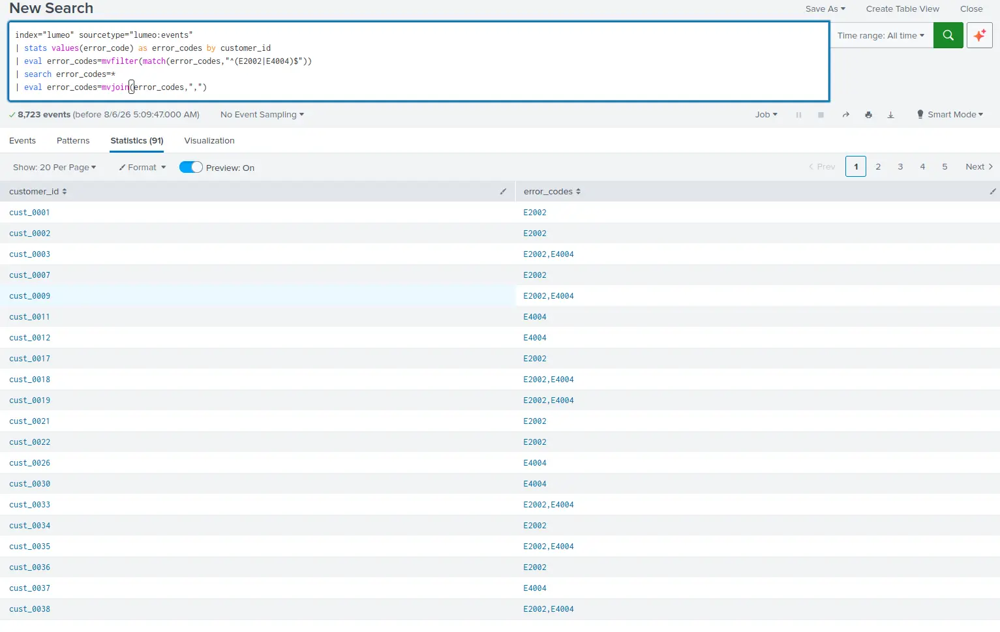

__Customers with license or auth failures__

## Extra practice
>`mvcombine` to merge stats rows that are otherwise identical 

```
index="lumeo" sourcetype="lumeo:events" error_code=*
| fields error_code,region,customer_id
| mvcombine error_code
| eval error_code=mvdedup(error_code)
```

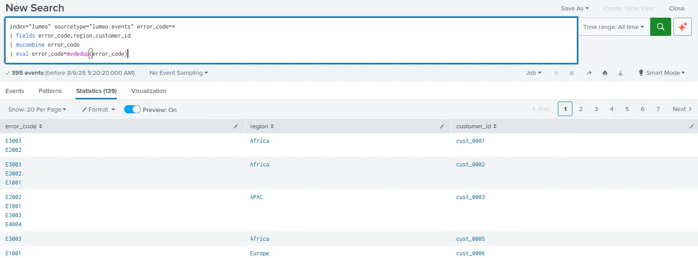

__Errors by customer and region__

>`nomv` to flatten a multivalue field back to one delimited string

```
index="lumeo" sourcetype="lumeo:events" error_code=*
| fields error_code,region,customer_id
| mvcombine error_code
| eval error_code=mvdedup(error_code)
| eval error_code_count_before_nomv=mvcount(error_code)
| nomv error_code
| eval error_code_count_after_nomv=mvcount(error_code)
```

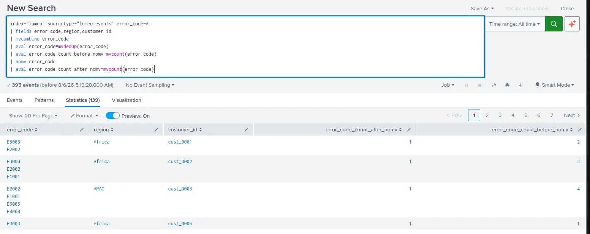

__Query result__

Main difference is that the `error_code` field is now a single string where each error code is delimited by a new line.

>`mvrange(1,5)` to generate a synthetic multivalue field and watch how `mvexpand` handles it.

This set of commands allow for a pseudo loop in Splunk as Splunk does not have a native `for` loop for events.
Allowing us access to a few use cases such as generating synthetic or test data that represent the shape of the real data without actually using the data.

An example is as shown below,
```
| makeresults
| eval iter=mvrange(1,100)
| mvexpand iter
| eval growth=pow(iter,5)
| table iter growth
```

Which when plotted on  a line chart gives us an exponential growth chart.

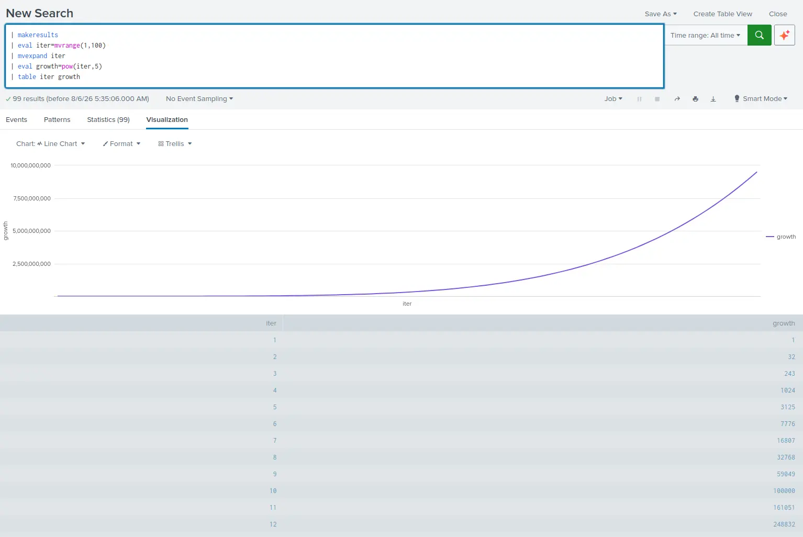

__Exponential growth line chart__

---

# Part 5 — Knowledge Objects

## Q13 — Calculated field: clean bitrate
Turn messy `bitrate_label` (`"4500 kbps"`, `"720p-3000kbps"`, etc.) into a permanent **calculated field** `bitrate_kbps` (Settings → Fields → Calculated Fields) using an `eval` with `replace`/`tonumber`. Confirm it appears automatically in a fresh search without retyping the `eval`.

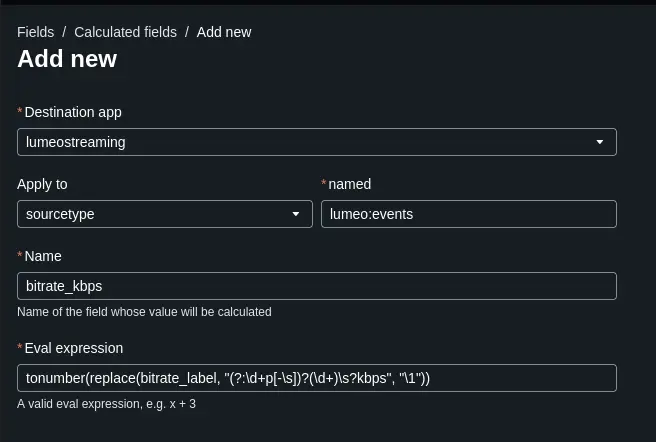

__Created calculated field for `bitrate_kbps`__

We can verify this through the following query,

```
index="lumeo" sourcetype="lumeo:events" bitrate_kbps=*
| table bitrate_kbps, bitrate_label, customer_id, event_type
```

Which gets us

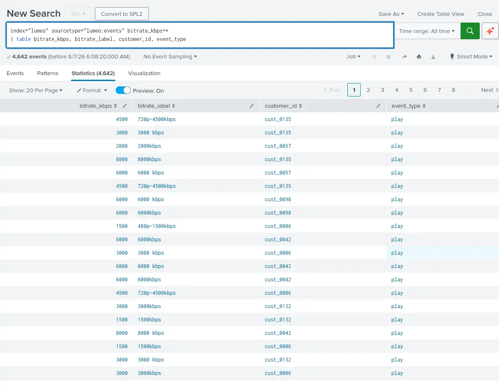

__Verified calculated field exists__

## Q14 — Field alias: unifying plan naming across sourcetypes
`lumeo:billing` calls it `plan`; your cleaned Q1 field on `lumeo:events` is `plan_tier`. Create a **field alias** on `lumeo:billing` so `plan` also answers to `plan_tier`, then run one search spanning both sourcetypes and confirm `plan_tier` populates from both without a `rename`.

> Hint: field aliases are sourcetype-scoped — you're not renaming the field everywhere, just teaching one sourcetype to also answer to a second name.

Let’s first make the `plan_tier` a calculated field instead of a field create by an eval in the search.

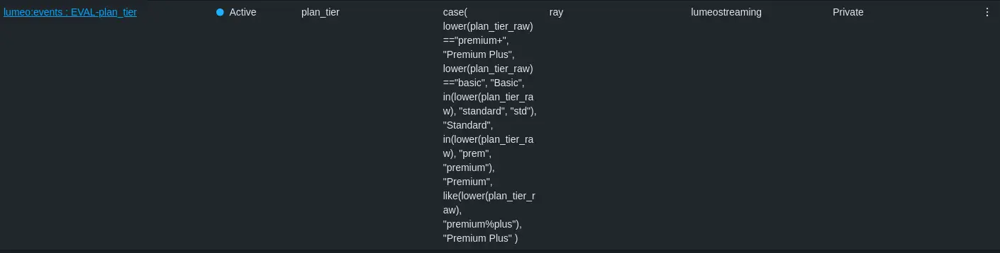

__Created `plan_tier` calculated field__

Verifying it works we run the query 

```
index="lumeo" sourcetype="lumeo:events"
| table plan_tier, plan_tier_raw
```

Which gives us,

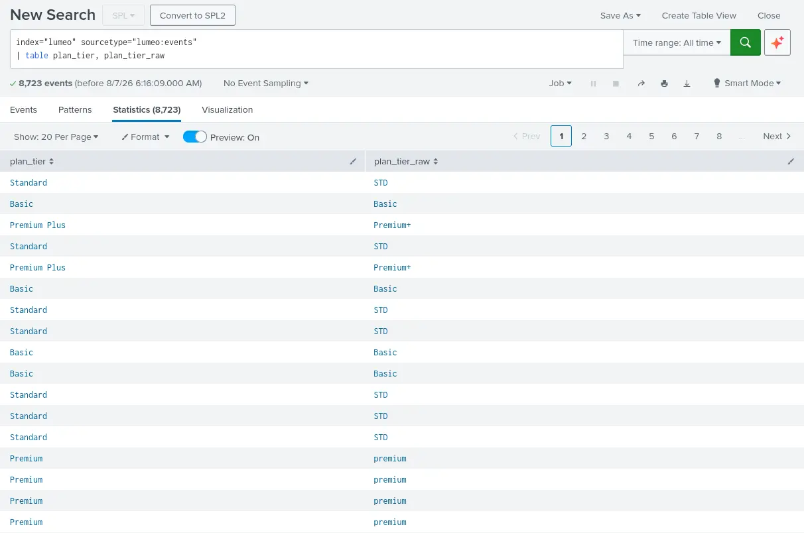

__Calculated field `plan_tier`__

Now we create a field alias for `lumeo:billing`.

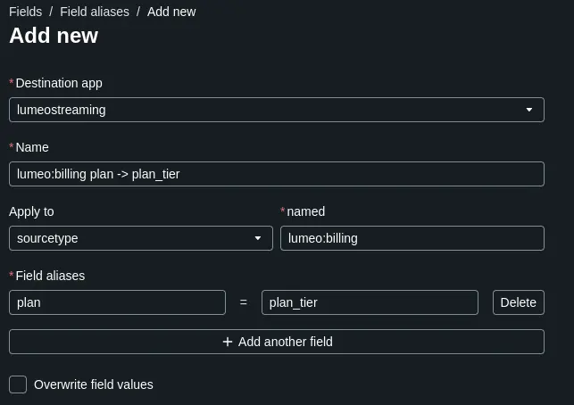

__Creating new field alias__

Then we verify if it applied by using 

```
index="lumeo" sourcetype="lumeo:billing" 
| table plan_tier
```

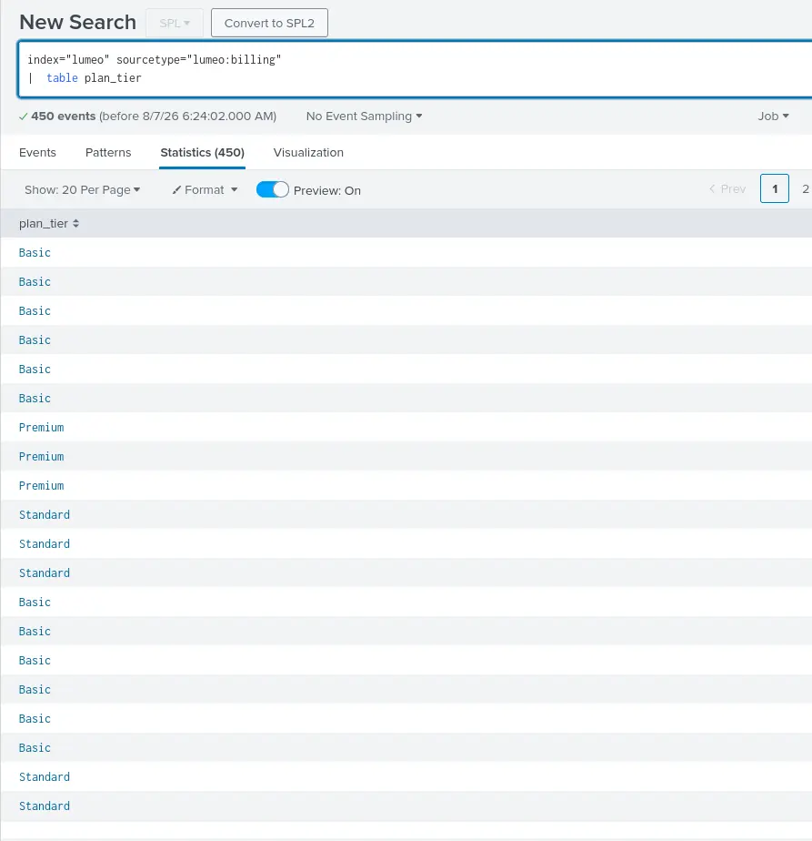

__Field alias `plan_tier` on `lumeo:billing`__

## Q15 — Macro: reusable QoE threshold
Turn Q3's `buffer_ms > 5000` "Poor QoE" logic into a **macro** `poor_qoe(threshold)` that takes the threshold as an argument. Use  `poor_qoe(5000)` `` in a search, then swap in `` `poor_qoe(2000)` `` and confirm the result count changes.

The  query used in Q3 is 

```
index="lumeo" sourcetype="lumeo:events" 
| fillnull device value="Unknown Device" 
| eval qoe_flag=if(buffer_ms>5000,"Poor QoE", "Normal QoE")
| fieldsummary device, qoe_flag
```

Let’s say that the desired macro produces table of events with “Poor QoE” based on a threshold with fields `buffer_ms`, `device`, `customer_id` and `region`. The macro definition would then be,

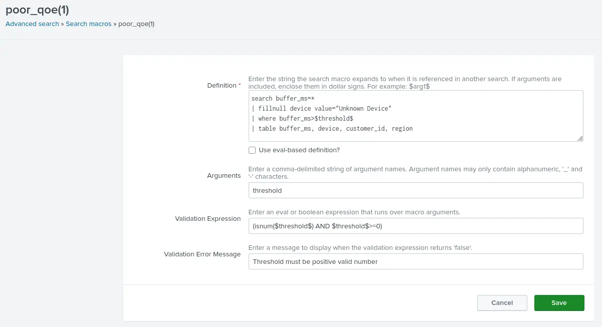

__Created `poor_qoe(1)` macro__

We can then verify it works by using two different thresholds, `2000` and `5000`.

Using threshold as `2000` we will find 478 matching events as shown below,

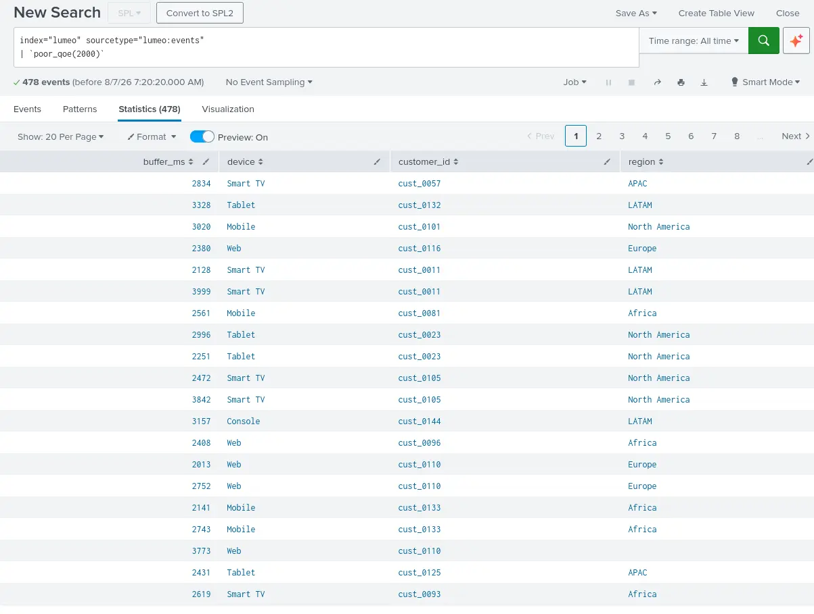

__Events with `buffer_ms` exclusively exceeding 2000__

Using threshold `5000` we will find 118 matching events as shown below,

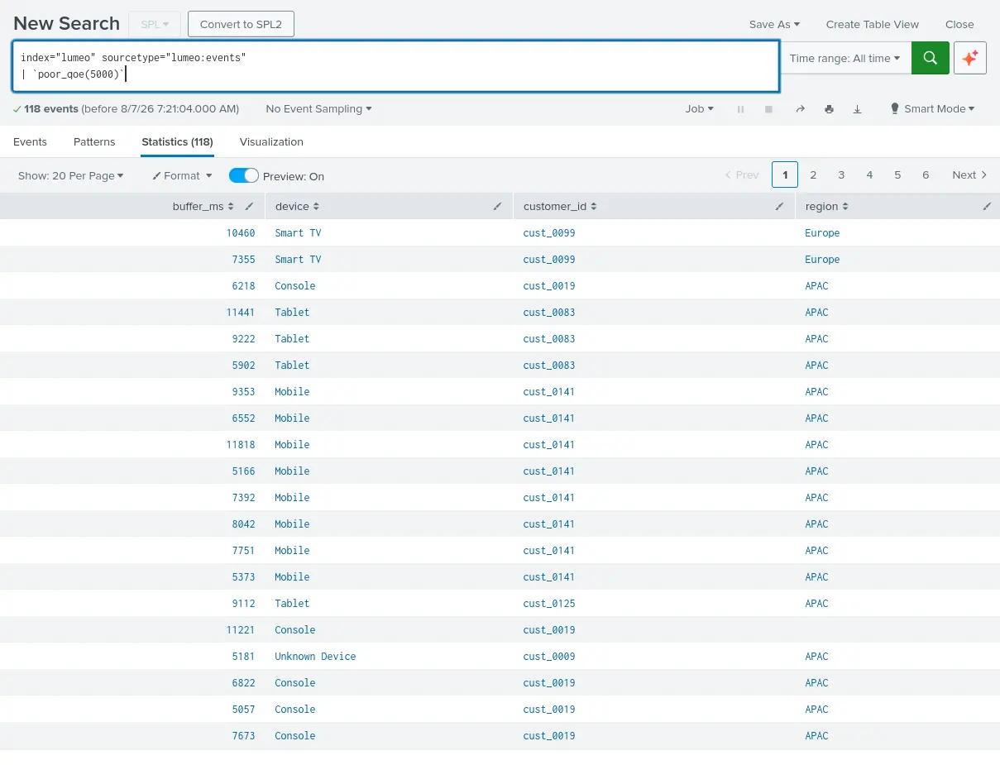

__Events with `buffer_ms` exclusively exceeding 5000__

Therefore, the macro works.
## Q16 — Workflow action: jump to a customer's full history
Build a **workflow action** on `customer_id` that runs a new search scoped to `index=lumeo customer_id=$customer_id$` in a new window. Confirm it shows up in the field's dropdown menu on any event containing that field.

> Hint: workflow actions only appear on the field(s) they're scoped to — if it's missing, check the field-name/eventtype restriction on the action first.

We define the following search work flow action.

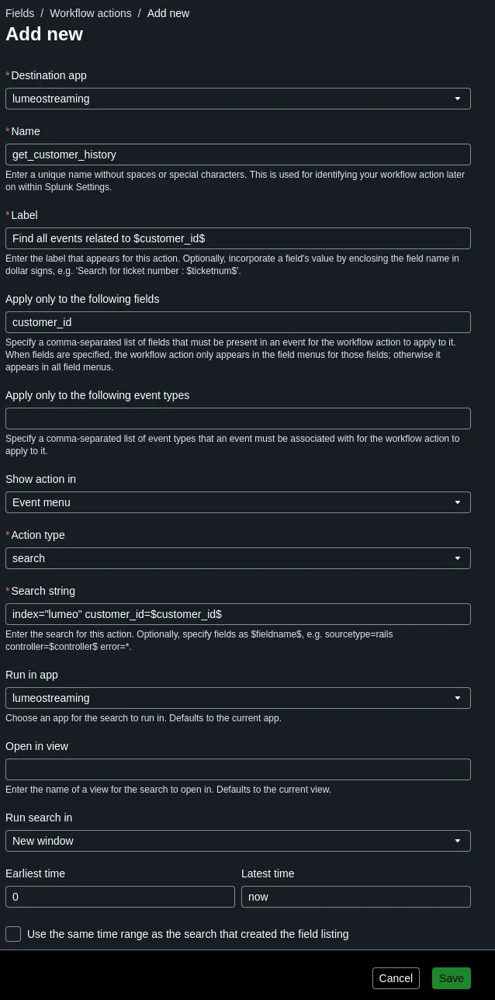

Now let’s say we found this event where `cust_0058` caused error `E3003` and we want to retrieve the entire history of this customer in our data.

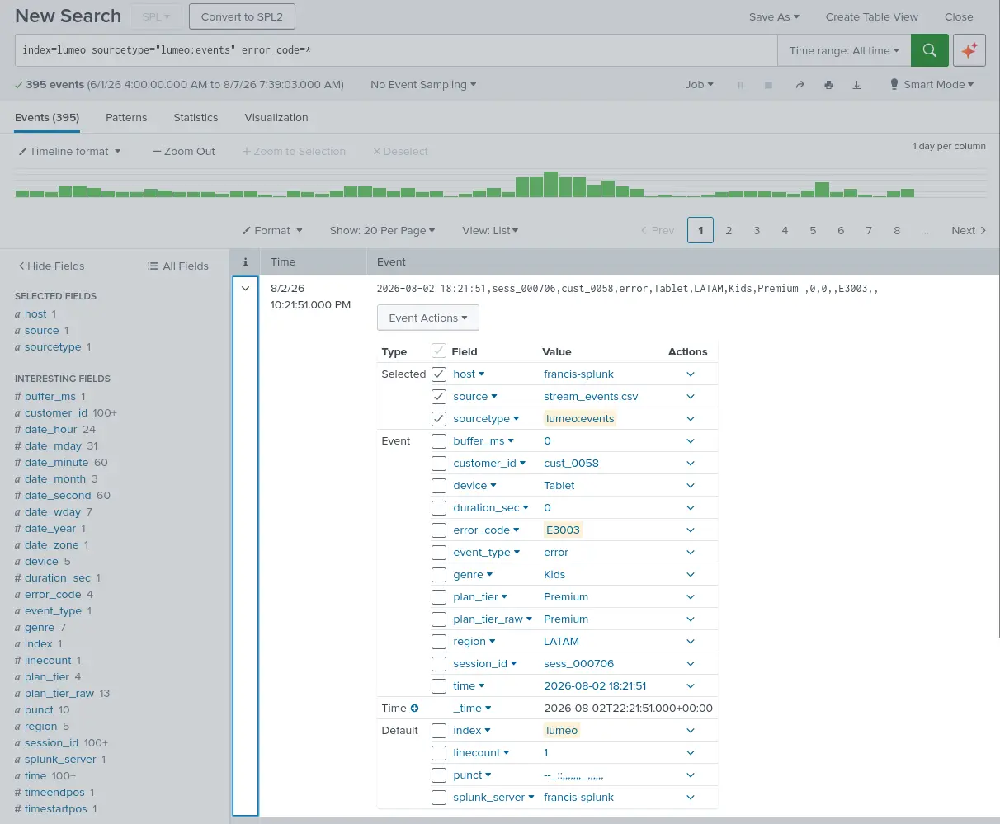

__Event we are investigating__

We can now click the event actions drop down and select `Find all events related to cust_0058` as shown below,

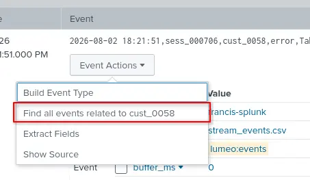

__Workflow action to get full history of customer__

This will open a search in a new window filtering for all events where `customer_id=cust_0058`.

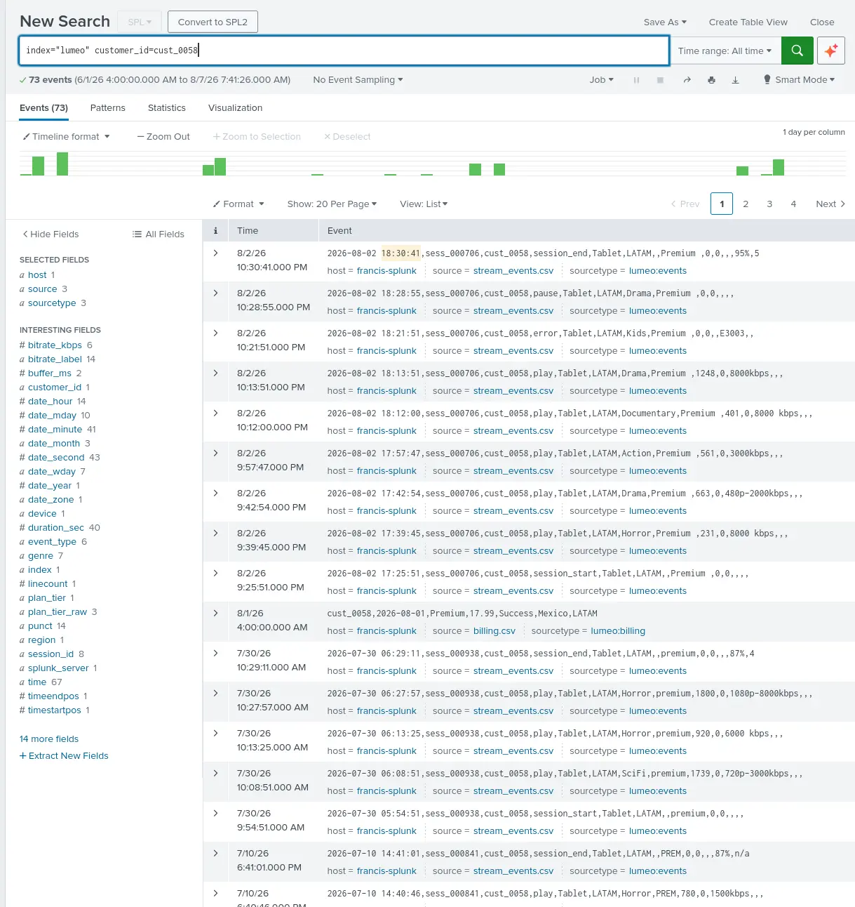

__All events related to `customer_id=cust_0058`__

## Extra practice

>confirm your Q13 calculated field shows up in the Interesting Fields sidebar like a native one

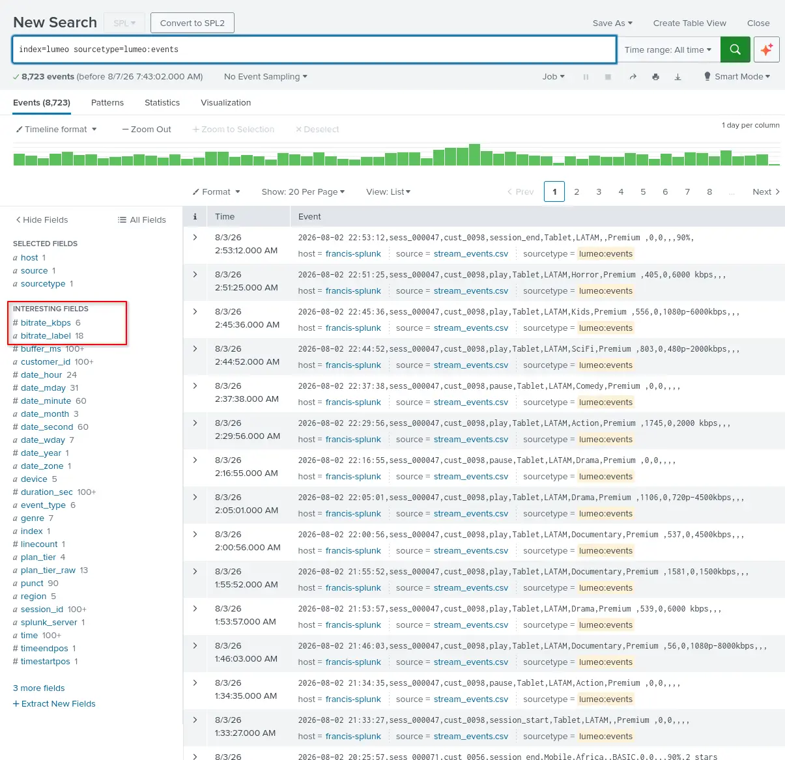

__`bitrate_kbps` shows up in interesting fields__

>add a second, GET-type workflow action that opens an external URL templated with `$error_code$`

We define a new workflow action that does the following,

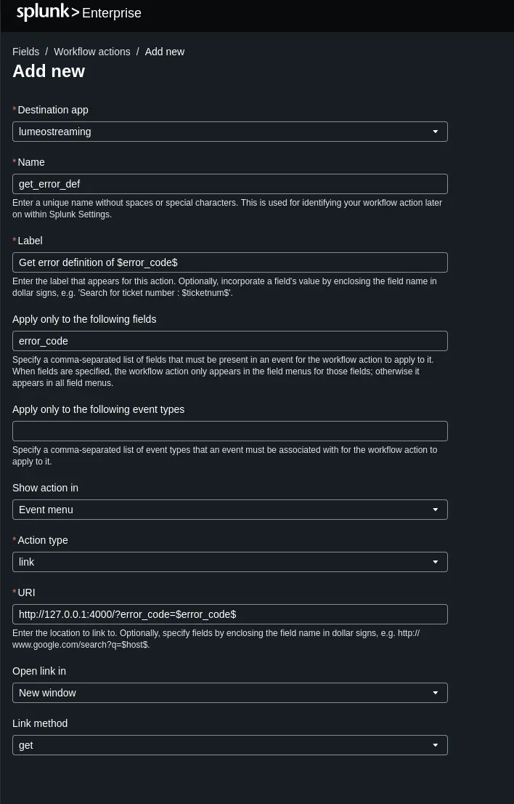

__New workflow action to get error definition__

Then we just create a basic http server using python that logs the requests and returns a error definition based on a hardcoded dictionary. 

```python
from http.server import BaseHTTPRequestHandler, HTTPServer
from urllib.parse import urlparse, parse_qs


class RequestLogger(BaseHTTPRequestHandler):
    def do_GET(self):
        parsed = urlparse(self.path)
        params = parse_qs(parsed.query)
        error_code = params.get("error_code", [None])[0]
        # Handle error param
        error_messages = {
            "E1001": "Lorem ipsum dolor sit amet, consectetur adipiscing elit.",
            "E2002": "Sed do eiusmod tempor incididunt ut labore et dolore magna aliqua.",
            "E3003": "Ut enim ad minim veniam, quis nostrud exercitation ullamco laboris.",
            "E4004": "Duis aute irure dolor in reprehenderit in voluptate velit esse cillum.",
        }
        if error_code in error_messages:
            message = error_messages[error_code]
            print(f"Matched {error_code}: {message}")
            self.send_response(200)
            self.end_headers()
            self.wfile.write(f"{error_code} : {message}".encode("utf-8"))
        else:
            self.send_response(200)
            self.end_headers()
            self.wfile.write(b"OK")
        self._handle(parsed, params)

    def do_POST(self):
        parsed = urlparse(self.path)
        params = parse_qs(parsed.query)

        self.send_response(200)
        self.end_headers()
        self.wfile.write(b"OK")

        self._handle(parsed, params)

    def _handle(self, parsed, params):
        print(f"\n--- {self.command} {parsed.path} ---")
        print("Query params:", params)
        print("Headers:")
        print(self.headers)

        content_length = int(self.headers.get("Content-Length", 0))
        if content_length > 0:
            body = self.rfile.read(content_length)
            print("Body:")
            print(body.decode("utf-8", errors="replace"))


if __name__ == "__main__":
    port = 4000
    server = HTTPServer(("127.0.0.1", port), RequestLogger)
    print(f"Listening on port {port}...")
    try:
        server.serve_forever()
    except KeyboardInterrupt:
        print("\n Shutting down")
        server.server_close()
```

Then we run the server and run a query on splunk that retrieves events with an error code, `index="lumeo" error_code=*`.
We can then click into any event then event actions to retrieve the error definition.

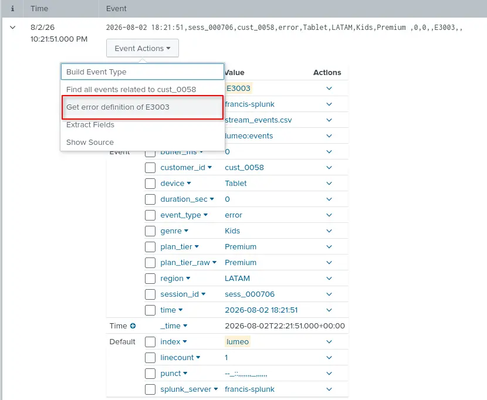

__Workflow action to get error definition__

Which when clicked gets us this page,

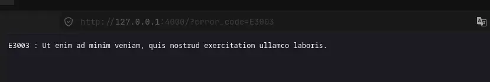

__Error code definition__

We can also see the server logged it as shown below,

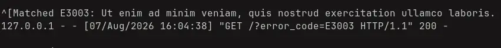

__Server logged request__


>reference  `poor_qoe(5000)`  inside a saved report to confirm macros work inside other knowledge objects, not just ad-hoc searches.

We create the base query as `index=lumeo sourcetype=lumeo:events | poor_qoe(5000)` then save it as report.

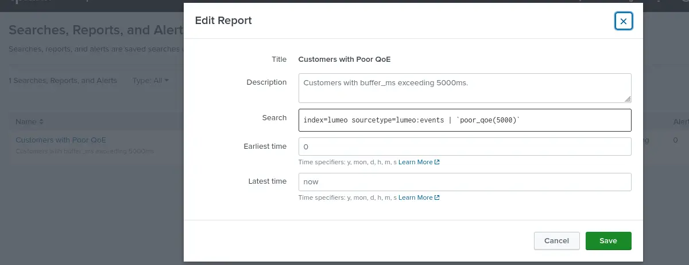

__Report definition__

We can now view the report showing that the macro works in saved reports.

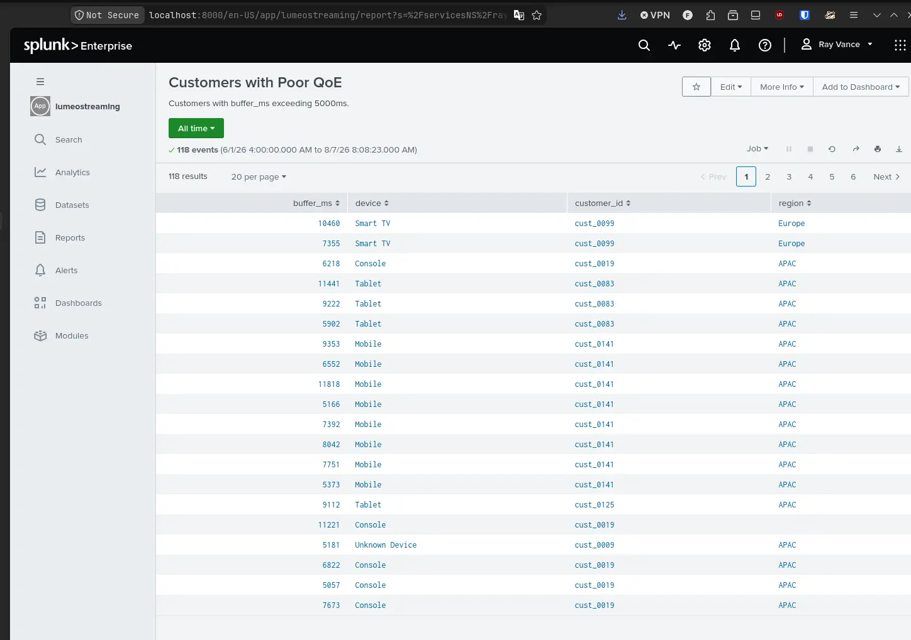

__Saved report with macro__

---

# Part 6 — Data Models & Pivot

## Q17 — Build the data model
Create a data model `Lumeo Streaming` with a root event object `Stream Events` (constraint: `sourcetype=lumeo:events`) and two child objects inheriting from it: `Errors` (`event_type=error`) and `Session Ends` (`event_type=session_end`). Add a few relevant attributes to each (e.g. `error_code` on Errors; `watch_pct_raw`, `rating_raw` on Session Ends).

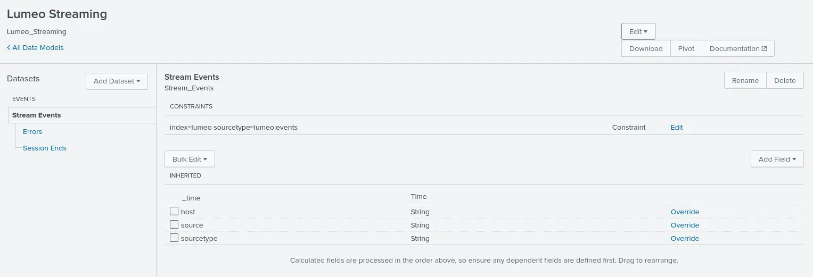

__Stream Events Root Event Dataset__

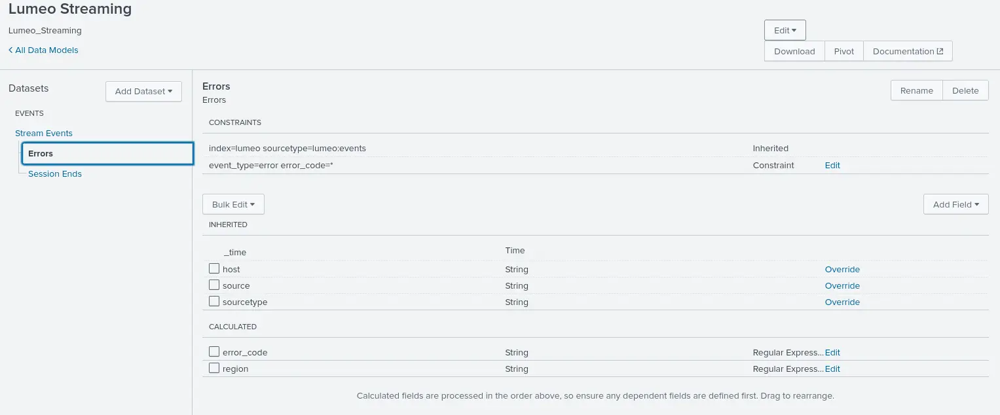

__Errors Child Dataset__

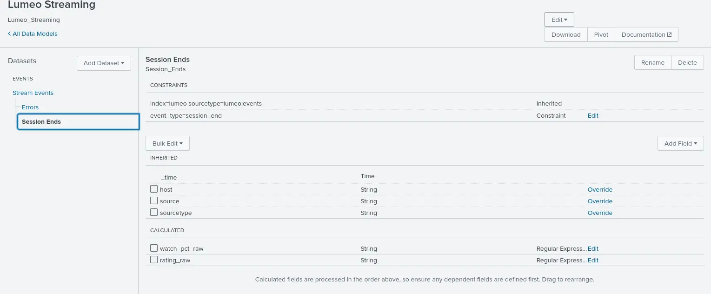

__Session Ends Child Dataset__

## Q18 — Accelerate it, then query with tstats
Turn on acceleration for the data model over a range covering the full dataset. Once built, run `| tstats count from datamodel=Lumeo_Streaming.Errors by error_code` and confirm it matches a raw `stats count by error_code` search over the same data.

> Hint: `tstats` reads the accelerated summary, not raw events — mismatched counts usually mean the backfill hasn't finished (check status in Data Models manager).

We set the summary range as 3 months as this comfortable encompasses all the data in our current set.

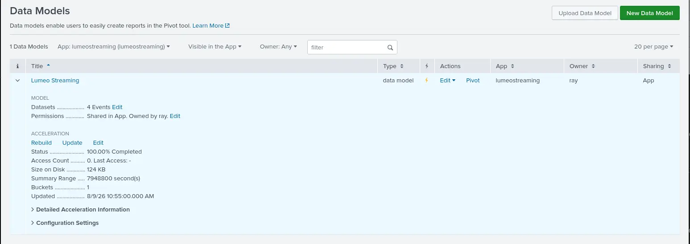

__Lumeo streaming Accelerated__

Then we use tstats to count by `error_code` using the following query,

```
| tstats summariesonly=true count 
    FROM datamodel=Lumeo_Streaming.Stream_Events
    BY Stream_Events.Errors.error_code
```

Which gives us,

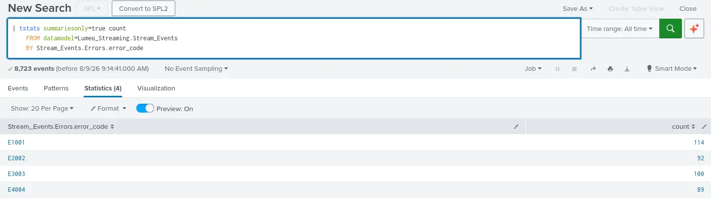

__tstats output__

Now we verify the results over a raw stats call over the same time range using the query

```
index=lumeo sourcetype=lumeo:events error_code=* 
| stats count by error_code
```

Which gives us,

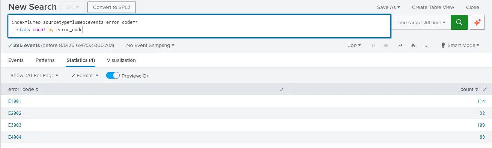

__Results of raw stat call__

As seen above both results match.

## Q19 — Pivot: no-SPL reporting
Using the Pivot UI (not SPL) on the `Errors` object, build a table of counts by `error_code` and `region`, visualize it as a chart, and save it as a report.


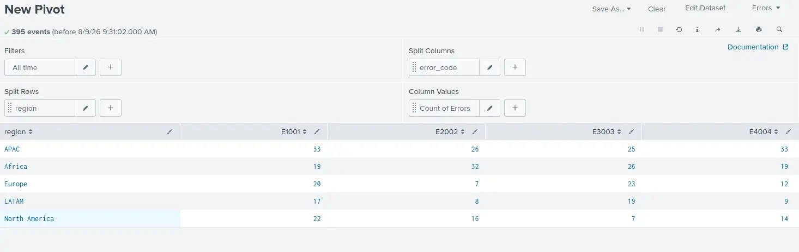

__Creating Pivot__

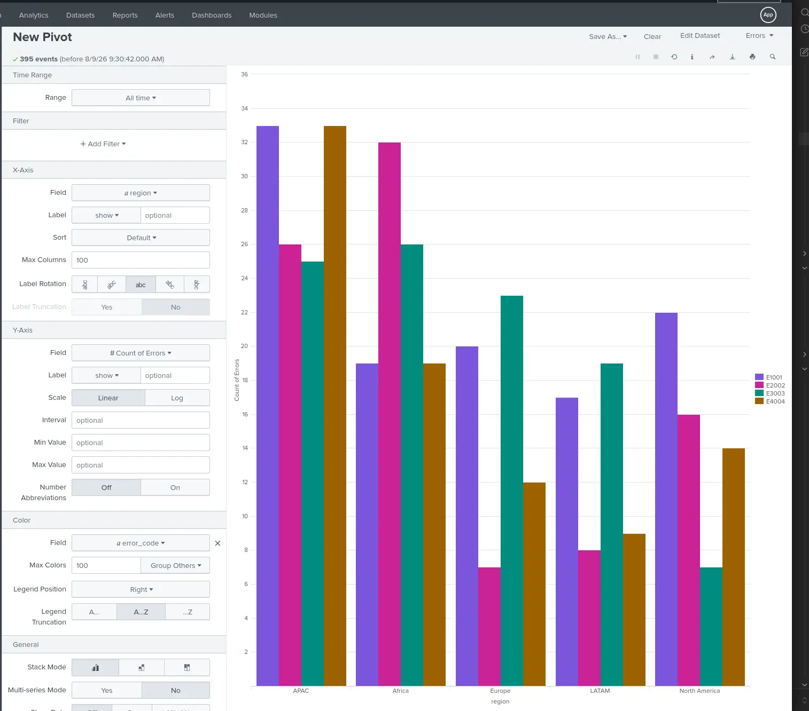

__Creating chart__

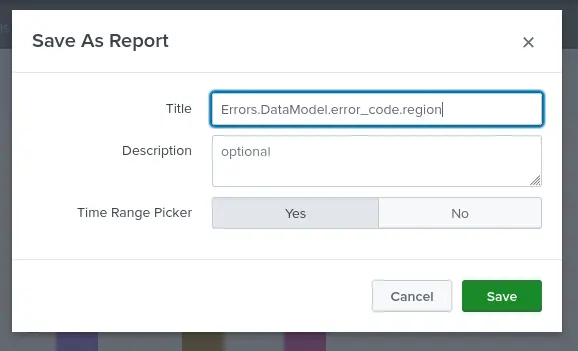

__Saving as report__

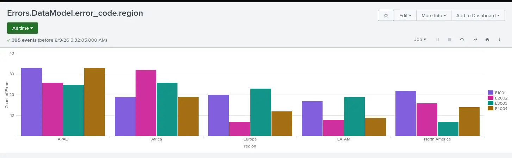

__Viewing the report__

## Extra practice

>add a third, nested child object under `Session Ends` for sessions under 20% watched — `watch_pct_raw` is a messy string (`"87%"`, `"N/A"`, blank) just like `bitrate_label` was for Q13, so add an eval-based calculated attribute in the data model to strip it down to a number before you can filter on it

The possible values for the `watch_pct_raw` field will either be a number followed by a `%` or a `N/A`.
Therefore, we can create a new field `watch_pct` that just normalizes all the values to just numbers.

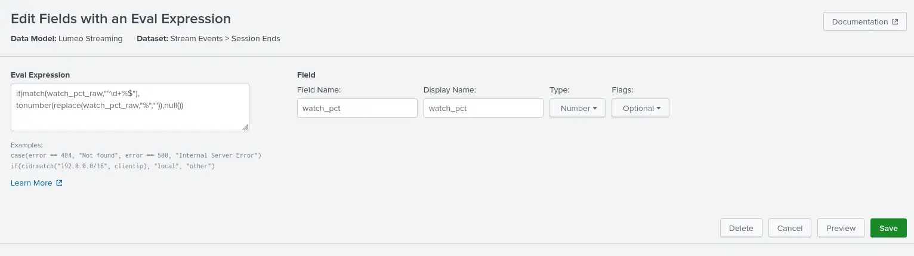

__Creating new field `watch_pct` with an eval expression__

Then we just create the child object under `Session Ends` defined as the following,

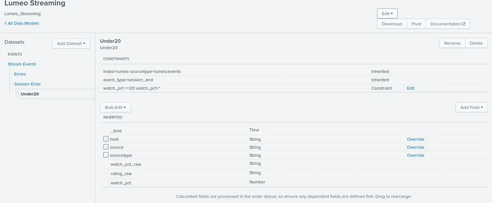

__`Under20` Child Object__

This child object for the current dataset does not actually return any values, changing the threshold to 50 will return events which shows that the created child model is working. It is just the current dataset does not have anything where the `watch_pct` is below `20%`, `null()`s are excluded from this search as null values are skew averages.

---