# Docker 

| Check                              | Result | Notes |
| ---------------------------------- | ------ | ----- |
| Container Health                   | PASS   |       |
| Playbook Status                    | PASS   |       |
| Docker volumes for `etc` and `var` | PASS   |       |
| Ownership for `etc` and `var`      | PASS   |       |
| Docker Ports                       | PASS   |       |
| Connectivity                       | PASS   |       |
| Splunk state after reboot          | PASS   |       |
# KVStore

| Check                       | Result | Notes                                                          |
| --------------------------- | ------ | -------------------------------------------------------------- |
| KVStore Health on Startup   | PASS   | KVstore runs with no errors on first start of docker container |
| KVStore Health post restore | PASS   | After KVStore restoration, KVStore runs with no errors         |
| KVStore Lookups             | PASS   | KVStore restoration was a success, all lookups are available   |

# Instance

| Check          | Result                                     | Notes                                                                |
| -------------- | ------------------------------------------ | -------------------------------------------------------------------- |
| Splunk version | PASS                                       |                                                                      |
| Splunk license | PASS                                       |                                                                      |
| Roles          |  | This search does not emit its own result so a screenshot is provided |
| Users          | | This search does not emit its own result so a screenshot is provided |

# Artifact Check

| Artifact Name   | Result | Notes                                                                                  |
| --------------- | ------ | -------------------------------------------------------------------------------------- |
| `splunk.secret` | PASS   | Hash of `splunk.secret` in the docker container matches that of pre-migration artifact |

# Scenario Checks
## Globalcart

| Category                   | Check                                                                                     | Result |
| -------------------------- | ----------------------------------------------------------------------------------------- | ------ |
| Knowledge Object Inventory | Apps                                                                                      | PASS   |
| Knowledge Object Inventory | Saved Searches                                                                            | PASS   |
| Knowledge Object Inventory | Dashboards                                                                                | PASS   |
| Knowledge Object Inventory | Indexes                                                                                   | PASS   |
| Knowledge Object Inventory | Sourcetypes                                                                               | PASS   |
| Knowledge Object Inventory | Lookup table files                                                                        | PASS   |
| Knowledge Object Inventory | Collections                                                                               | PASS   |
| Knowledge Object Inventory | Lookup definitions                                                                        | PASS   |
| Access Control             | Role `globalcart_analyst`                                                                 | PASS   |
| Access Control             | User `john`                                                                               | PASS   |
| Known Searches             | `_indextime`                                                                              | PASS   |
| Known Searches             | `_time`                                                                                   | PASS   |
| Known Searches             | Events indexed                                                                            | PASS   |
| Known Searches             | Unique Customers in Beauty                                                                | PASS   |
| Known Searches             | Total revenue                                                                             | PASS   |
| Known Searches             | Best category + priority tier                                                             | PASS   |
| Known Searches             | category_to_priority rows                                                                 | PASS   |
| Known Searches             | country_to_region rows                                                                    | PASS   |
| Known Searches             | product_to_cost rows                                                                      | PASS   |
| Known Searches             | category_to_priority md5 checksum                                                         | PASS   |
| Known Searches             | country_to_region md5 checksum                                                            | PASS   |
| Known Searches             | product_to_cost md5 checksum                                                              | PASS   |
| Functional Checks          | Log in as `john`                                                                          | PASS   |
| Functional Checks          | `john` can search `globalcart` but not sensitive indexes like `_audit`                    | PASS   |
| Functional Checks          | `Too much revenue lost` alert is still scheduled, fires and writes to `globalcart:alerts` | PASS   |
| Functional Checks          | lookup editor app is usable by `john`                                                     | PASS   |

# Logs Check

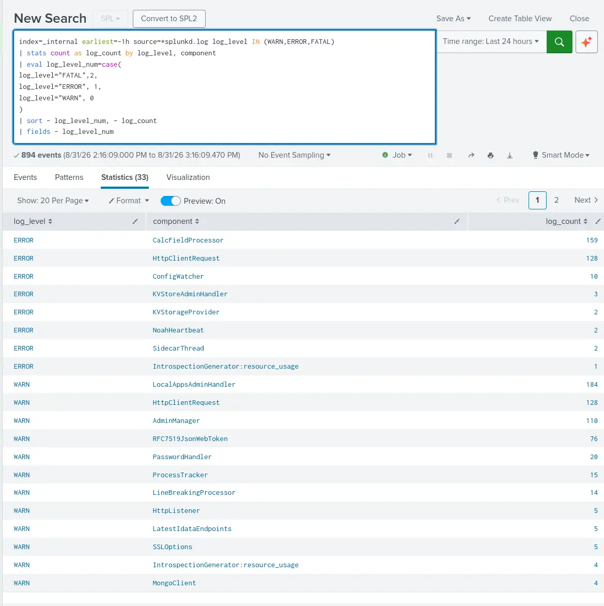

__Logs__

No FATAL logs on startup of container 

# Accepted Deviations

| Deviation                                                                                                            | Reason                                                                                                                                                                                                                                                                                                                                                                                                                                                              |
| -------------------------------------------------------------------------------------------------------------------- | ------------------------------------------------------------------------------------------------------------------------------------------------------------------------------------------------------------------------------------------------------------------------------------------------------------------------------------------------------------------------------------------------------------------------------------------------------------------- |
| File system adopted by docker container for persistent data storage is `btrfs` instead of the source system's `ext4` | The file system adopted by the persistent data storage of the docker container is the same as the host which in this case is `btrfs`. The source Ubuntu VM adopts `ext4` as the file system. This is a non-issue as Splunk officially supports `btrfs` as detailed [here](https://help.splunk.com/en/splunk-enterprise/get-started/install-and-upgrade/10.4/plan-your-splunk-enterprise-installation/system-requirements-for-use-of-splunk-enterprise-on-premises). |

# Verdict

All post-migration checks pass. Migration was successful.
# Appendix

## Docker

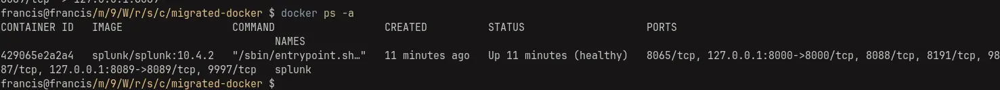

__Docker health__

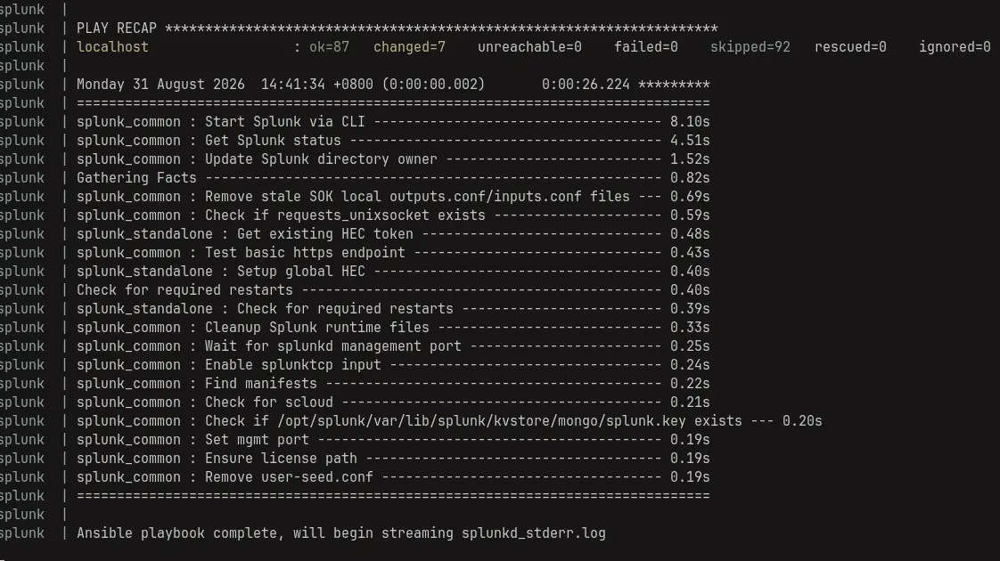

__Playbook Status__

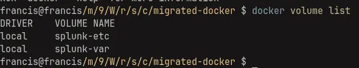

__Docker Volumes__

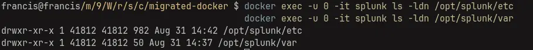

__Folder ownership for `etc` and `var`__

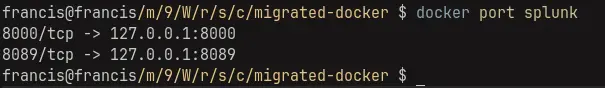

__Docker published ports__

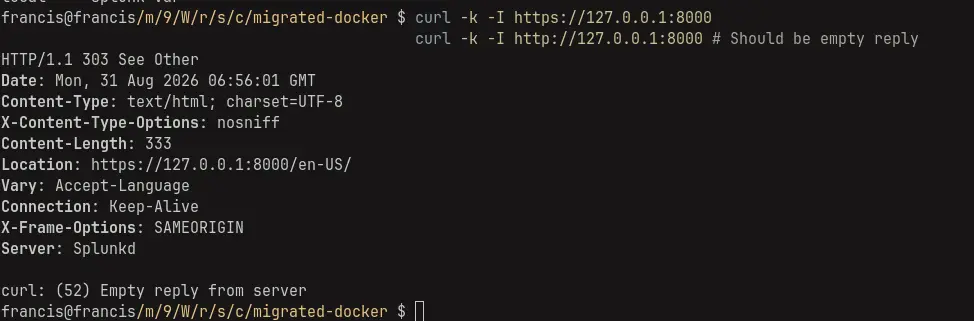

__Connectivity Checks__

## KVStore

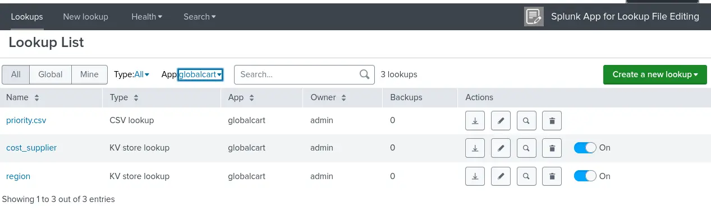

__Restored lookups__

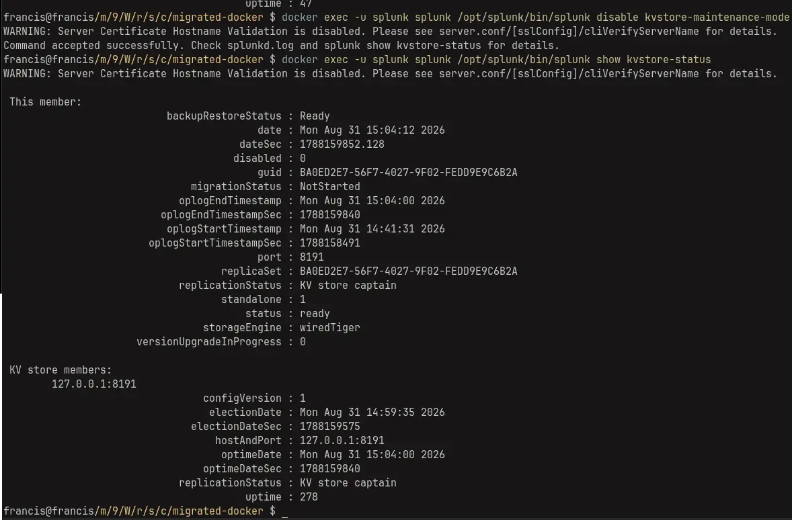

__Maintenance mode disabled and KVStore comes back healthy__

## Artifact

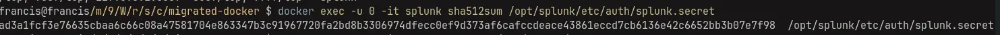

__`splunk.secret` checksum__

## Functional Checks 

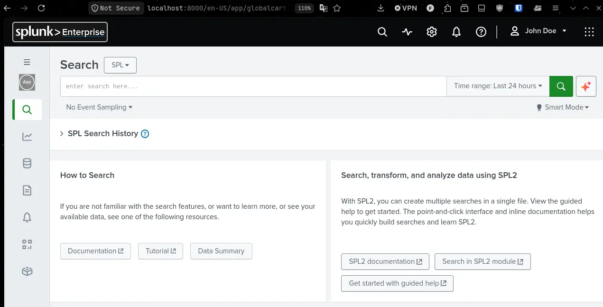

__Login as John__

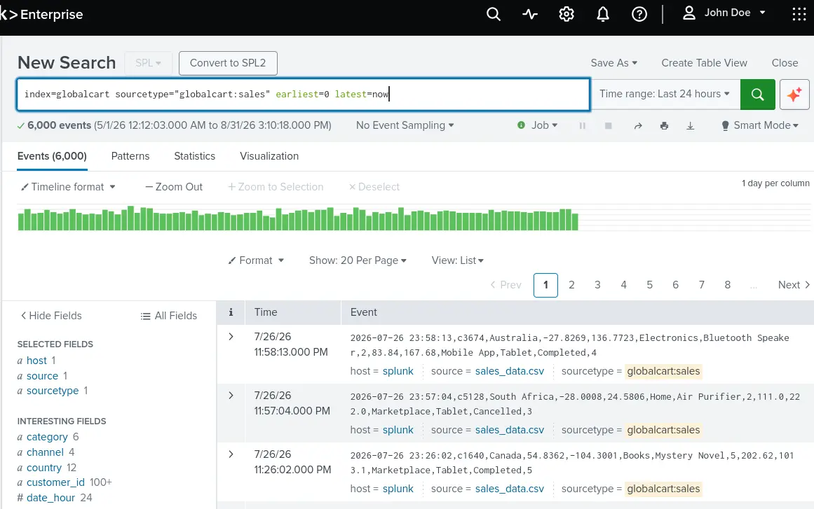

__Searching globalcart index as John__

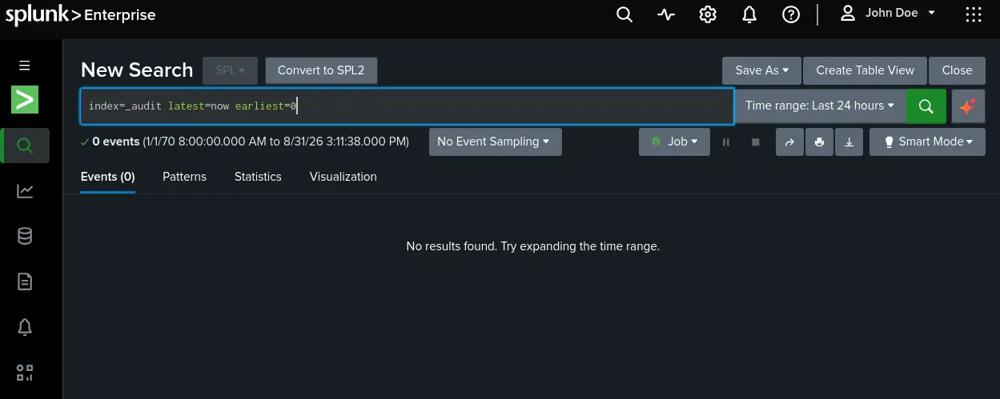

__John cannot search `_audit`__

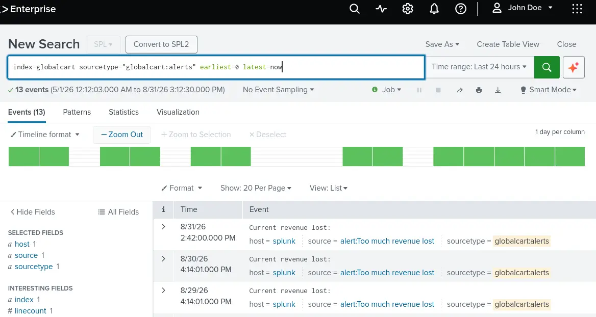

__Alert fires and writes with sourcetype `globalcart:alerts`__

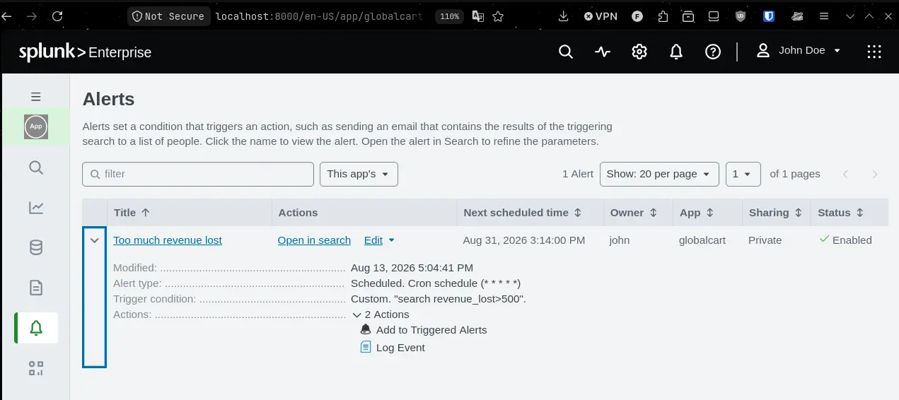

__Alert is still scheduled__

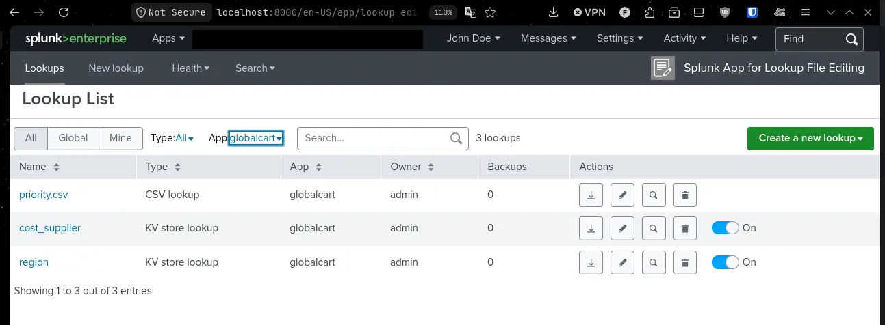

__Lookup App Usable by John__