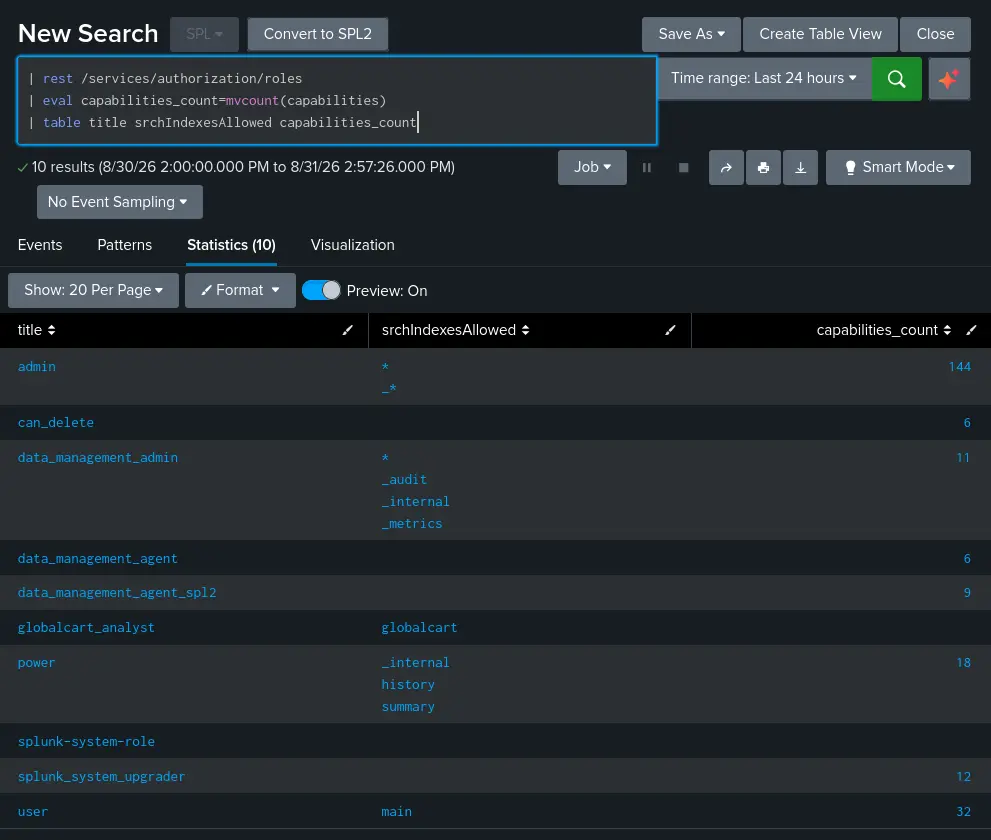
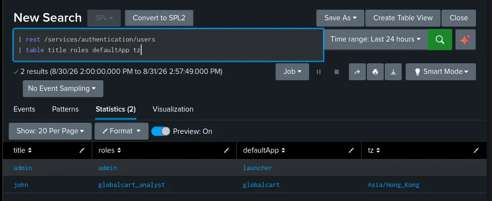
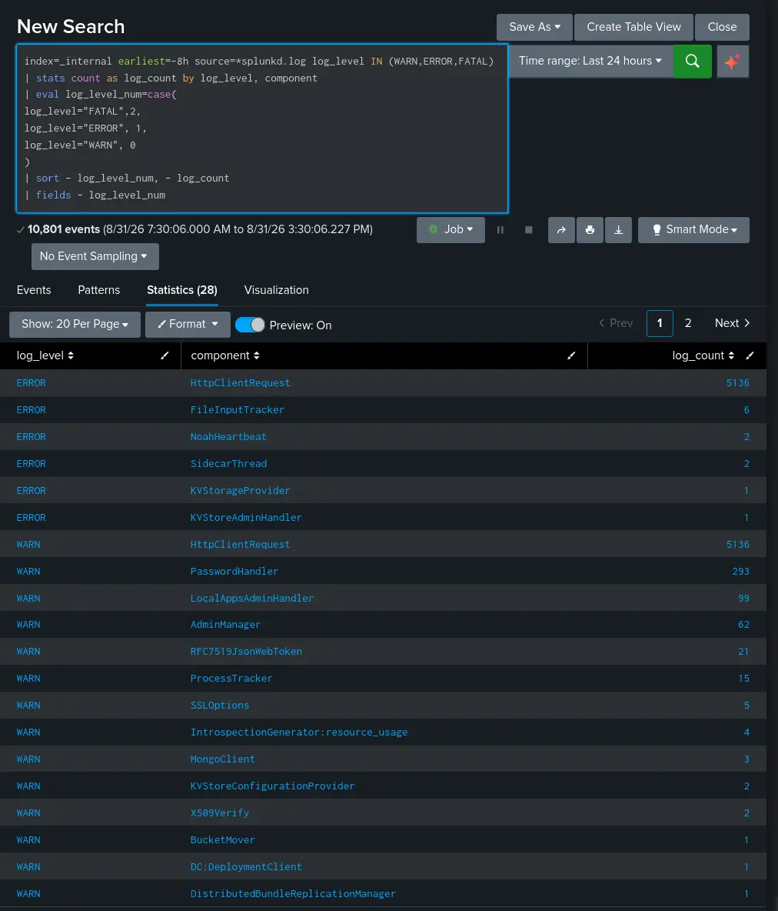
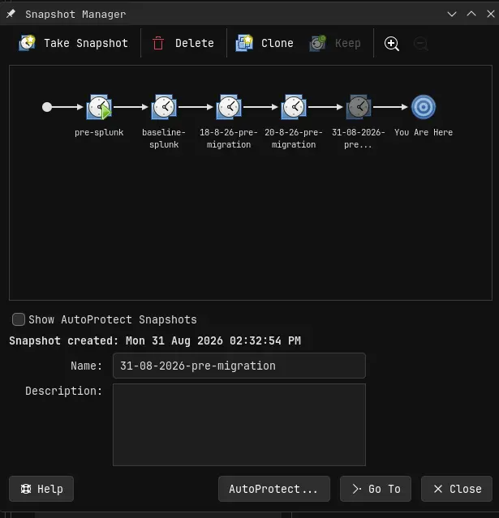
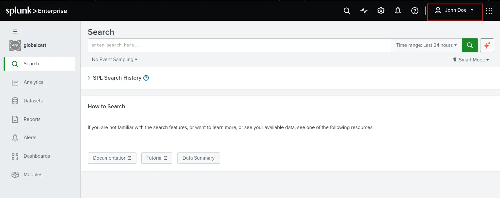
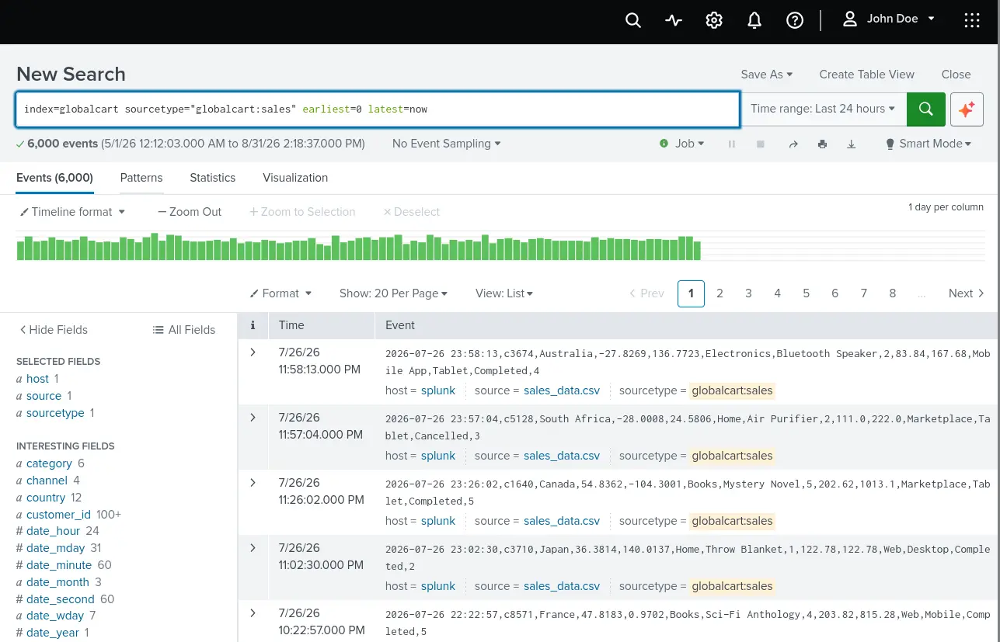
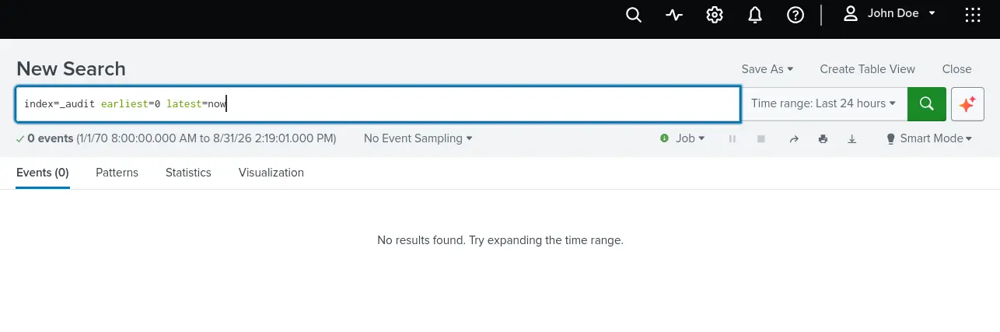
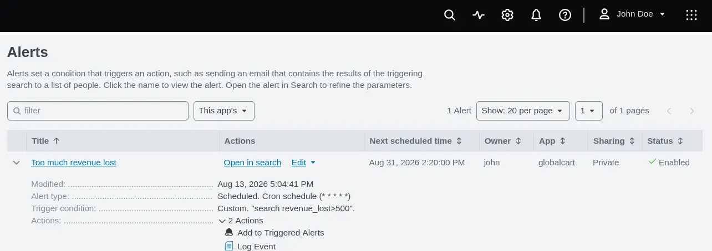
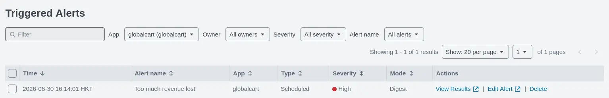
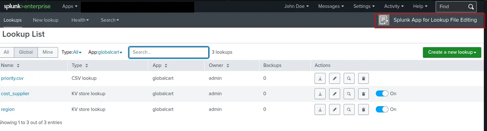

# Instance

| Check          | Result                                     | Notes                                                                |
| -------------- | ------------------------------------------ | -------------------------------------------------------------------- |
| Splunk version | PASS                                       |                                                                      |
| Splunk license | PASS                                       |                                                                      |
| Roles          |  | This search does not emit its own result so a screenshot is provided |
| Users          |  | This search does not emit its own result so a screenshot is provided |

# Scenario Checks
## Globalcart

| Category                   | Check                                                                                     | Result |
| -------------------------- | ----------------------------------------------------------------------------------------- | ------ |
| Knowledge Object Inventory | Apps                                                                                      | PASS   |
| Knowledge Object Inventory | Saved Searches                                                                            | PASS   |
| Knowledge Object Inventory | Dashboards                                                                                | PASS   |
| Knowledge Object Inventory | Indexes                                                                                   | PASS   |
| Knowledge Object Inventory | Sourcetypes                                                                               | PASS   |
| Knowledge Object Inventory | Lookup table files                                                                        | PASS   |
| Knowledge Object Inventory | Collections                                                                               | PASS   |
| Knowledge Object Inventory | Lookup definitions                                                                        | PASS   |
| Access Control             | Role `globalcart_analyst`                                                                 | PASS   |
| Access Control             | User `john`                                                                               | PASS   |
| Known Searches             | `_indextime`                                                                              | PASS   |
| Known Searches             | `_time`                                                                                   | PASS   |
| Known Searches             | Events indexed                                                                            | PASS   |
| Known Searches             | Unique Customers in Beauty                                                                | PASS   |
| Known Searches             | Total revenue                                                                             | PASS   |
| Known Searches             | Best category + priority tier                                                             | PASS   |
| Known Searches             | category_to_priority rows                                                                 | PASS   |
| Known Searches             | country_to_region rows                                                                    | PASS   |
| Known Searches             | product_to_cost rows                                                                      | PASS   |
| Known Searches             | category_to_priority md5 checksum                                                         | PASS   |
| Known Searches             | country_to_region md5 checksum                                                            | PASS   |
| Known Searches             | product_to_cost md5 checksum                                                              | PASS   |
| Functional Checks          | Log in as `john`                                                                          | PASS   |
| Functional Checks          | `john` can search `globalcart` but not sensitive indexes like `_audit`                    | PASS   |
| Functional Checks          | `Too much revenue lost` alert is still scheduled, fires and writes to `globalcart:alerts` | PASS   |
| Functional Checks          | lookup editor app is usable by `john`                                                     | PASS   |
# Logs Check



__Logs__

No FATAL logs in the last 8 hours.
# Script Output

```
[Mon Aug 31 02:23:20 PM +08 2026] Login to Splunk
WARNING: Server Certificate Hostname Validation is disabled. Please see server.conf/[sslConfig]/cliVerifyServerName for details.
[Mon Aug 31 02:23:25 PM +08 2026] Checking kvstore-status is healthy
WARNING: Server Certificate Hostname Validation is disabled. Please see server.conf/[sslConfig]/cliVerifyServerName for details.
WARNING: Server Certificate Hostname Validation is disabled. Please see server.conf/[sslConfig]/cliVerifyServerName for details.
[Mon Aug 31 02:23:26 PM +08 2026] backupRestoreStatus is ready!
[Mon Aug 31 02:23:26 PM +08 2026] kvstore is ready and healthy!
[Mon Aug 31 02:23:26 PM +08 2026] Enable kvstore maintenance mode
WARNING: Server Certificate Hostname Validation is disabled. Please see server.conf/[sslConfig]/cliVerifyServerName for details.
Command accepted successfully. Check splunkd.log and splunk show kvstore-status for details.
[Mon Aug 31 02:23:26 PM +08 2026] Waiting for kvstore to enter maintenance mode
WARNING: Server Certificate Hostname Validation is disabled. Please see server.conf/[sslConfig]/cliVerifyServerName for details.
WARNING: Server Certificate Hostname Validation is disabled. Please see server.conf/[sslConfig]/cliVerifyServerName for details.
WARNING: Server Certificate Hostname Validation is disabled. Please see server.conf/[sslConfig]/cliVerifyServerName for details.
[Mon Aug 31 02:23:29 PM +08 2026] backupRestoreStatus is ready!
[Mon Aug 31 02:23:29 PM +08 2026] kvstore is in maintenance mode and ready!
[Mon Aug 31 02:23:29 PM +08 2026] Backing up kvstore as kvstore-backup-2026-08-31-142329
WARNING: Server Certificate Hostname Validation is disabled. Please see server.conf/[sslConfig]/cliVerifyServerName for details.
[Mon Aug 31 02:23:30 PM +08 2026] Waiting for kvstore tarball kvstore-backup-2026-08-31-142329
[Mon Aug 31 02:23:32 PM +08 2026] Waiting for kvstore-backup-2026-08-31-142329.tar.gz to finish writing
[Mon Aug 31 02:23:34 PM +08 2026] Checking if gzip is valid
[Mon Aug 31 02:23:34 PM +08 2026] Created gzip is valid!
[Mon Aug 31 02:23:34 PM +08 2026] Staging kvstore backup
[Mon Aug 31 02:23:34 PM +08 2026] Disabling kvstore maintenance mode
WARNING: Server Certificate Hostname Validation is disabled. Please see server.conf/[sslConfig]/cliVerifyServerName for details.
Command accepted successfully. Check splunkd.log and splunk show kvstore-status for details.
WARNING: Server Certificate Hostname Validation is disabled. Please see server.conf/[sslConfig]/cliVerifyServerName for details.
[Mon Aug 31 02:23:35 PM +08 2026] kvstore is out of maintenance mode and ready!
[Mon Aug 31 02:23:35 PM +08 2026] Getting current folder permissions and service account details
[Mon Aug 31 02:23:35 PM +08 2026] Stopping Splunkd
[Mon Aug 31 02:24:16 PM +08 2026] Stopped
[Mon Aug 31 02:24:16 PM +08 2026] Backing up and staging $SPLUNK_HOME/etc
[Mon Aug 31 02:24:44 PM +08 2026] Backing up and staging $SPLUNK_HOME/var, excluding /var/run/* & /var/lib/splunk/kvstore/* & /var/packages/*
[Mon Aug 31 02:24:56 PM +08 2026] Appending kvstore version marker versionFile80
[Mon Aug 31 02:26:42 PM +08 2026] Checking if exclusions were applied
[Mon Aug 31 02:27:00 PM +08 2026] Exclusions were applied successfully!
[Mon Aug 31 02:27:00 PM +08 2026] Checking if version marker is missing from var tarball
[Mon Aug 31 02:27:19 PM +08 2026] Version marker exists!
[Mon Aug 31 02:27:40 PM +08 2026] Created gzips are valid for both etc and var!
[Mon Aug 31 02:27:40 PM +08 2026] Grabbing license file and splunk.secret
[Mon Aug 31 02:27:40 PM +08 2026] Stage license file and splunk.secret
[Mon Aug 31 02:27:40 PM +08 2026] Calculating SHA512 sum for etc tarball, var tarball,
2ff1efa910608568f34d9dd8bda08ce08194c3648de94b093c9152a9cfcf8e1aba219b27fec0b893838dc2a0d9701ce3018e7aa415924e86b69f2ad3a41a55da  splunk-etc-2026-08-31.tar.gz
a52360c7d0c1b2ac4e654cfb90af03c970f51995bb44764eb59f048b1d46a6c329b90da8a0d7a2b10b30d49bf8425e1e0e8e8e59e191c7d698e8e1ba9819a15c  splunk-var-2026-08-31.tar.gz
5b0b618138e6c83566a0854f9647d5204281371322cf02f612b8c9eaa43a5fa46c54b4a77385def53e091d7053768def21ef4c84212e5cc314b85634e1136c19  kvstore-backup-2026-08-31-142329.tar.gz
ad3a1fcf3e76635cbaa6c66c08a47581704e863347b3c91967720fa2bd8b3306974dfecc0ef9d373af6cafccdeace43861eccd7cb6136e42c6652bb3b07e7f98  splunk.secret
4c32184392a60e8f558745ff57ad39ed3988c1cc3ec9b4a1f3bf26ab38904d8c2ad25c66c10856a0565c17e29643498e73486312e4c03e524359efd199e978cf  Splunk.License.lic
[Mon Aug 31 02:27:44 PM +08 2026] Copying data to destination folder...
[Mon Aug 31 02:27:48 PM +08 2026] Checking SHA512 hashes
splunk-etc-2026-08-31.tar.gz: OK
splunk-var-2026-08-31.tar.gz: OK
kvstore-backup-2026-08-31-142329.tar.gz: OK
splunk.secret: OK
Splunk.License.lic: OK
[Mon Aug 31 02:27:53 PM +08 2026] Hashes verified! Snapshot done!
[Mon Aug 31 02:27:53 PM +08 2026] Artifact table

| Artifact | Size | Path |
| -------- | ---- | ---- |
| `splunk-etc-2026-08-31.tar.gz` | 518M | `/mnt/hgfs/splunk-lab-resources/splunk-backup/2026-08-31-FCpMjqCn/splunk-etc-2026-08-31.tar.gz` |
| `splunk-var-2026-08-31.tar.gz` | 2.0G | `/mnt/hgfs/splunk-lab-resources/splunk-backup/2026-08-31-FCpMjqCn/splunk-var-2026-08-31.tar.gz` |
| `kvstore-backup-2026-08-31-142329.tar.gz` | 34K | `/mnt/hgfs/splunk-lab-resources/splunk-backup/2026-08-31-FCpMjqCn/kvstore-backup-2026-08-31-142329.tar.gz` |
| `splunk.secret` | 512 | `/mnt/hgfs/splunk-lab-resources/splunk-backup/2026-08-31-FCpMjqCn/splunk.secret` |
| `Splunk.License.lic` | 2.0K | `/mnt/hgfs/splunk-lab-resources/splunk-backup/2026-08-31-FCpMjqCn/Splunk.License.lic` |

[Mon Aug 31 02:27:53 PM +08 2026] SHA512 checksums

2ff1efa910608568f34d9dd8bda08ce08194c3648de94b093c9152a9cfcf8e1aba219b27fec0b893838dc2a0d9701ce3018e7aa415924e86b69f2ad3a41a55da  splunk-etc-2026-08-31.tar.gz
a52360c7d0c1b2ac4e654cfb90af03c970f51995bb44764eb59f048b1d46a6c329b90da8a0d7a2b10b30d49bf8425e1e0e8e8e59e191c7d698e8e1ba9819a15c  splunk-var-2026-08-31.tar.gz
5b0b618138e6c83566a0854f9647d5204281371322cf02f612b8c9eaa43a5fa46c54b4a77385def53e091d7053768def21ef4c84212e5cc314b85634e1136c19  kvstore-backup-2026-08-31-142329.tar.gz
ad3a1fcf3e76635cbaa6c66c08a47581704e863347b3c91967720fa2bd8b3306974dfecc0ef9d373af6cafccdeace43861eccd7cb6136e42c6652bb3b07e7f98  splunk.secret
4c32184392a60e8f558745ff57ad39ed3988c1cc3ec9b4a1f3bf26ab38904d8c2ad25c66c10856a0565c17e29643498e73486312e4c03e524359efd199e978cf  Splunk.License.lic

[Mon Aug 31 02:27:53 PM +08 2026] Ownership and Permissions

| Value | Result |
| ----- | ------ |
| splunk UID:GID on the VM | `splunk:x:998:999:Splunk Service Account:/opt/splunk:/bin/bash` |
| Mode on `/opt/splunk/etc` | 755 |
| Mode on `/opt/splunk/var` | 710 |
[Mon Aug 31 02:27:53 PM +08 2026] Report: /mnt/hgfs/splunk-lab-resources/splunk-backup/2026-08-31-FCpMjqCn/SNAPSHOT-2026-08-31.md
```

# VM Snapshot

| Snapshot Name            | Date       |
| ------------------------ | ---------- |
| 31-08-2026-pre-migration | 31-08-2026 |



__Snapshot History__
# Verdict

All pre-migration checks pass, migration ready.
# Appendix

## Functional Checks 



__Login as John__



__Search globalcart index as John__



__Search `_audit` as John__



__Alert is scheduled__




__Alert fires__

> [!note]
> The alert is throttled for 1 day(s)




__Using Lookup app as John__